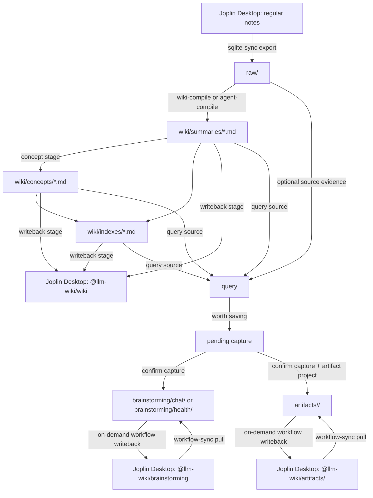

# joplin-llm-wiki

[繁體中文 README](README.md)

joplin-llm-wiki is a local-first knowledge-base curation tool for Joplin. You
can think of it as:

- Export notes from Joplin Desktop `database.sqlite` into Markdown under
  `raw/`.
- Use local Ollama or a locally authenticated Codex CLI to compile large note
  collections into summaries, concepts, and indexes under `wiki/`.
- Write the compiled wiki back to the Joplin `@llm-wiki` notebook so it can be
  read directly in Joplin.
- Query the compiled `wiki/` first, then fall back to `raw/` source notes when
  more source evidence is needed.

The whole workflow runs locally by default. It currently does not use RAG,
vector databases, or Chroma. If you only need the day-to-day workflow, you can
start with the GUI and do not need to memorize the CLI commands.

This project partially borrows workflow concepts and skill design from
[karpathy/442a6bf555914893e9891c11519de94f](https://gist.github.com/karpathy/442a6bf555914893e9891c11519de94f)
and [gatelynch/llm-knowledge-base](https://github.com/gatelynch/llm-knowledge-base).
This repo is not a fork or runtime dependency of those projects. It implements
the ideas as a Joplin-first version where Joplin remains the main reading and
note-management interface.

## Language Default

The bundled workflow prompts and skills default to Traditional Chinese output
because this repository was built for a Traditional Chinese Joplin knowledge
base. You can change those prompts and skill instructions to your preferred
language when adapting the system for your own notes.

## GUI

This repo includes a local Joplin-LLM-wiki tool for common operations through a
graphical interface:

- Check config, `raw/`, `wiki/`, and Ollama connectivity.
- Edit common settings and validate them with `loadConfig` before saving.
- Load notebook lists from Joplin SQLite and select notebooks for export.
- Run the initialization pipeline, create only a raw snapshot, or recompile the
  wiki.
- Resume from the concepts or writeback stage, with dry-run and run support for
  both local and agent modes.
- Query the knowledge base, confirm query captures, and run lint checks.
- Install or remove the Ollama + `sqlite-sync` LaunchAgent stack on macOS.

Start the GUI:

```bash
pnpm install
pnpm exec joplin-llm-wiki-health-gui --config ./config.yaml
```

If you do not have a config file yet, copy one from `config.yaml.example`:

```bash
cp config.yaml.example config.yaml
pnpm exec joplin-llm-wiki-health-gui --config ./config.yaml
```

## Joplin Plugin: Jarvis

This repo does not include a vector index, but it works well with the Joplin
plugin [Jarvis](https://joplinapp.org/plugins/plugin/joplin.plugin.alondmnt.jarvis/).
Jarvis related notes / semantic search can find notes in Joplin that are
semantically close to the current note, selected text, or search phrase. If its
embedding model is configured with a multilingual and multi-granularity model
such as `bge-m3`, related-note links across Chinese and mixed-language note
libraries tend to feel more natural.

The recommended split is: this repo exports `raw/` from Joplin SQLite, compiles
`wiki/`, and writes the compiled wiki back to `@llm-wiki`; Jarvis provides
real-time semantic related notes inside the Joplin interface. This keeps the
rebuildable knowledge layer from this repo while adding Jarvis related-note
support during reading and writing.

## Knowledge Flow

| Layer | Path | Purpose |
| --- | --- | --- |
| Raw library | `raw/` | Unedited source material. SQLite export writes here; manually maintained long-term content should not live in this layer. |
| Wiki | `wiki/summaries/*.md` | One summary per source, without child folders. |
| Wiki | `wiki/concepts/*.md` | Concept entries that cross-reference summaries and concepts, without child folders. |
| Wiki | `wiki/indexes/All-Sources.md`, `wiki/indexes/All-Concepts.md` | Stable index entry points. |
| Brainstorming | `brainstorming/chat/`, `brainstorming/health/` | Confirmed query records, health checks, and research directions. |
| Artifacts | `artifacts/` | Finished work products. Joplin writeback requires a project notebook. |



Loop:

1. **Import**: Joplin notes enter `raw/` first. This layer is source material
   and usually should not be edited manually.
2. **Summarize**: `wiki-compile` or `agent-compile` turns raw notes into
   `wiki/summaries/*.md` and the source index.
3. **Concepts**: the concept stage reads summaries, organizes canonical
   concepts by meaning, and writes `wiki/concepts/*.md` plus
   `wiki/indexes/All-Concepts.md`.
4. **Publish**: the writeback stage writes completed wiki Markdown back to the
   Joplin `@llm-wiki` notebook.
5. **Query**: `query` reads the compiled `wiki/` first and falls back to `raw/`
   source material when needed.
6. **Distill**: valuable Q&A first becomes a pending capture, then is confirmed
   into `brainstorming/chat/` or `artifacts/<project>/`, without directly
   polluting `wiki/`.
7. **Lint**: `lint` checks the wiki layout, frontmatter, links, missing indexes,
   and undistilled brainstorming records from the filesystem.

## Codex / Cursor MCP

This repo also provides a local MCP server, allowing Codex, Cursor, or other MCP
clients to operate the same knowledge flow through structured tools. MCP wraps
the existing CLI/service behavior over stdio. It does not open a public HTTP
listener and does not change the data boundaries of `raw/`, `wiki/`,
`brainstorming/`, and `artifacts/`.

The conversation design is: one skill acts as the entry point, the LLM decides
which knowledge-flow stage is being requested, and MCP tools perform
deterministic actions. The `joplin-knowledge-flow` skill only provides
operating rules and guardrails; actual file reads/writes, Joplin sync, wiki
compilation, and project archival are executed by MCP server tools.

Common intent-to-tool mapping:

| Intent | Tool |
| --- | --- |
| Query the local knowledge base | `joplin_query` |
| Brainstorm and organize ideas | `joplin_brainstorm` |
| Show a pending capture | `joplin_show_capture` |
| Confirm and save a query/brainstorm result | `joplin_confirm_capture` |
| Suggest project names before archiving | `joplin_suggest_archive_project` |
| Archive after the user confirms a project name | `joplin_archive_project` |
| Sync Joplin sources | `joplin_sync_sources` |
| Compile the wiki | `joplin_compile_wiki` |

### Quick Install

This command installs the MCP server quickly. It clones the repo locally,
installs dependencies, creates the `joplin-llm-wiki-mcp` launcher shim, and can
write Codex/Cursor MCP config when requested. You do not need to clone this
project manually first.

Before installing, make sure you have:

- `git`
- Node.js 20+
- `pnpm`

Install only the MCP server and print a config example:

```bash
curl -fsSL https://raw.githubusercontent.com/gcake119/joplin-llm-wiki/main/scripts/install-mcp.sh | bash
```

Also write Cursor or Codex MCP config:

```bash
curl -fsSL https://raw.githubusercontent.com/gcake119/joplin-llm-wiki/main/scripts/install-mcp.sh | bash -s -- --client cursor
curl -fsSL https://raw.githubusercontent.com/gcake119/joplin-llm-wiki/main/scripts/install-mcp.sh | bash -s -- --client codex
curl -fsSL https://raw.githubusercontent.com/gcake119/joplin-llm-wiki/main/scripts/install-mcp.sh | bash -s -- --client both
```

The default install path is `$HOME/.local/share/joplin-llm-wiki`. To choose a
custom install path:

```bash
curl -fsSL https://raw.githubusercontent.com/gcake119/joplin-llm-wiki/main/scripts/install-mcp.sh | bash -s -- --client both "$HOME/.local/share/joplin-llm-wiki"
```

After installation, prepare `config.yaml` in the install directory and configure
the required fields for your Joplin environment: Joplin SQLite, `raw`, `wiki`,
Ollama, and Joplin Data API / Web Clipper token. Minimal startup:

```bash
cd "$HOME/.local/share/joplin-llm-wiki"
cp config.yaml.example config.yaml
$EDITOR config.yaml
pnpm exec joplin-llm-wiki lint --config ./config.yaml
```

After config changes, restart Codex/Cursor, or run Reload Window in Cursor, so
the MCP client reloads the server config.

Cursor config can follow `.cursor/mcp.json.example`:

```json
{
  "mcpServers": {
    "joplin-llm-wiki": {
      "command": "pnpm",
      "args": [
        "exec",
        "joplin-llm-wiki-mcp"
      ],
      "cwd": "/Users/caiyijun/joplin-llm-wiki"
    }
  }
}
```

Available tools:

| Tool | Purpose |
| --- | --- |
| `joplin_query` | Answer from `wiki/` first and optionally supplement from `raw/`, with pending capture support. |
| `joplin_show_capture` | Read a pending capture without modifying files. |
| `joplin_confirm_capture` | Confirm a pending capture and write it to `brainstorming/chat/` or `artifacts/<project>/`. |
| `joplin_brainstorm` | Explore through the query flow, biased toward brainstorming capture by default. |
| `joplin_suggest_archive_project` | Suggest 2-3 project names before project archival. |
| `joplin_archive_project` | Use a confirmed project name and write the work product to `artifacts/<project>/`. |
| `joplin_sync_sources` | Wrap `sqlite-sync` normal, export-only, and snapshot-only modes. |
| `joplin_compile_wiki` | Wrap `wiki-compile` or `agent-compile`. |
| `joplin_sync_workflow_notes` | Pull Joplin `@llm-wiki/brainstorming` / `@llm-wiki/artifacts` workflow notes back into the workspace on demand. |

Project archival must first call `joplin_suggest_archive_project` to obtain
name suggestions, then wait for the user to confirm the project name.
`joplin_archive_project` only writes a formal artifact when it receives
`confirmed_project: true`; otherwise it returns `PROJECT_CONFIRMATION_REQUIRED`
and does not write files. New project artifact paths are fixed as
`artifacts/<project>/<timestamp>-<slug>.md`; do not use
`artifacts/projects/<project>/`.

Full MCP setup and tool semantics are documented in
`docs/codex-cursor-mcp.md`.

## CLI Commands

Besides the GUI, the same work can be done through the CLI. This is useful for
scheduling, automation, and debugging:

```bash
pnpm exec joplin-llm-wiki sqlite-sync --config ./config.yaml --export-only
pnpm exec joplin-llm-wiki sqlite-sync --config ./config.yaml --snapshot-only
pnpm exec joplin-llm-wiki wiki-compile --config ./config.yaml
pnpm exec joplin-llm-wiki agent-compile --config ./config.yaml
pnpm exec joplin-llm-wiki workflow-sync --config ./config.yaml --dry-run
pnpm exec joplin-llm-wiki query --config ./config.yaml "your question"
pnpm exec joplin-llm-wiki query --config ./config.yaml --confirm-capture "<id>"
pnpm exec joplin-llm-wiki lint --config ./config.yaml
```

### Concept Resume Recovery

If `wiki/summaries/*.md` are already complete but concept generation or Joplin
writeback fails, pause the `sqlite-sync` schedule first and resume from a
downstream stage. You do not need to regenerate per-note summaries for every
raw note.

```bash
pnpm exec joplin-llm-wiki wiki-compile --config ./config.yaml --resume-stage concepts --dry-run
pnpm exec joplin-llm-wiki wiki-compile --config ./config.yaml --resume-stage concepts
pnpm exec joplin-llm-wiki wiki-compile --config ./config.yaml --resume-stage writeback --dry-run
pnpm exec joplin-llm-wiki wiki-compile --config ./config.yaml --resume-stage writeback
pnpm exec joplin-llm-wiki agent-compile --config ./config.yaml --resume-stage concepts --dry-run
pnpm exec joplin-llm-wiki agent-compile --config ./config.yaml --resume-stage concepts
pnpm exec joplin-llm-wiki agent-compile --config ./config.yaml --resume-stage writeback --dry-run
pnpm exec joplin-llm-wiki agent-compile --config ./config.yaml --resume-stage writeback
```

Concept resume reads only existing `wiki/summaries/*.md`. Local mode uses
Ollama, and agent mode uses local `codex exec` to derive canonical concepts from
summary evidence. It only writes `wiki/concepts/*.md` and
`wiki/indexes/All-Concepts.md`. Writeback resume is the only resume stage that
writes to Joplin, and it only processes `wiki/concepts/*.md` and
`wiki/indexes/All-Concepts.md`; it does not resend summaries.

Full compilation and resume follow the same publication boundary: concepts are
fully written locally before entering Joplin writeback. Dry-run does not modify
the wiki or Joplin. If dry-run reports Joplin concept collisions or orphan
candidates, inspect the output before deciding whether to repair them. Normal
writeback only creates/updates notes and does not automatically delete old
notes. To recover, you can keep the schedule paused, manually move the faulty
`wiki/concepts/*.md` file or fix duplicate Joplin notes, then rerun dry-run.

## Config

Minimal config:

```yaml
raw: ./raw
raw_glob: "**/*.md"
wiki: ./wiki
wiki_glob: "**/*.md"

wiki_schema:
  path: ./wiki-schema.example.yaml
  strict: true

joplin_wiki_writeback:
  enabled: false

ollama:
  base_url: http://127.0.0.1:11434
  chat_model: gemma4:e4b
  timeout_ms: 120000

```

The default `raw/` and `wiki/` folders are included in `.gitignore`.

## SQLite Sync Change Gate

`sqlite-sync` can detect whether `raw/` has materially changed after each
export, then sync the wiki layer according to configuration:

```yaml
joplin_sqlite_sync:
  enabled: true
  database_path: "/ABS/PATH/database.sqlite"
  pipeline:
    compile_mode: local # local | agent | off
  schedule:
    every_seconds: 600 # null means a single run; set seconds for resident polling
```

- `local`: run `wiki-compile` after raw additions, updates, or deletions are
  detected.
- `agent`: run `agent-compile` after raw changes are detected, using the locally
  authenticated `codex exec`.
- `off`: only export and update snapshot state; do not compile automatically.

The state file is written by default next to the config file at
`.joplin-llm-wiki/sqlite-sync-state.json`, not inside `raw/`, so
`reconcile_mode: mirror` does not clean it up.

The first non-dry-run sync only creates a baseline and does not trigger
compilation. Later runs detect changes by raw-relative path, `joplin_note_id`,
and Markdown content SHA-256. `--export-only` still exports and updates state
but does not compile. `--snapshot-only` scans existing `raw/` to create a
baseline without opening SQLite, deleting files, or compiling; it is useful when
connecting automatic change detection to an existing `raw/` tree.

Scheduled checking is not a filesystem watcher. To check SQLite/raw snapshots
periodically, run `sqlite-sync` as a resident polling process or through an
external scheduler: set `joplin_sqlite_sync.schedule.every_seconds`, use CLI
`--every <seconds>`, or start it periodically through launchd/cron. If
`every_seconds: null` and no `--every` is provided, `sqlite-sync` runs once and
exits.

State is committed only after downstream succeeds. If raw changed and
`compile_mode` is `local` or `agent`, `sqlite-sync` maps changed raw files to
changed summaries, recompiles only affected concepts, and writes back only the
changed downstream relPaths to Joplin. It updates
`.joplin-llm-wiki/sqlite-sync-state.json` only after preflight, compile, and
writeback all succeed. If the token is invalid, the Data API is unavailable, or
`agent-compile` / `wiki-compile` fails, state remains at the last successful
snapshot and the next run retries the same raw changes. Each stdout JSON payload
includes `state_committed`, `state_commit_reason`, `downstream_status`,
`writeback_preflight_status`, `changed_summary_paths`, and
`writeback_relpaths`.

The macOS LaunchAgent template uses `RunAtLoad` to start. Normal periodic work
should still be handled by a single resident process using
`schedule.every_seconds`. The plist `KeepAlive.SuccessfulExit=false` is only for
controlled restart after non-zero exits and is rate-limited with
`ThrottleInterval`; do not combine `StartInterval` with non-empty
`every_seconds`, or runs may overlap. The LaunchAgent wrapper performs readiness
based on the resolved `compile_mode`: `agent` and `off` do not wait for Ollama;
`local` waits for Ollama `/api/tags`.

## Joplin Writeback

When `joplin_wiki_writeback` is enabled, you must configure a local Joplin Web
Clipper / Data API token, and the `base_url` hostname must be `127.0.0.1`,
`localhost`, or `::1`.

```yaml
joplin_data_api:
  base_url: http://127.0.0.1:41184
  token: "<clipper-token>"

joplin_wiki_writeback:
  enabled: true
  parent_notebook_title: "@llm-wiki"
  wiki_notebook_title: wiki
  brainstorming_notebook_title: brainstorming
  artifacts_notebook_title: artifacts
  artifacts_project_notebook_title: ProjectA # only required for on-demand artifacts writeback
```

After a successful non-dry-run `wiki-compile` / `agent-compile`, if
`joplin_wiki_writeback.enabled` is true, the command enters Joplin writeback
only after local wiki compilation finishes. When automatic compilation is driven
through `sqlite-sync`, downstream compile/writeback only runs when the raw
snapshot changed, and only the compiled wiki relPaths changed in the current run
are written back:

- `@llm-wiki/wiki/summaries`
- `@llm-wiki/wiki/concepts`
- `@llm-wiki/wiki/indexes`

`brainstorming/` and `artifacts/` are not automatically synchronized with wiki
compile. They are written back only on demand when organizing Q&A, health
reports, or work products:

- `@llm-wiki/brainstorming/chat`
- `@llm-wiki/brainstorming/health`
- `@llm-wiki/artifacts/<artifacts_project_notebook_title>`

If you edit workflow notes directly in Joplin under
`@llm-wiki/brainstorming/...` or `@llm-wiki/artifacts/...`, use explicit pull
sync to bring Joplin content back into the workspace:

```bash
pnpm exec joplin-llm-wiki workflow-sync --config ./config.yaml --dry-run
pnpm exec joplin-llm-wiki workflow-sync --config ./config.yaml --section brainstorming
pnpm exec joplin-llm-wiki workflow-sync --config ./config.yaml --section artifacts
```

`workflow-sync` only handles `brainstorming/` and `artifacts/`. It does not
rewrite `raw/` or compiled `wiki/`. Dry-run only reports `created`, `updated`,
`unchanged`, `skipped`, `conflicts`, `errors`, and `changed_files`; it does not
create directories or write files. Duplicate names, unknown workflow folders,
and path-traversal candidates are reported in the summary and are not silently
overwritten.

`wiki-compile --dry-run` and `agent-compile --dry-run` do not send
data-changing HTTP requests to Joplin.

If automatic compile from `sqlite-sync` reports
`writeback_preflight_status: "failed"`, first confirm that Joplin Desktop Web
Clipper is enabled, `joplin_data_api.base_url` is loopback, and
`joplin_data_api.token` is the current Clipper token. After fixing config, rerun
the same `sqlite-sync`; because state was not committed, the raw changes will be
retried.

## Query Capture

`query` lets the LLM decide by default whether an answer is worth saving. If it
is worth saving, the CLI only creates
`.joplin-llm-wiki/pending-captures/<id>.json` and prints `CAPTURE_DRAFT`; it
does not write a formal note directly. The note lands only after confirmation:

```bash
pnpm exec joplin-llm-wiki query --config ./config.yaml --confirm-capture "<id>"
pnpm exec joplin-llm-wiki query --config ./config.yaml --confirm-capture "<id>" --artifact-project ProjectA
```

Pending capture IDs keep the legacy UTC `Z` timestamp prefix by default, for
example `2026-05-25T11-46-36-845Z-<slug>-<hash>`. To make new
`capture_draft_id` values use Taiwan local time, set:

```yaml
knowledge_flow:
  pending_capture_id_timezone: Asia/Taipei
```

New IDs then use a GMT+8 local prefix such as
`2026-05-25T19-46-36-<slug>-<hash>`. Existing legacy UTC IDs do not need a
migration and remain compatible with `joplin_show_capture`,
`joplin_confirm_capture`, and `query --confirm-capture "<id>"`.

`--capture=brainstorming` or `--capture=artifacts` can force a proposed capture
category. Categories are only `brainstorming` or `artifacts`. If
`--writeback-workflow=true` is also provided, only the confirmed note from that
confirmation is written back to Joplin on demand.

## Development

```bash
pnpm test
pnpm vitest run test/config-schema.test.js
```

`pnpm test` is this repo's full Vitest suite entry point. To run one test file,
use `pnpm vitest run <path>`.
