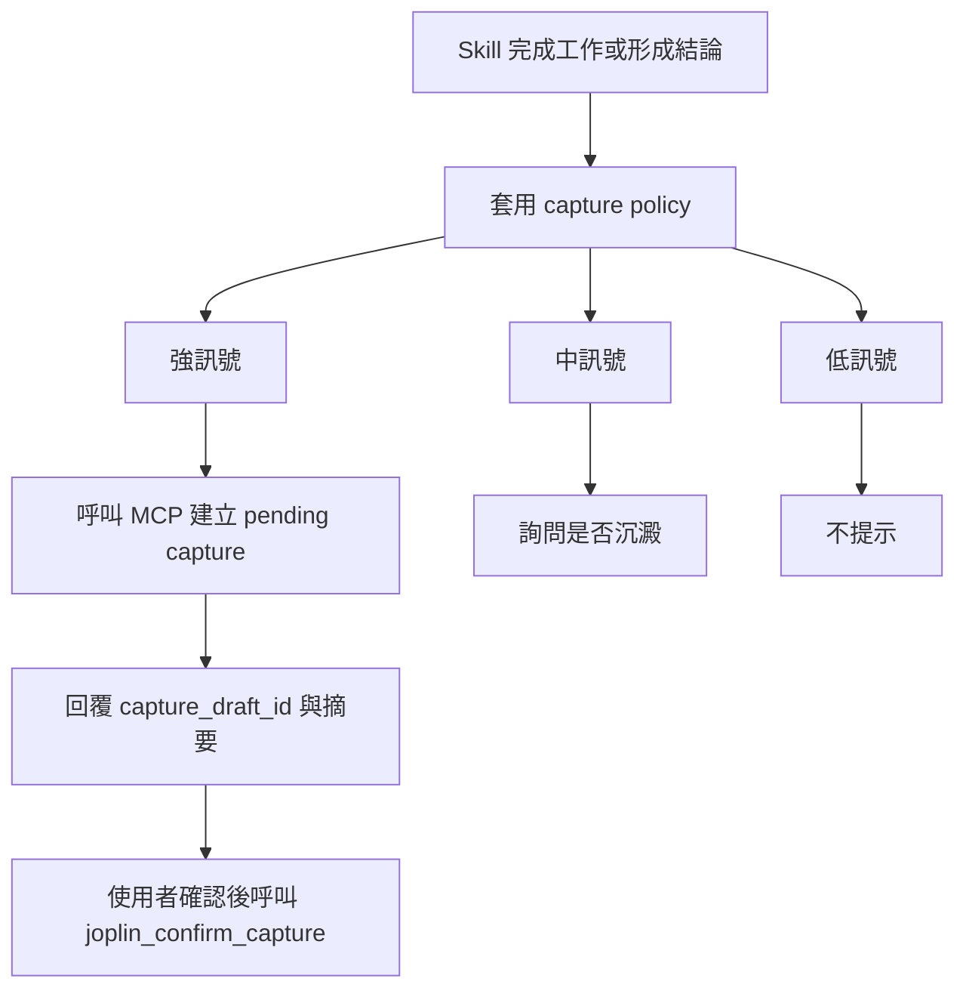

# Knowledge Capture Automation Design

## 背景

`joplin-llm-wiki` 已經把日常知識流包成 MCP tools。現有
`joplin-knowledge-flow` skill 是一個很薄的入口，負責把 LLM 導向
`joplin_query`、`joplin_brainstorm`、`joplin_confirm_capture`、
`joplin_sync_sources`、`joplin_compile_wiki` 等確定性工具。

目前的使用痛點是：有價值的討論、debug root cause、Spectra archive
經驗、架構說明與 handoff 脈絡，常常需要使用者手動想起並叫出
`joplin-knowledge-flow` 才會沉澱。這份設計要把「是否值得沉澱」變成常用
skills 的自然收尾判斷，同時保留人工確認邊界。

## 目標

- 讓高價值工作結論自動形成 pending capture 草稿。
- 減少使用者手動叫出 `joplin-knowledge-flow` 的摩擦。
- 保留 `joplin_confirm_capture` 或 project archive confirmation 作為正式寫入邊界。
- 避免把一般查詢、短命令或未收斂討論變成噪音。
- 不改變 `raw/`、`wiki/`、`brainstorming/`、`artifacts/` 的既有資料邊界。

## 非目標

- 不自動正式寫入 `brainstorming/chat/` 或 `artifacts/<project>/`。
- 不讓 skill 以 ad hoc file write 取代 MCP tools。
- 不把 `brainstorming/` 或 `artifacts/` 納入 compiled `wiki/` pipeline。
- 不在第一版全面修改所有 skills。
- 不保存含有 token、個資、production 管理畫面或客戶敏感資料的內容，除非使用者明確要求。

## 核心分工

### MCP tools

MCP tools 繼續負責確定性行為：

- 查詢知識庫。
- 產生 brainstorming 或 query pending capture。
- 顯示與確認 pending capture。
- 同步 Joplin sources。
- 編譯 wiki。
- 按確認後的 project 名稱歸檔 artifact。

### `joplin-knowledge-flow` skill

`joplin-knowledge-flow` 維持為知識流操作入口與 guardrails：

- 指示 LLM 使用 MCP tools。
- 說明 pending capture 與確認流程。
- 當 MCP tools 不可用時，要求使用者重啟或檢查 MCP 設定。
- 禁止 silent fallback 到手寫檔案。

### Knowledge capture policy

新增或強化一個共用 capture policy，提供其他 skills 判斷：

- 哪些工作結果值得沉澱。
- 哪些場景要自動建立 pending capture。
- 哪些場景只提示使用者是否要沉澱。
- 哪些場景完全不打擾。
- 自動草稿應該使用什麼摘要格式。

### 常用 skills

第一版只接高價值、低噪音的 skills。這些 skills 在工作完成或結論收斂時，
套用 capture policy；若判斷為強訊號，呼叫 MCP 建立 pending capture。

## 第一版接點

### `spectra-archive`

Archive 完成後自動建立 pending capture。內容應包含：

- change 名稱。
- 已套用或更新的 spec。
- 主要決策。
- 驗證證據。
- 可重用經驗。
- 後續待追蹤事項。

### `spectra-debug` 與 `superpowers:systematic-debugging`

當 root cause 已確認且修復完成後，自動建立 pending capture。內容應包含：

- 症狀。
- 被排除的錯誤假設。
- 真正原因。
- 修法。
- 驗證命令與結果。
- 下次遇到類似問題的檢查順序。

### `how`

當架構、subsystem 或 flow 說明已形成清楚 mental model 時，自動建立 pending
capture。內容應包含：

- 入口。
- 主要元件。
- 資料流。
- 邊界與責任。
- 易混淆處。
- 可重用理解。

### `superpowers:brainstorming`

當 brainstorming 已收斂成設計方向、取捨或決策，但尚未進入 Spectra 或
implementation 時，自動建立 pending capture。內容應包含：

- 討論背景。
- 採納方向。
- 被排除方案。
- 取捨理由。
- 下一步。

### 延後接點

`spectra-propose` 與 `spectra-discuss` 第一版只做提示型，因為 proposal、
design、tasks 本身已經是 Spectra SSOT。若要沉澱，只保存「為什麼這樣決策」
與「未來可查的脈絡」，不重複保存全文。

`spectra-commit` 第一版不主動接入。Commit message 本身已經是沉澱來源；
只有跨 repo workflow、工具鏈修復、或非顯而易見的決策，才適合未來加入
capture policy。

## 觸發規則

### 強訊號，自動建立 pending capture

- Spectra archive 已完成。
- Debug root cause 已確認，且修復已驗證。
- 架構說明形成可重用 mental model。
- Brainstorming 收斂成設計方向、決策或取捨。
- Handoff prompt 或 workflow 經驗可直接重用。

### 中訊號，只提示使用者

- 討論內容有價值，但還沒有明確結論。
- 內容可能要保存，但分類或敏感性需要使用者判斷。
- Spectra proposal 或 discussion 已經有正式文件，但另有補充脈絡值得保留。

### 低訊號，不提示

- 短命令輸出。
- 一般查詢。
- 一次性修補。
- 沒有後續可重用價值的對話。
- 尚未收斂的早期發散。

## Pending Capture 格式

自動草稿不保存整段對話，而是保存可重用摘要。

```md
# 標題

## 背景

這段知識從哪個 repo、change、debug、設計討論或架構解釋來。

## 核心結論

最後採納的決策、理解或解法。

## 關鍵證據

引用到的檔案、命令、測試結果、錯誤訊息或觀察。

## 可重用規則

下次遇到類似情境時，可以直接套用的判斷準則。

## 待追蹤

尚未實作、尚未驗證、或之後要回頭看的事情。
```

各類 skill 可以微調欄位：

- Debug 類加上「症狀」、「真正原因」、「修法」。
- Archive 類加上「已完成」、「驗證」、「spec 變更」。
- `how` 類加上「入口」、「資料流」、「邊界」。
- Brainstorming 類加上「採納方案」、「排除方案」、「取捨理由」。

## 流程



## 錯誤與安全邊界

- MCP tools 不可用時，不建立草稿、不寫檔，只提示 MCP server 未載入。
- 自動草稿內容不足時，降級成提示型。
- 涉及 token、個資、production 管理畫面、客戶資料時，預設不自動 capture。
- 任何正式保存都必須經由 `joplin_confirm_capture` 或 project archive confirmation。
- 新 project artifact 必須走已確認 project name，不寫入 `artifacts/projects/<project>/`。

## 驗證標準

第一版完成後，用三個場景驗證：

1. 完成一次 `spectra-archive` 後，能產生有用的 pending capture，且不正式寫入。
2. 完成一次 debugging 後，保存 root cause、修法與驗證，而不是流水帳。
3. 問一次 `how` 架構說明後，保存成可讀的 mental model。

每個場景都應確認：

- MCP tools 被使用，而不是 ad hoc file write。
- 回覆有顯示 `capture_draft_id`。
- 未經使用者確認前，不寫入正式 `brainstorming/chat/` 或 `artifacts/<project>/`。
- 敏感內容不會被自動保存。
