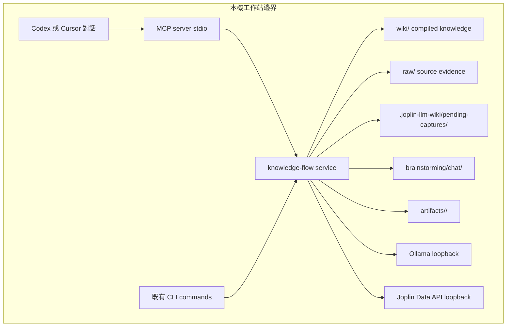
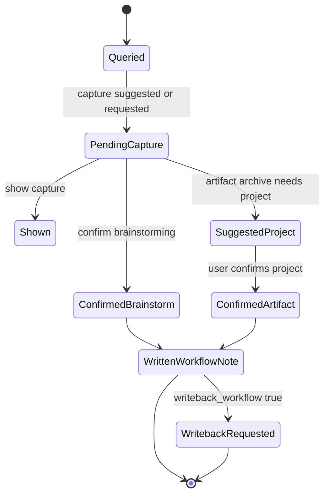

## Context

joplin-llm-wiki 目前已經有 CLI 型知識流：query 讀取 wiki/ 與 raw/，產生回答與來源清單；值得保存的結果先寫成 pending capture；使用者確認後才寫入 brainstorming/chat/ 或 artifacts 相關目錄；必要時再經 Joplin Data API writeback 到 @llm-wiki。這個流程適合終端操作，但在 Codex/Cursor 對話裡仍缺少穩定工具介面，agent 需要自行組 shell 指令與解析 stdout。

本設計新增 MCP server 作為 Codex/Cursor 的本機工具入口，但不改變 Joplin、Jarvis 與 CLI 的責任邊界。Joplin 仍是筆記系統與可選 writeback 目的地；Jarvis 仍處理 Joplin 內即時輔助；joplin-llm-wiki 仍是本機知識流與 workflow artifact 的 source of truth。

## Goals / Non-Goals

**Goals:**

- 提供 Codex/Cursor 可呼叫的 MCP tools：query、show capture、confirm capture、brainstorm、suggest archive project、archive project、sync sources、compile wiki。
- 將 query/capture/archive/writeback 的核心行為抽出為 CLI 與 MCP 共用的 service，避免兩套入口行為分裂。
- Project 歸檔路徑固定為 artifacts/<project>/，且正式寫入前必須經過建議命名與使用者確認。
- 保留本機優先邊界：不新增遠端 DB、雲端 LLM、HTTP API 或 Web UI。
- 提供 Codex/Cursor 設定範例與 skill/操作規則，讓 agent 知道 MCP tools 的確認流程。

**Non-Goals:**

- 不搬移歷史 artifacts/projects/ 內容。
- 不在 MCP tools 中自動批准 project 名稱。
- 不把 query 重新改回 vector RAG、embedding 或 Chroma。
- 不讓 MCP server 對外提供公網服務。
- 不取代既有 CLI；CLI 仍是可用與可測入口。

## Decisions

### 新增 MCP server 作為對話工具入口

MCP server 使用 Node.js 20+、JavaScript ESM 與 pnpm，和現有 CLI runtime 一致。它以 stdio 方式讓 Codex/Cursor 啟動，不需要常駐 HTTP port。

替代方案是只建立 Codex/Cursor skill。Skill 只能提供操作說明，仍需要 agent 執行 shell 與解析文字；MCP tools 能提供 JSON schema、穩定錯誤碼與確認流程，所以 MCP 是主入口，skill 是使用規則層。

### 抽出 CLI 與 MCP 共用的 knowledge-flow service

現有 cmd-query.js 已包含 query、pending capture、confirm capture、capture destination 與 writeback 呼叫。實作時要把可重用邏輯移到 service 模組，例如 knowledge query、pending capture read/write、capture confirm、archive path resolution 與 command orchestration。CLI 只負責 argv/opts 轉換與 stdout/stderr 呈現；MCP tools 只負責 schema 驗證與回傳結構化 JSON。

替代方案是在 MCP tool 中 spawn 既有 CLI。這雖然快，但會把 stdout parsing 變成隱性 API，較難保證錯誤碼、capture id 與 partial failure 行為。

### Project 歸檔拆成建議與確認兩步

Project 歸檔必須先呼叫 joplin_suggest_archive_project，回傳 2-3 個建議 project 名稱、建議 title 與理由。使用者在對話中確認後，agent 才可呼叫 joplin_archive_project，並傳入 confirmed_project=true 或等價欄位。archive tool 若沒有 confirmed project，必須拒絕寫入。

這個拆分把「使用者確認」做成工具合約，而不是只靠 prompt 規則。歸檔輸出路徑固定為 artifacts/<project>/<timestamp>-<slug>.md。

### Brainstorm 是 query 的語意化包裝

joplin_brainstorm 使用相同 knowledge query 流程，但 prompt/capture intent 預設偏向 brainstorming，保存目標仍是 pending capture。正式寫入 brainstorming/chat/ 仍要走 confirm capture，避免對話一產生就污染 workflow 筆記。

### Sync 與 compile tools 只包既有命令語意

joplin_sync_sources 對應 sqlite-sync 的 export_only、normal、snapshot_only 模式。joplin_compile_wiki 對應 wiki-compile 與 agent-compile。這兩類 tools 不重新定義編譯流程，只提供 Codex/Cursor 可呼叫的安全入口與結構化結果。

## Architecture Overview



## Local-First Constraints

- MCP server 只透過 stdio 與 Codex/Cursor 溝通，不新增 HTTP listener。
- query 讀取 wiki/ 與 raw/ 檔案系統內容，不使用 RAG、embedding、Chroma 或 vector index。
- provider=ollama 時只呼叫設定的 ollama.base_url；provider=codex-agent 時只透過本機 codex exec。
- workflow writeback 只使用已由 config 驗證的 loopback Joplin Data API。
- raw/ 仍視為唯讀來源，不由 MCP archive 或 brainstorm 寫入。

## Component Diagram

同 Architecture Overview。MCP server 與 CLI 都依賴同一個 service；service 才能存取 workflow directories、Ollama、Codex agent 與 Joplin Data API。

## Module Layout

```text
bin/joplin-llm-wiki.js
package.json
pnpm-lock.yaml
config.yaml.example
src/cli.js
src/commands/cmd-query.js
src/commands/cmd-sqlite-sync.js
src/commands/cmd-wiki-compile.js
src/commands/cmd-agent-compile.js
src/knowledge-flow/query-service.js
src/knowledge-flow/capture-service.js
src/knowledge-flow/archive-service.js
src/knowledge-flow/orchestration-service.js
src/mcp/server.js
src/mcp/tools.js
src/mcp/schema.js
src/joplin/wiki-writeback.js
docs/codex-cursor-mcp.md
.cursor/mcp.json.example
brainstorming/chat/
artifacts/<project>/
reports/
```

## API/CLI Contract

| Interface | Input | Output | Errors | Idempotency |
| --- | --- | --- | --- | --- |
| joplin_query | question, source_scope, provider, capture | answer, sources, capture_draft_id | QUERY_EMPTY, EMPTY_KNOWLEDGE, CONFIG_INVALID, OLLAMA_UNAVAILABLE | Re-running can create a new pending capture when capture is enabled |
| joplin_show_capture | capture_id | pending capture JSON | CAPTURE_NOT_FOUND | Read-only |
| joplin_confirm_capture | capture_id, writeback_workflow, artifact_project, confirmed_project | capture_written, writeback | CAPTURE_NOT_FOUND, CAPTURE_INVALID, ARTIFACT_PROJECT_REQUIRED, PROJECT_CONFIRMATION_REQUIRED | Same capture cannot be confirmed twice after cleanup |
| joplin_brainstorm | topic, context, source_scope, provider, save | answer, sources, capture_draft_id | QUERY_EMPTY, EMPTY_KNOWLEDGE | Re-running can create a new pending capture |
| joplin_suggest_archive_project | title, content, context | suggested_projects, suggested_title, reason | ARCHIVE_CONTENT_REQUIRED | Read-only |
| joplin_archive_project | project, title, content or capture_id, confirmed_project, writeback_workflow | archive_written, writeback | PROJECT_CONFIRMATION_REQUIRED, ARTIFACT_PROJECT_REQUIRED, CAPTURE_NOT_FOUND | Writes a new timestamped artifact |
| joplin_sync_sources | mode, config_path | exit_code, stdout summary, stderr summary | SQLITE_OPEN_FAILED, CONFIG_INVALID | Snapshot state follows existing sqlite-sync semantics |
| joplin_compile_wiki | mode, dry_run, batch, config_path | exit_code, stdout summary, stderr summary | WIKI_COMPILE_ABORT, OLLAMA_UNAVAILABLE, JOPLIN_DATA_API_FAILED | Compile remains existing command behavior |

CLI behavior remains available. Existing query options keep their current names, but artifact confirm behavior changes to write artifacts/<project>/ after project confirmation rather than artifacts/projects/<project>/.

## Data Model

Pending capture JSON keeps the existing fields: id, created_at, question, answer, provider, source_scope, capture. capture contains classification, title, content, knowledge_sources.

Archive project suggestion result:

```json
{
  "suggested_projects": [
    { "name": "tainan-city", "reason": "Matches workspace and topic" },
    { "name": "health-dispatch-monitor", "reason": "Matches deliverable domain" }
  ],
  "suggested_title": "health bureau dispatch monitoring plan",
  "requires_user_confirmation": true
}
```

Archive output frontmatter:

```yaml
title: "..."
created_at: "..."
capture_classification: "artifacts"
project: "tainan-city"
capture_path: "artifacts/tainan-city/...md"
knowledge_sources:
  - layer: "wiki"
    path: "concepts/example.md"
```

## Data Flow & State Machine



## Error Handling

- MCP tools return structured error objects with code, message, and retryable where useful.
- User-facing error messages must not expose tokens, raw stack traces, or internal parameter dumps.
- Project archive without confirmed project returns PROJECT_CONFIRMATION_REQUIRED and writes no file.
- Artifact archive without project returns ARTIFACT_PROJECT_REQUIRED and writes no file.
- Missing pending capture returns CAPTURE_NOT_FOUND and writes no file.
- Long stdout/stderr from orchestration tools is capped and summarized to keep Codex/Cursor responses usable.

## Security & Privacy

- MCP tools run locally and read/write only configured workflow paths.
- raw/ is read-only evidence; archive and brainstorm write only pending captures, brainstorming/chat/, or artifacts/<project>/.
- Joplin Data API token is never included in tool output.
- No MCP tool sends note content to remote SaaS or remote vector services.
- Codex/Cursor agent must confirm project naming with the user before archive writes.

## Observability

- Tool results include action, exit_code when wrapping commands, written relative paths, source counts, capture id, and writeback summary.
- Failures include stable error codes aligned with existing CLI behavior.
- Tests assert that rejected archive attempts leave no filesystem output.

## Migration/Phase

1. Add service modules while keeping CLI behavior passing.
2. Update artifact destination to artifacts/<project>/ and adjust writeback mapping.
3. Add MCP server and tools with schema validation.
4. Add Codex/Cursor docs and MCP configuration example.
5. Keep existing artifacts/projects/ files untouched; no migration is performed.

Rollback: remove MCP configuration from Codex/Cursor and continue using the CLI. If artifact path behavior needs to be reverted before archive, reverse only the service destination change; no raw/wiki/Joplin data migration is required.

## Implementation Contract

The shipped behavior is observable through both CLI tests and MCP tool tests.

In scope:

- MCP stdio server exposes the tools listed in API/CLI Contract.
- query and brainstorm return structured answer/source/capture results.
- pending capture show/confirm works without direct stdout parsing.
- artifact project archive requires prior user-confirmed project and writes to artifacts/<project>/.
- workflow writeback maps artifact workflow notes under @llm-wiki/artifacts/<project>.
- docs explain Codex/Cursor setup and the two-step archive confirmation rule.

Out of scope:

- Web UI, daemon supervisor, remote deployment, cloud LLM providers, vector index work, historical artifact migration.

Acceptance criteria:

- Unit tests cover query service output shape, pending capture lifecycle, archive project rejection without confirmation, archive write path, and writeback notebook path.
- CLI routing tests still pass for query confirm and existing sync/compile commands.
- MCP tool tests invoke handlers directly or through the server harness and verify JSON outputs.
- pnpm test passes.
- spectra validate add-mcp-knowledge-flow-tools passes before apply.

## Traceability

| Requirement group | Design coverage |
| --- | --- |
| REQ-MCP-001 | MCP server, API/CLI Contract, Error Handling |
| REQ-MCP-002 | Decisions, Data Model, Data Flow & State Machine |
| REQ-MCP-003 | Local-First Constraints, Security & Privacy |
| REQ-MCP-004 | API/CLI Contract, Observability |
| REQ-QUERY-003 | Decisions, Data Model, Migration/Phase |
| REQ-QUERY-004 | API/CLI Contract, Migration/Phase |
| REQ-JWKB-WORKFLOW | API/CLI Contract, Security & Privacy |

## Risks / Trade-offs

- [Risk] MCP SDK dependency adds setup surface. → Mitigation: isolate it under src/mcp and keep CLI independent.
- [Risk] Agent could skip project confirmation if only documented. → Mitigation: archive tool rejects writes unless confirmation is explicit.
- [Risk] Refactoring cmd-query.js could regress CLI. → Mitigation: extract services under tests before replacing CLI internals.
- [Risk] Existing artifacts/projects/ history differs from new artifacts/<project>/ convention. → Mitigation: do not migrate history; document new behavior and keep writeback able to read explicitly selected paths.
