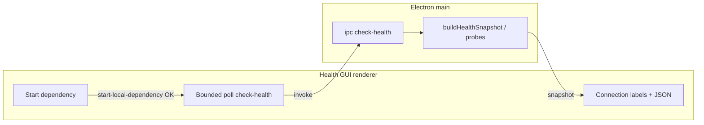

## Context

Health GUI 依 `buildHealthSnapshot`／`probeChroma` 顯示連線狀態；背景啟動僅保證子程序 `spawn` 完成，不代表 HTTP 服務已可接受探測。另，`loadConfig` 對相對 `chroma.persist_path` 若使用 `process.cwd()`，與同檔案內 `notes_root` 以設定檔目錄為錨點之行為不一致，從非預期 cwd 啟動 Electron 或 CLI 時，持久化目錄與操作者認知脫節，並與 `REQ-HGUI-DEP-START` 中「`loadConfig` 後之絕對路徑」敘述在實務上產生落差。

## Goals / Non-Goals

**Goals:**

- 讓相對 `chroma.persist_path` 之解析與其他設定欄位一致，減少本機路徑錯置。
- 在操作者完成背景啟動後，於 renderer 以有界輪詢自動取得最新 `check-health` 快照，使連線標籤與 `reachable` 欄位一致，無需額外手動「重新整理」即可完成首輪確認。
- 維持全本機邊界：不新增遠端服務、不暴露 GUI 於區網監聽。

**Non-Goals:**

- 不在 GUI 內嵌即時串流 Chroma／Ollama 程序 stdout／stderr（detached 啟動維持現狀）。
- 不變更 Chroma HTTP API、不調整 `ChromaStore` 之外部契約（仍以宿主／埠＋`listCollections` 類探測為準）。

## Architecture Overview（Local-First Constraints）

本變更僅觸及 **設定載入**（`loadConfig`）與 **Health GUI renderer** 行為；主程序 IPC `check-health`／`start-local-dependency` 契約保持，輪詢透過重複呼叫既有 `check-health` 完成，無新增後端服務。

## Component Diagram

- **load-config**：將相對 `chroma.persist_path` 改以 `cfgDir`（`path.dirname(absConfigPath)`）解析為絕對路徑。
- **renderer `app.js`**：成功啟動後呼叫輪詢助手：固定間隔 sleep、重複 `jb.checkHealth()`，直到 `ollama.reachable` 或 `chroma.reachable` 符合本轮 `kind`，或總等待時間逾時；每次成功取得快照則更新 `lastHealthSnap`、連線字串與 JSON 區（與手動 refresh 同源之 `applyHealthSnapshot` 語意）。
- **探測子系統**：無需修改演算法；受益於 `persist_path` 與 spawn argv 對齊後之一致性。

## Module Layout（文字樹）

- `src/config/load-config.js` — `chroma.persist_path` 相對路徑解析
- `src/health-gui/renderer/app.js` — 輪詢與 UI 更新
- `test/config-schema.test.js` — 相對 `chroma.persist_path` 回歸斷言

## API / CLI Contract

- **IPC**：仍為 `check-health` 回傳 `HealthSnapshot`；輪詢僅增加呼叫頻率，不改 payload。
- **CLI / bin**：`loadConfig` 語意變更會影響所有子命令與測試中使用相對 `chroma.persist_path` 之組態；**BREAKING**：舊依賴「相對於 shell cwd」之非文件化行為不再適用。
- **錯誤與失敗**：輪詢逾時不拋未捕捉例外；最後一次快照之 `reachable: false` 保留，狀態列以文字提示操作者可手動重新整理或查日誌。

## Data Model

- `AppConfig.chroma.persist_path`：絕對路徑字串；相對輸入之展開規則與 `notes_root` 對齊（錨定為設定檔目錄）。

## Error Handling

- 輪詢單次 `checkHealth` 若回傳 `ok: false`（例如設定暫時無效），行為為繼續輪詢至逾時或下一次成功 `ok: true` 快照（實作可限制連續失敗次數，但必須不阻塞事件迴圈）。

## Security & Privacy

- 無新增對外連線；`check-health` 仍僅觸之本機 Ollama／Chroma HTTP。

## Observability

- 操作者仍可透過 GUI JSON 區檢視最新快照；狀態列文字反映自動驗證成功／逾時。

## Migration / Phase

1. 釋出說明標註相對 `chroma.persist_path` 錨點變更（**BREAKING** 可能）。
2. 建議使用相對路徑者確認 `config.yaml` 所在目錄與預期資料夾之相對關係；或改為絕對路徑。

## Decisions

### Decision: 錨定相對 chroma.persist_path 於設定檔目錄

**Rationale**：與 `notes_root`／`wiki_schema.path` 等同檔規則一致，避免 `process.cwd()` 隨啟動方式漂移。

**Alternatives considered**：維持 `process.cwd()`（一致性差）；改為相對 repo root 單獨欄位（需額外設定，超出本變更範圍）。

### Decision: 在 renderer 以有界輪詢重複 check-health

**Rationale**：不改 main process 契約即可消化「spawn 與 listen 競態」，並立即刷新操作者可見標籤。

**Alternatives considered**：要求操作者手動按「重新整理」（體驗差）；在 main 內阻塞等待埠開放（易拖長 IPC、與現有 detached 語意衝突）。

## Implementation Contract

**Behavior**

- 相對 `chroma.persist_path`：`loadConfig` 產出之 `AppConfig.chroma.persist_path` 必為絕對路徑，且若 YAML 值為相對路徑，則其絕對化結果等於「`path.resolve(cfgDir, relative)`」語意（與 `path.dirname(configPath)` 一致之錨點）。
- 背景啟動後：renderer 在收到 `start-local-dependency` **成功** 回應後，於同一互動流程內啟動輪詢，直到對應依賴 `reachable === true` 或達最大等待時間；每次取得 `ok: true` 快照時，連線標籤與 JSON 區與該快照一致。

**Failure modes**

- 輪詢逾時：停止輪詢；UI 保留最後一次快照；狀態列提示可能逾時（具體字串由實作決定，必須可操作者理解）。

**Acceptance**

- `pnpm test` 全通過；`test/config-schema.test.js` 覆蓋相對 `chroma.persist_path` 斷言；手動：背景啟動 Chroma 後無需手動「重新整理」即可在等待視窗內見「已連線」（本機 Chroma 正常啟動之前提）。

**Scope boundaries**

- **In scope**：`load-config.js`、Health GUI renderer、相關測試。
- **Out of scope**：launchd plist、Chroma 套件升級、VectorStore 實作替換。

## Risks / Trade-offs

- [語意變更影響舊腳本] → 於 README／release note 標註並提供絕對路徑遷移建議。
- [輪詢增加 IPC 負載] → 有界次數與間隔；僅在成功 spawn 後觸發。

## Open Questions

- （無）若未來需在 main 集中節流 `check-health`，可另開 change。
