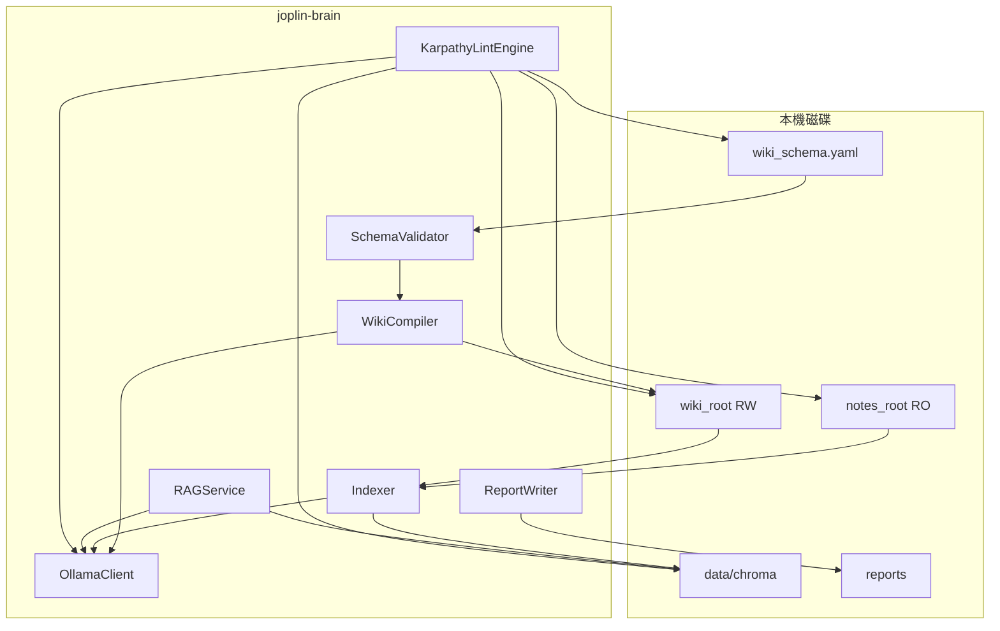

## Context

joplin-brain 於本機同時實作 **Karpathy LLM Wiki 三層**：唯讀 **Sources**（Joplin `.md`）、LLM 維護之 **Compiled Wiki**（獨立 `wiki_root`）、以及 **Schema**（頁型別與 ingest workflow）。向量層分 **collection_sources** 與 **collection_wiki**；`wiki-compile` 受 `max_pages_per_run` 約束；`lint` 延伸至矛盾、Wiki 孤立與 schema 缺口。推理僅走本機 Ollama。

## Goals / Non-Goals

**Goals:**

- 交付完整 Karpathy 功能：分層儲存、wiki ingest、schema 驗證、雙 collection 索引、wiki-first RAG、延伸 Lint。
- 預設 **不寫回 `notes_root`**；Wiki 僅寫入 `wiki_root`。
- CLI：`index`、`watch`、`wiki-compile`、`ask`、`lint`；exit code 契約穩定。

**Non-Goals：**

- 雲端向量／雲端 LLM、對外 HTTP 服務。
- 預設自動覆寫使用者原件檔案。

## Architecture Overview

```
Sources (notes_root, RO) ──┐
                           ├── Indexer ──► Chroma collection_sources
Wiki (wiki_root, RW) ──────┘              │
                           ├── WikiCompiler (LLM plan + write) ──► wiki md files
                           └── Indexer ──► Chroma collection_wiki

SchemaValidator ◄── wiki_schema.path
KarpathyLintEngine ◄── embeddings + graphs + LLM structured judges (local)
RAGService ◄── retrieve_mode selects collection order
```

## Local-First Constraints

- HTTP 僅至 `ollama.base_url`（預設 127.0.0.1）。
- Chroma 嵌入式 `data/chroma/`；至少兩 named collections。
- `wiki-compile` 之 LLM 呼叫 SHALL NOT 指向非設定之 host。

## Component Diagram



## Module Layout

```
bin/joplin-brain.js
src/cli.js
src/config/load-config.js
src/joplin/cli-runner.js
src/fs/note-discovery.js
src/wiki/wiki-compiler.js
src/wiki/wiki-planner.js
src/wiki/frontmatter.js
src/schema/schema-validator.js
src/index/chunker.js
src/index/indexer.js
src/index/state-machine.js
src/ollama/client.js
src/vector/chroma-store.js
src/rag/rag-service.js
src/lint/karpathy-lint-engine.js
src/report/report-writer.js
src/watch/watcher.js
wiki-schema.example.yaml
config.yaml.example
test/fixtures/...
```

## Decisions

### Decision: Node.js JavaScript ESM + pnpm

維持 Node 20+、`type: module`、`pnpm`。

### Decision: 雙 Chroma collection

`chroma.collection_sources` 與 `chroma.collection_wiki` 分開；metadata 含 `layer`、`relative_path`、`content_hash`。

### Decision: Wiki 預設為唯一可寫知識樹

LLM 批次寫入僅限 `wiki_root`；`notes_root` 預設 RO。

### Decision: wiki-compile 上限頁數

`wiki_ingest.max_pages_per_run` 預設 15；合法範圍 10–18（可配置，超出須 log warning）。

### Decision: 矛盾判定為 LLM 結構化輸出

Lint 矛盾段要求模型輸出 JSON schema（路徑對、claim ids）；誤報為候選。

### Decision: RAG wiki_first

預設先查 `collection_wiki`，chunk 不足再查 `collection_sources`。

### Decision: 選配 Joplin CLI 子行程

維持既有閉集預檢；不得取代磁碟讀原件。

## Implementation Contract

**In scope**

- `wiki-compile`：讀 schema + 變更之 sources diff／mtime → planner → ≤max_pages 檔案寫入或 dry-run 報告。
- `index`：兩棵樹皆可索引；metadata 區分 layer。
- `ask`：`rag.retrieve_mode` 三種模式。
- `lint`：輸出延伸 JSON 鍵。

**Out of scope**

- 對外公開監聽埠。
- 預設 write_back 至 `notes_root`。

**Exit codes**

- `0` 成功
- `1` 使用者／設定／schema／JOPLIN_CLI_FAILED
- `2` Ollama／Chroma 不可用
- `3` 內部錯誤

**新增錯誤鍵**

- `SCHEMA_INVALID`、`WIKI_COMPILE_ABORT`、`LINT_JUDGE_FAILED`（可重試後仍失敗）

## API / CLI Contract

| 指令 | 說明 |
|------|------|
| index | 索引 sources／wiki（依設定） |
| watch | 監看 sources（與可選 wiki） |
| wiki-compile | Karpathy ingest；`--dry-run` |
| ask | RAG |
| lint | Karpathy 完整 lint |

## Traceability

| REQ 前綴 | 模組 |
|----------|------|
| REQ-IDX-* | indexer、chroma |
| REQ-WIKI-* | wiki-compiler、frontmatter |
| REQ-WS-* | schema-validator |
| REQ-WI-* | wiki-ingest flow |
| REQ-RAG-* | rag-service |
| REQ-KL-* | karpathy-lint-engine |

## Migration / Phase

單一 change 交付；實作順序見 `tasks.md`（先骨架與雙 collection → sources index → wiki schema → wiki-compile → wiki index → ask 模式 → lint 延伸 → 整合測試）。

## Risks / Trade-offs

- Wiki 與原件漂移 → lint contradictions + source_refs 強制。
- Token 成本 → max_pages 與 dry-run。

## Open Questions

- `wiki-compile` planner 是否固定單次 chat 或 chain-of-thought 多輪：首版允許多輪但須上限步數（config）。
