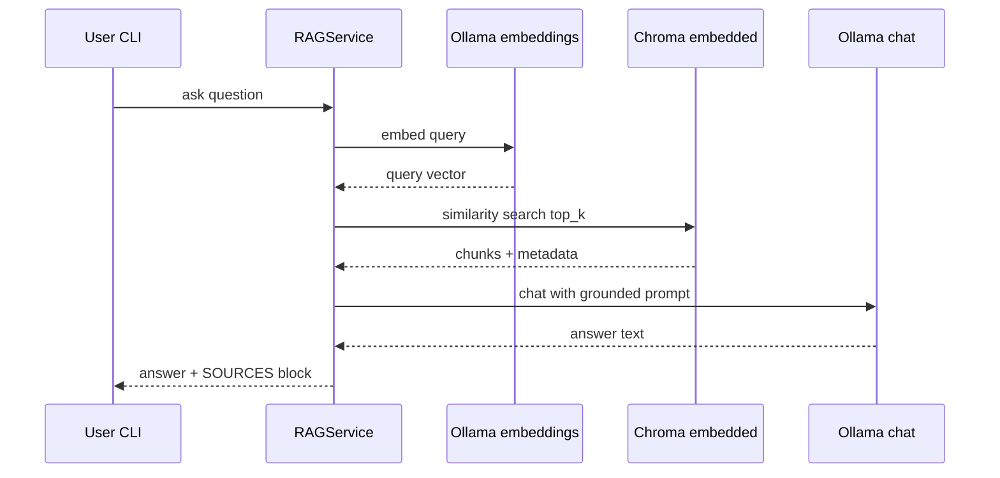
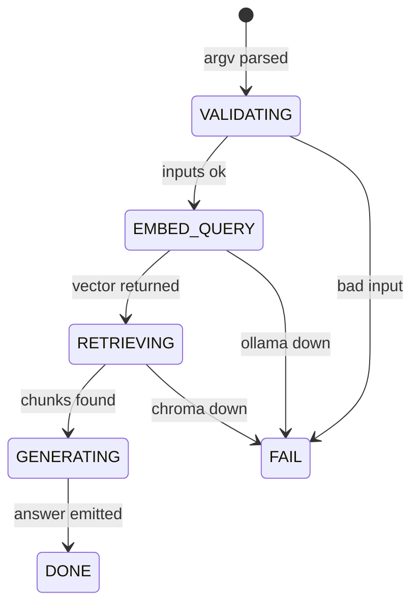

# cli-rag — System Goal & Scope

Local retrieval-augmented generation over indexed chunks using Ollama chat models. Answers MUST cite contributing notes by `relative_path`.

# Components & Interfaces

| Name | Input | Output | Error codes | Idempotent |
|------|-------|--------|-------------|------------|
| RAGService | natural language question, top_k | answer text + sources | QUERY_EMPTY | semantic repeat differs |
| VectorStore query | embedding vector | top_k chunks | CHROMA_ERROR | yes |
| OllamaClient chat | prompt | completion | OLLAMA_UNAVAILABLE | no |

# Data Flow & State Machine

# Events & Triggers

| Event | Trigger | System reaction |
|-------|---------|-----------------|
| ASK | CLI `ask` | embed query → retrieve → chat |
| EMPTY_CORPUS | zero chunks | exit 1 with guidance |

# Config & Env Vars

| Key | Type | Default | Required | Description |
|-----|------|---------|----------|-------------|
| ollama.base_url | string | http://127.0.0.1:11434 | no | Chat + embeddings base |
| ollama.embed_model | string | bge-m3 | no | Query embedding model |
| ollama.chat_model | string | gemma2:2b | no | Chat model tag (user pulls actual) |
| rag.top_k | number | 5 | no | Retrieved chunks |
| rag.max_context_chars | number | 6000 | no | Prompt budget |
| rag.retrieve_mode | string | wiki_first | no | One of wiki_first, sources_only, merged |
| chroma.collection_sources | string | joplin_sources_mvp | no | Query target for source layer |
| chroma.collection_wiki | string | joplin_wiki_mvp | no | Query target for wiki layer |

# Acceptance Tests

1. SCN-RAG-01: After indexing fixtures, run `pnpm exec joplin-brain ask --config fixtures/minimal.config.yaml "What is in note A?"`. Expect stdout contains SOURCES section listing a valid `relative_path` present on disk.
2. SCN-OFFLINE-01: With external network disabled but localhost Ollama up, command succeeds.
3. SCN-RAG-WIKI-FIRST: With dual-layer fixtures and `rag.retrieve_mode: wiki_first`, ask a question answered only in wiki compiled page; expect SOURCES JSON includes a path under `wiki_root`.

# Risks & Assumptions

- Chat stochasticity: acceptance focuses on citations, not literal wording.

## ADDED Requirements

### Requirement: REQ-LOCAL-RAG Local inference only

The system SHALL send chat and embedding requests only to `ollama.base_url`.

The system SHALL NOT call cloud LLM APIs in MVP.

#### Scenario: SCN-LOCAL-RAG-01 No third-party hosts

- **WHEN** `ask` executes successfully
- **THEN** all HTTP requests target only the configured `ollama.base_url` host

### Requirement: REQ-RAG-001 Retrieval uses indexed vectors

The system SHALL embed the user question with `ollama.embed_model`.

The system SHALL query Chroma for `rag.top_k` nearest chunks.

#### Scenario: SCN-RAG-RETR Top_k respected

- **WHEN** configuration sets `rag.top_k` to 3 and corpus has ≥5 chunks
- **THEN** at most 3 distinct chunks feed the prompt construction step

##### Example: bounded chunks

| rag.top_k | Max chunks in prompt |
|-----------|----------------------|
| 3 | 3 |
| 5 | 5 |

### Requirement: REQ-RAG-002 Grounded answer with citations

The system SHALL call Ollama chat (`POST /api/chat` preferred; `/api/generate` allowed if documented) using a prompt that includes retrieved chunk texts.

The system SHALL emit a machine-parseable SOURCES block on stdout containing JSON array of objects with key `relative_path` referencing contributing notes.

#### Scenario: SCN-RAG-01 Citations required

- **WHEN** `pnpm exec joplin-brain ask` runs against indexed fixtures
- **THEN** stdout includes SOURCES JSON listing at least one existing `relative_path`

### Requirement: REQ-RAG-003 Failure modes

The system SHALL exit 1 when the question string is empty after trimming.

The system SHALL exit 2 when Ollama chat or embeddings fail after retries.

The system SHALL exit 1 when retrieval returns zero chunks.

#### Scenario: SCN-RAG-FAIL Empty question

- **WHEN** user passes an empty question argument
- **THEN** CLI exits 1 and stderr explains empty query

### Requirement: REQ-RAG-004 Performance targets

The system SHALL default `rag.top_k` to 5.

The system SHALL complete `ask` end-to-end within 120 seconds for MVP fixture corpus on a developer machine when Ollama is responsive.

#### Scenario: SCN-RAG-PERF Fixtures complete

- **WHEN** indexed fixture corpus (≤20 chunks) is queried
- **THEN** the command finishes within 120 wall-clock seconds

### Requirement: REQ-RAG-005 Offline localhost operation

The system SHALL operate without wide-area network when `ollama.base_url` is reachable on localhost and indexed data is local.

#### Scenario: SCN-OFFLINE-RAG WAN disconnected

- **WHEN** external network interfaces are disabled except loopback services
- **THEN** `ask` still returns an answer with citations for indexed content

### Requirement: REQ-RAG-006 Wiki-first retrieval

When `rag.retrieve_mode` is `wiki_first`, the system SHALL query `chroma.collection_wiki` first until `rag.top_k` chunks are collected or the collection is exhausted.

The system SHALL then query `chroma.collection_sources` for remaining slots.

#### Scenario: SCN-RAG-WIKI-FIRST Prefers wiki chunks

- **WHEN** both collections contain relevant chunks and mode is `wiki_first`
- **THEN** at least one chunk in the prompt has metadata `layer=wiki` when wiki collection returned hits for the query

### Requirement: REQ-RAG-007 Sources-only and merged modes

When `rag.retrieve_mode` is `sources_only`, the system SHALL query only `chroma.collection_sources`.

When `rag.retrieve_mode` is `merged`, the system SHALL build the prompt from the union of hits ranked by similarity score with deduplication key `(layer,relative_path,chunk_index)`.

#### Scenario: SCN-RAG-SOURCES-ONLY No wiki chunks

- **WHEN** mode is `sources_only`
- **THEN** no chunk with metadata `layer=wiki` enters the prompt
