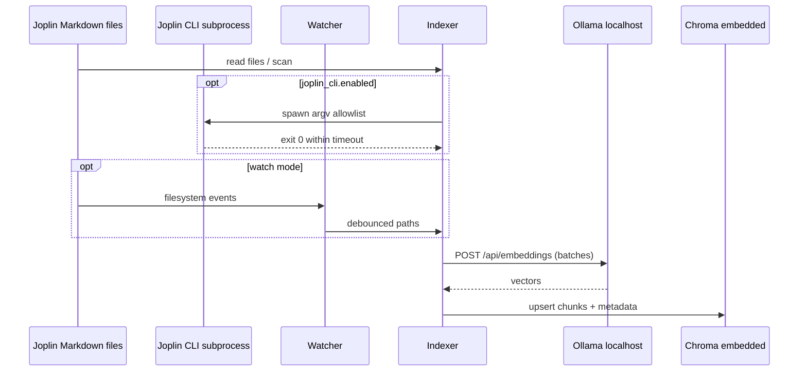
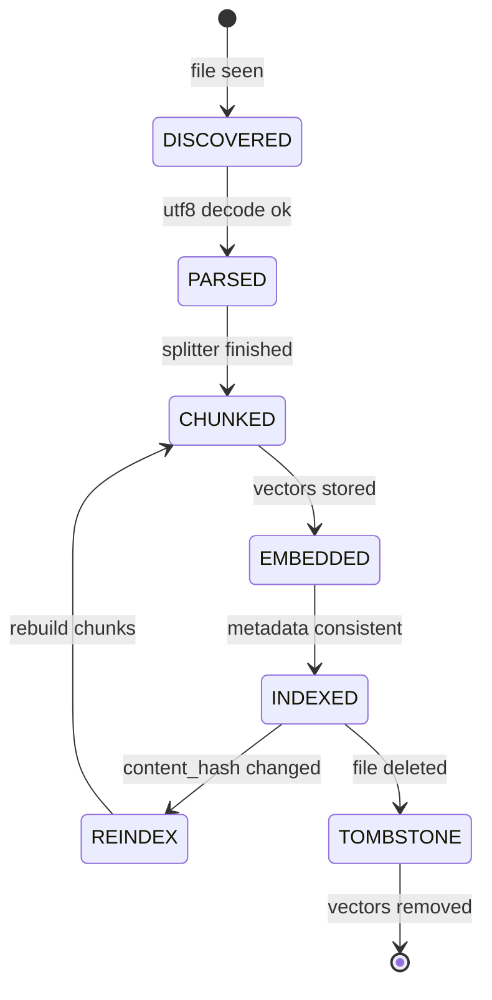

# note-indexing — System Goal & Scope

Batch and incremental indexing of read-only Joplin Markdown files into a local Chroma vector store using local Ollama embeddings. Scope covers discovery, chunking, embedding, persistence, optional filesystem watch, and idempotent updates.

# Components & Interfaces

| Name | Input | Output | Error codes | Idempotent |
|------|-------|--------|-------------|------------|
| JoplinCliRunner | enabled flag, closed argv allowlist, timeout | exit code, stdout/stderr | JOPLIN_CLI_FAILED | yes |
| Watcher | notes_root glob, debounce | file change events | WATCH_ROOT_MISSING | yes (events coalesced) |
| Indexer | NoteFile list or single path | chunk records + embeddings scheduled | NOTE_UNREADABLE | yes per content_hash |
| OllamaClient | text batch | embedding vectors | OLLAMA_UNAVAILABLE | retry then fail |
| VectorStore | upsert/delete ops | persisted vectors | CHROMA_ERROR | upsert by idempotent ids |

# Data Flow & State Machine

# Events & Triggers

| Event | Trigger | System reaction |
|-------|---------|-----------------|
| NOTE_UPSERT | index CLI or watch debounce | Parse→chunk→embed→upsert |
| NOTE_DELETE | file missing after prior index | Mark TOMBSTONE, delete vectors |
| CONFIG_RELOAD | process restart | Full scan rules re-evaluated |

# Config & Env Vars

| Key | Type | Default | Required | Description |
|-----|------|---------|----------|-------------|
| notes_root | string | — | yes | Absolute path to Joplin markdown root |
| notes_glob | string | **/*.md | no | Glob relative to notes_root |
| ollama.base_url | string | http://127.0.0.1:11434 | no | HTTP base for Ollama only |
| ollama.embed_model | string | bge-m3 | no | Embeddings model tag |
| ollama.timeout_ms | number | 120000 | no | HTTP timeout |
| ollama.embed_batch_size | number | 16 | no | Texts per request batch |
| chroma.persist_path | string | data/chroma | no | Relative to repo cwd |
| chroma.collection_sources | string | joplin_sources_mvp | no | Collection for notes_root chunks |
| chroma.collection_wiki | string | joplin_wiki_mvp | no | Collection for wiki_root chunks |
| wiki_root | string | — | no | Compiled wiki root; empty disables wiki indexing |
| wiki.glob | string | **/*.md | no | Glob relative to wiki_root |
| write_back.sources_enabled | boolean | false | no | When false, indexer SHALL NOT write under notes_root |
| chunk.size_chars | number | 1200 | no | Chunk size |
| chunk.overlap_chars | number | 200 | no | Overlap |
| watch.enabled | boolean | false | no | Start watcher |
| watch.debounce_ms | number | 2000 | no | Event debounce |
| joplin_cli.enabled | boolean | false | no | Run optional official CLI preflight |
| joplin_cli.command | string | joplin | no | Executable name resolved via PATH |
| joplin_cli.preflight_argv | array of string | ["config", "version"] | no | Closed argv appended after command (read-only probe) |
| joplin_cli.timeout_ms | number | 30000 | no | Subprocess wall-clock limit |

# Acceptance Tests

1. SCN-IDX-01: Prepare fixtures under tmp notes_root with 3 markdown files. Run `pnpm exec joplin-brain index --config fixtures/minimal.config.yaml`. Expect stdout summary with indexed_files=3 and Chroma collection count ≥ 3 chunks total.
2. SCN-IDX-02: After initial index, append one paragraph to a single file, wait `watch.debounce_ms + 5s`, with watch mode enabled expect REINDEX reflected by updated `content_hash` metadata on affected chunks within 60 seconds.
3. SCN-OFFLINE-01: With only localhost reachable, disconnect external interfaces, rerun index; expect success path except documented hard failures.
4. SCN-JOP-CLI-01: With `joplin_cli.enabled: true` and a fake `joplin` script that exits non-zero, expect `pnpm exec joplin-brain index` to exit 1 and stderr JSON key `JOPLIN_CLI_FAILED`.
5. SCN-IDX-DUAL: Given configured `wiki_root` with at least one md and sources fixtures, run index; expect chunk counts &gt; 0 in both `chroma.collection_sources` and `chroma.collection_wiki`.

# Risks & Assumptions

- Assumes <10k notes; operators MUST tune `ollama.embed_batch_size` and scan-related settings when corpus grows beyond MVP sizing documented in README.
- Race between Joplin sync and indexer mitigated by mtime and content_hash.
- When `joplin_cli.enabled` is true, operators MUST ensure the spawned `joplin` matches the same logical profile as the Markdown tree under `notes_root`.

## ADDED Requirements

### Requirement: REQ-LOCAL-IDX Network and storage locality for indexing

The system SHALL persist vectors only under `chroma.persist_path` inside the repository working directory and SHALL NOT connect to remote vector databases in MVP.

The system SHALL only perform outbound HTTP to `ollama.base_url` for embeddings during indexing.

#### Scenario: SCN-LOCAL-IDX-01 Embeddings stay local

- **WHEN** indexing runs with valid configuration
- **THEN** no network endpoints other than `ollama.base_url` are contacted and vectors are stored on local disk under `chroma.persist_path`

### Requirement: REQ-IDX-001 Read-only Markdown discovery

The system SHALL discover Markdown files matching `notes_glob` under `notes_root` without modifying file contents.

#### Scenario: SCN-IDX-01 Discover fixtures

- **WHEN** `pnpm exec joplin-brain index` executes with a config pointing at a fixtures directory containing three `.md` files
- **THEN** all three files are parsed and at least one chunk per file is embedded unless a file is explicitly skipped with logged reason

##### Example: three fixed files

| File | Expected minimum chunks |
|------|-------------------------|
| a.md | 1 |
| b.md | 1 |
| c.md | 1 |

### Requirement: REQ-IDX-002 Chunking and content-hash idempotency

The system SHALL split note text into chunks using `chunk.size_chars` and `chunk.overlap_chars`.

The system SHALL compute `content_hash` per chunk and SHALL skip Ollama embedding when chunk hash is unchanged.

#### Scenario: SCN-IDX-IDEMP Unchanged note skips embed

- **WHEN** index runs twice without editing any note
- **THEN** the second run performs zero additional embedding HTTP calls for unchanged chunks

##### Example: repeated dry runs

| Run | Expected embedding HTTP calls added for unchanged corpus |
|-----|----------------------------------------------------------|
| first | > 0 |
| second | 0 |

### Requirement: REQ-IDX-003 Ollama embedding failure semantics

The system SHALL call Ollama `POST /api/embeddings` with batches limited by `ollama.embed_batch_size`.

The system SHALL retry transient failures up to 3 times with exponential backoff and SHALL exit with code 2 on terminal failure.

#### Scenario: SCN-IDX-OFFLINE Ollama down

- **WHEN** Ollama is unreachable at `ollama.base_url`
- **THEN** the CLI exits with code 2 and emits an error object mentioning `OLLAMA_UNAVAILABLE`

### Requirement: REQ-IDX-004 Chroma persistence contract

The system SHALL use Chroma embedded PersistentClient (or equivalent) with `persist_path` resolving to `chroma.persist_path`.

The system SHALL upsert source chunks into collection `chroma.collection_sources` and wiki chunks into `chroma.collection_wiki`.

The system SHALL upsert chunk records with metadata keys `note_id`, `relative_path`, `title`, `mtime_ms`, `content_hash`, `chunk_index`, `layer` where `layer` is `source` or `wiki`.

#### Scenario: SCN-IDX-CHROMA Restart persistence

- **WHEN** index completes and the process restarts
- **THEN** querying the collection without re-embedding unchanged notes still returns prior vectors

##### Example: collection continuity

| Step | Expected chunk count for unchanged corpus |
|------|---------------------------------------------|
| after first index | N |
| after restart + second index | N (no duplicate vectors for same logical chunks) |

### Requirement: REQ-IDX-005 State machine for lifecycle

The system SHALL track per-note states DISCOVERED→PARSED→CHUNKED→EMBEDDED→INDEXED.

The system SHALL transition to REINDEX when file `mtime_ms` or `content_hash` changes.

The system SHALL transition to TOMBSTONE when a previously indexed file disappears and SHALL delete associated vectors.

#### Scenario: SCN-IDX-TOMB Deleted note removes vectors

- **WHEN** an indexed markdown file is deleted and index runs
- **THEN** no vectors remain whose metadata `relative_path` matches the deleted file

### Requirement: REQ-IDX-006 Watch-driven incremental indexing latency

The system SHALL debounce filesystem events using `watch.debounce_ms`.

The system SHALL complete embedding and upsert for a changed note within 60 seconds after the debounced event under MVP fixture load on a developer machine.

#### Scenario: SCN-IDX-02 Watch settles within SLA

- **WHEN** a single note is edited once and watch mode is enabled
- **THEN** updated chunks are visible in Chroma within 60 seconds after the debounced event completes

### Requirement: REQ-IDX-007 Unreadable and skipped notes

The system SHALL skip notes that cannot be decoded as UTF-8 or are explicitly encrypted without readable plaintext.

The system SHALL record skipped paths with reasons in stderr summary JSON field `skipped_notes`.

#### Scenario: SCN-IDX-SKIP Binary file renamed to md

- **WHEN** a file matches glob but fails UTF-8 decoding
- **THEN** indexing continues for other files and the failing path appears in `skipped_notes`

### Requirement: REQ-IDX-008 Dual-layer indexing

When `wiki_root` is non-empty and points to an existing directory, the system SHALL index Markdown under `wiki_root` using `wiki.glob` into `chroma.collection_wiki` with metadata `layer=wiki`.

When `wiki_root` is empty or missing, the system SHALL skip wiki indexing without error.

#### Scenario: SCN-IDX-DUAL Both layers indexed

- **WHEN** configuration sets valid `notes_root` and `wiki_root` each containing at least one markdown file
- **THEN** after `pnpm exec joplin-brain index`, both collections contain at least one chunk

### Requirement: REQ-JOP-CLI-001 Optional official Joplin CLI preflight

When `joplin_cli.enabled` is false, the system SHALL NOT spawn `joplin_cli.command`.

When `joplin_cli.enabled` is true, before reading Markdown for `index` or `watch`, the system SHALL spawn exactly one subprocess whose argv is `joplin_cli.command` followed by every token in `joplin_cli.preflight_argv` in order.

The system SHALL enforce `joplin_cli.timeout_ms` wall-clock limit and SHALL terminate the subprocess on timeout.

The system SHALL treat non-zero exit codes or spawn failures as fatal with exit code 1 and SHALL emit stderr JSON containing `"error":"JOPLIN_CLI_FAILED"`.

#### Scenario: SCN-JOP-CLI-01 Preflight failure surfaces

- **WHEN** `joplin_cli.enabled` is true and the `joplin` executable exits with code 1
- **THEN** `pnpm exec joplin-brain index` exits with code 1 and stderr includes `JOPLIN_CLI_FAILED`

### Requirement: REQ-JOP-CLI-002 CLI must not supply corpus bytes

The system SHALL NOT pass Markdown bodies from `notes_root` through the Joplin CLI subprocess.

The system SHALL NOT use Joplin CLI output as the embedding source of truth; corpus bytes SHALL always come from filesystem reads under `notes_root`.

#### Scenario: SCN-JOP-CLI-02 Filesystem remains source

- **WHEN** indexing runs with `joplin_cli.enabled` true and fixtures on disk
- **THEN** indexed chunk text is derived only from files under `notes_root` regardless of CLI stdout content
