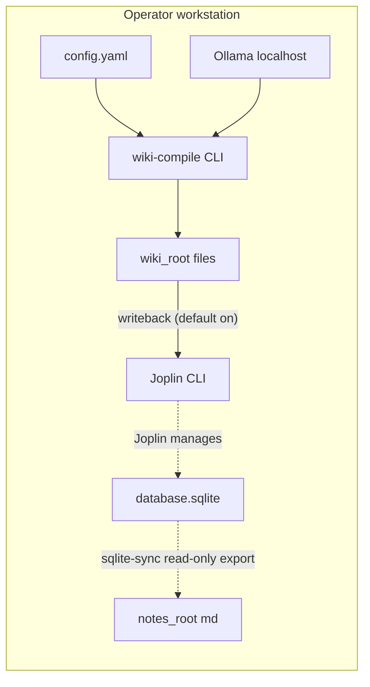

## Context

joplin-brain 已有 `wiki-compile` 將 LLM 產物寫入 `wiki_root`，以及 `sqlite-sync` 從 Joplin Desktop `database.sqlite` **唯讀**匯出至 `notes_root`。使用者需要的是**可選、預設開啟的闭合**：在 wiki 編譯成功後，將本輪產出之頁面**透過 Joplin 官方終端機 CLI** 寫入 **專用 Joplin 筆記本樹**（預設頂層名稱 `note-wiki`，下轄依 **主題／領域**分櫃之子筆記本），以 **note 標題 upsert** 建立或更新正文，讓 Desktop／行動客戶端以分層方式瀏覽「編譯知識庫」，**不**在應用程式內直接對 SQLite 做 `UPDATE`。另需將 `wiki_root` 的範例設定與 `notes_root` 一樣預設為倉庫根相對路徑並視為不進版控產物。

**讀取／匯出能否改為全面改用 Joplin CLI？** 技術上可用 CLI 逐筆讀取筆記內容，但大量匯出（鏡像整庫至 `notes_root`）會變成大量子行程與序列化，**效能與可靠性**通常不如現有 **better-sqlite3 唯讀**路徑；且 CLI 輸出格式與目前匯出器假設需重新對齊。**結論：本 change 不將 `joplin_sqlite_sync` 改為 CLI 實作**；若未來要取代，應另開 change 並定義效能目標與相容矩陣。

## 系統預備條件（操作者環境）

- **Joplin Desktop**：操作者應安裝，用於**讀取／瀏覽完整筆記庫**（同步、搜尋、手動編輯）；README 須說明其與 **`joplin_sqlite_sync` 所讀 `database.sqlite`**、**`joplin_cli` 寫回**共用同一 **Joplin Profile** 之前提，避免匯出路徑與寫回目標不一致。
- **Joplin 終端機 CLI**：操作者應另外安裝；**寫回專用**——在 `wiki-compile` 成功後對 **`note-wiki`（可配置）筆記本樹**做 upsert，將 LLM 編譯 Wiki 落到 Joplin，供 Desktop／行動版與管線並用。

## Goals / Non-Goals

**Goals:**

- **預設開啟**的 `joplin_wiki_writeback`（仍以 `enabled: false` 可完全關閉）；在 `wiki-compile` **成功完成檔案寫入階段後**呼叫 **Joplin CLI 子行程**完成寫回。
- 筆記本樹：解析／建立頂層筆記本 `parent_notebook_title`（預設 `note-wiki`）；依 frontmatter 鍵 `topic_frontmatter_key`（預設 `domain`）解析／建立**子筆記本**；於各子筆記本內對 **note 標題**（預設 frontmatter `title`，否則檔名去 `.md`）做 **create-or-update body**。
- `wiki-compile --dry-run` 時不得執行任何**會變更 Joplin 資料**的 CLI 呼叫（見 Decisions）。
- `config.yaml.example` 預設 `wiki_root: ./wiki_root` 並註解與 `.gitignore` 中 `wiki_root/` 條目對齊；README 並列說明；**預設開啟寫回**時須一併示例或註解 **`joplin_cli.enabled: true`** 之前提，否則 load-config 將 `CONFIG_INVALID`。

**Non-Goals:**

- 不因 `wiki_root` 檔案刪除而同步刪除 Joplin 列；不處理附件遷移。
- 不解密 E2EE；不可讀列必須跳過並計入摘要。
- 不在同一時間與 `sqlite-sync` 對同一 Joplin Profile 做競態操作（匯出仍可能短暫開唯讀 DB；寫回走 CLI，仍建議序列化與離峰）。

- **不**將 `joplin_sqlite_sync` 的唯讀 SQLite 匯出改為 CLI 逐筆匯出（非本 change 範圍）。

## Architecture Overview（本機邊界）



- **Local-First**：寫回僅透過本機 **Joplin CLI** 與其設定之 Profile；不新增雲端依賴。
- **分離**：`notes_root` 檔案預設仍不由 wiki-compile 修改（`write_back.sources_enabled` 語意不變）。

## Module Layout（文字樹）

```text
src/
  commands/
    cmd-wiki-compile.js       ← 編排：compile 成功後呼叫 writeback（可選）
  config/
    load-config.js           ← 解析／驗證 joplin_wiki_writeback
  joplin/
    cli-runner.js            ← 延伸：除 preflight 外，封裝「寫回 body」spawn／逾時／重試
    wiki-writeback.js        ← 新增：筆記本樹解析／建立、標題 upsert、組 argv、呼叫 runner、摘要（路徑名稱可由實作微調）
config.yaml.example          ← wiki_root 預設 ./wiki_root + 新區塊範例
README.md
test/
  joplin-wiki-writeback.test.js  ← 新增：mock spawn、映射、dry-run
.gitignore                   ← 已含 wiki_root/ 則只驗證文件
package.json
pnpm-lock.yaml
```

## Decisions

### Decision: 寫回觸發點綁定 `wiki-compile` 成功結束後

- **作法**：在 `cmd-wiki-compile` 於非 dry-run 且 compile 成功後，若 `joplin_wiki_writeback.enabled` 為 true，呼叫 `wiki-writeback` 模組。
- **替代方案**：獨立子命令 `wiki-writeback` — 較不利「編譯完即寫回」的一次性操作敘述，故作為後續可選延伸，不納入 MVP 必做路径。

### Decision: 設定區塊命名 `joplin_wiki_writeback`

- **欄位**：
  - `enabled` boolean，**預設 true**（與「預設開啟寫回」產品決策一致；本機無 Joplin CLI 或未啟用 `joplin_cli` 之專案須顯式 `enabled: false`，否則 `CONFIG_INVALID`）
  - `parent_notebook_title` string，預設 `note-wiki`
  - `topic_frontmatter_key` string，預設 `domain`
  - `note_title_key` string，預設 `title`
  - `max_cli_attempts` integer，預設 3（每個 **邏輯 CLI 動作**可重試次數，不含 preflight）
- **聯動**：當 `enabled` 為 true 時，`joplin_cli.enabled` **必須**為 true，且 `joplin_cli.command` 可執行；否則 `CONFIG_INVALID`。寫回 spawn 逾時沿用 `joplin_cli.timeout_ms`（實作在 tasks 固定唯一來源）。
- **移除**：寫回不再要求 `database_path`／`busy_timeout_ms`／`max_write_attempts`（該等鍵僅屬 `joplin_sqlite_sync` 匯出語意）。

### Decision: 以 Joplin 終端機 CLI 寫回（取代應用程式內 RW SQLite）

- **作法**：對每個待寫回 wiki 檔，將去 frontmatter 後正文寫入暫存檔（UTF-8），再依序 **spawn** `joplin_cli.command` 完成：**解析或建立**頂層筆記本 → **解析或建立**主題子筆記本 → **列出子筆記本內 notes 以比對標題**或 **建立新 note** → **套用 body**（精確子命令與參數順序在 Implementation Contract 表格鎖定，並與 Joplin 終端機文件對齊）。
- **理由**：繞過應用程式直接 `UPDATE` SQLite；由 Joplin 引擎處理階層與欄位較符合「官方路徑」。
- **逾時／重試**：單次 spawn 逾時使用 `joplin_cli.timeout_ms`；非零 exit 或逾時依 `max_cli_attempts` 重试；仍失敗則依 spec 判斷整命令失敗或 skippable。
- **preflight**：寫回批次開始前呼叫現有 `runJoplinCliPreflight(cfg)`。

### Decision: 主題筆記本標題正規化

- 讀取本次 compile **實際寫入或更新**之 wiki 檔（若難取得精確集合，實作可折衷為「本輪 planner 命中的相對 path 清單」— 必須在 Implementation Contract 與 tasks 對齊可驗證行為）。
- 解析 YAML frontmatter；自 `topic_frontmatter_key` 讀取字串；缺漏或非字串 → 主題固定為 `_uncategorized`。
- **正規化**：`trim`；Unicode NFC；拒絕或替換字元 `\`、`/`、路徑分隔符與控制字元（實作以單一替換策略文件化，例如改 `_`）；長度上限 **128** 字碼單位，超出則截斷並於摘要記錄 `TOPIC_TRUNCATED`。
- Wiki 檔**傳給 Joplin 的正文**為移除 YAML frontmatter 區塊後的剩餘 Markdown；不得把 wiki frontmatter 鍵寫入 body。

### Decision: 同一批次內重複（主題, 標題）

- 若兩個 wiki 檔解析後得到相同 **（正規化主題, note 標題）**，**後處理者覆寫前者**（併入同一 `would_write`／統計計數規則於實作註解）；寫回摘要 SHALL 帶 `writeback_collision_count` 或等價鍵以利觀測（鍵名以實作選定並於 README 列舉）。

### Decision: fatal vs skip（ROW-ELIGIBILITY 實作參考）

| 結果 | MVP 行為 |
| ---- | -------- |
| Joplin CLI 明確「找不到父／子筆記本」且非 dry-run | 應先走建立路徑；若建立仍失敗 → **整命令失敗** |
| 同一 note 標題存在多筆衝突且 CLI 無法唯一定位 | **整命令失敗**（`JOPLIN_CLI_WRITE_FAILED`） |
| 單一檔案 body 寫入在重試耗盡後仍失敗 | **整命令失敗**（MVP） |
| preflight 失敗 | **整命令失敗** |

### Decision: `--dry-run` 與寫回

- **作法**：當 `wiki-compile --dry-run` 時，**不 spawn** 任何會變更 Joplin 資料的 CLI  argv；stdout 的 JSON summary 僅包含 `would_write` 統計。
- **理由**：與 REQ-WI-002「演練模式不改狀態」一致。

### Decision: 與 `sqlite-sync` 的執行隔離

- **作法**：文件建議勿與 `sqlite-sync` **同一短窗**對同一 Profile heavy 競争；寫回走 CLI、匯出走唯讀 SQL，仍可能爭用 Joplin 內部鎖，故以**序列化批次**與離峰為預設建議。
- **理由**：降低雙管線同時觸發之不確定性。

## Implementation Contract

**行為（操作者可見）**

- 當 `joplin_wiki_writeback.enabled` 為 false：`wiki-compile` 行為與現版一致；不發起寫回用 Joplin CLI。
- 當為 true（含**預設**）且非 `--dry-run`，且 wiki 編譯成功：對本輪待寫回 wiki 頁，依 **`<parent_notebook_title> / <normalized topic> / <note title>`** 透過 Joplin CLI 做 **筆記本與 note 之 upsert**（正文為去 frontmatter 後 Markdown）；stdout 追加或合併**單一機讀摘要**（固定鍵名於實作註解），含 `writeback_written`, `writeback_skipped`, `writeback_notebooks_created`, `writeback_collisions` 或等價鍵與理由代碼。
- `--dry-run`：不 spawn 變更型 Joplin CLI；summary 可得 `would_write`、**`would_create_notebooks`** 等計數。

**Joplin CLI argv 契約（鎖定流程，參數細節須與官方終端機文件一致）**

| 步驟 | 行為 | 備註 |
| ---- | ---- | ---- |
| A | `runJoplinCliPreflight(cfg)` | 沿用既有 preflight_argv |
| B | 解析頂層筆記本 id：list／find `parent_notebook_title` | 不存在則 `mkbook`（非 dry-run） |
| C | 對每個正規化主題：解析子筆記本 id（相對於父） | 不存在則建立子筆記本／子資料夾（非 dry-run） |
| D | 對每個 wiki 檔：於子筆記本下列出 notes 或使用 `mknote` 建立 | 以**標題**唯一比對；多筆同名 → fatal（見 Decisions 表） |
| E | 建立暫存 `.md` 寫入去 frontmatter 後正文；spawn 將 body 套用至目標 note id | 路徑禁止含未轉義換行；檔名含隨機避免碰撞 |
| F | 每步驟等待 exit 0；非 0 依 `max_cli_attempts` 重試 | 逾時使用 `joplin_cli.timeout_ms` |

**介面／資料形狀**

- `load-config` 回傳 `joplin_wiki_writeback: { enabled, parent_notebook_title, topic_frontmatter_key, note_title_key, max_cli_attempts }` 與既有 `joplin_cli` 區塊；啟用寫回且 `!joplin_cli.enabled` → `CONFIG_INVALID`。
- 寫回模組函式簽名：`cfg`, `wikiPathsTouched`, `dryRun`，回傳 summary plain object。

**失敗模式**

- 設定無效：`CONFIG_INVALID`。
- preflight / spawn 失敗：優先使用既有 **`JOPLIN_CLI_FAILED`**；若需區分寫回階段，可另拋 **`JOPLIN_CLI_WRITE_FAILED`**（單行 stderr JSON），exit code **1**。
- 單一檔案 upsert 在耗盡重試後仍失敗：整命令失敗（MVP）。

**驗收（審查／測試）**

- 單元測試以 **mock `child_process.spawn`** 斷言 argv／環境／逾時；dry-run 斷言零 mutating spawn；至少覆蓋「父不存在→mkbook」「子不存在→建子」「標題命中→僅 set body」三種序列片段。
- 可選：整合測在具 Joplin CLI 的開發機上手動驗證 `note-wiki` 下一筆 upsert。

**範圍邊界**

- 可建立／更新 **Joplin 筆記本與 note**；**不**刪除 note；不修改 `notes_root` 檔案；**不**保證與 `source_refs`／原件 note id 對齊。

## API / CLI Contract

- **joplin-brain**：維持 `pnpm exec joplin-brain wiki-compile --config <path> [--dry-run]`；writeback 跟隨設定。
- **Joplin app**：由操作者安裝；與 `joplin_cli.command` 一致。
- **Exit codes**：寫回失敗預設退出碼 **1**，stderr 單行 JSON，`error` 鍵為 `JOPLIN_CLI_FAILED` 或 `JOPLIN_CLI_WRITE_FAILED`（與 `src/cli.js` 映射一致）。

## Security & Privacy

- 暫存 body 檔應寫入作業系統暫存目錄並於成功或失敗後刪除；權限遵循本機使用者。
- README 提醒備份 Joplin Profile；**預設開啟**寫回可覆寫 **`note-wiki` 樹下同名 note** 之 body（含客戶端手編內容）。

## Observability

- 每輪 writeback 產生可機讀 JSON 摘要鍵：`writeback_written`, `writeback_skipped`, `writeback_errors`（名稱以實作為準，须文件化）。

## Migration / Phase

- **Phase 1（本 change）**：`note-wiki` 筆記本樹 + 主題子筆記本 + 標題 upsert + dry-run 閉鎖 + 範例設定（寫回預設開啟）。
- **Phase 2（非本 change）**：墓碑同步（wiki 刪除↔Joplin 刪除）、附件、由 `source_refs` 回填原件連結。

## Traceability

| Spec REQ | Design 小節 |
| -------- | ----------- |
| REQ-JWKB-*（joplin-wiki-writeback） | Decisions、Implementation Contract |
| REQ-JWKB-README-PREREQUISITES | 系統預備條件（操作者環境） |
| REQ-WI-00x（wiki-ingest 延伸） | Decision 寫回觸發點、CLI Contract |
| REQ-WIKI-00x（compiled-wiki 延伸） | Goals wiki_root 範例、可選 frontmatter `domain` 說明 |

## Risks / Trade-offs

- **覆寫 `note-wiki` 樹下同名 note**、**誤建大量空筆記本** → **預設開啟**須搭配 README 警語、`--dry-run`、明確 `enabled: false` rollback；主題鍵預設 `domain` 鼓勵在 wiki frontmatter 顯式分類。
- **Joplin CLI 版本／子命令漂移** → argv 契約對照官方文件並於 README 標示最低支援版本；測試以 mock 鎖定呼叫型樣。
- **Desktop 與 CLI 併寫競態** → 文件建議離峰／關閉 Desktop；逾時與重試上限。

## Open Questions

- **已結案（本 change）**：寫回批次使用的 wiki **相對路徑清單**與 `wiki-compile` 非 dry-run 寫檔清單一致，來源為 **本輪 planner 產生的 `paths`**（套用 `wiki_ingest.max_pages_per_run` 截斷後、實際寫入 `wiki_root` 的同一有序陣列）。實作見 `src/wiki/wiki-compiler.js` 註解；**不**另做 fs mtime 差分。測試以 `SCN-JWKB-*` / `SCN-WI-WB-*` 驗證行為。

## Migration Plan

1. 釋出文件：如何備份 DB、如何關閉 writeback。
2. rollback：還原設定 `enabled: false`，無需資料庫遷移。
