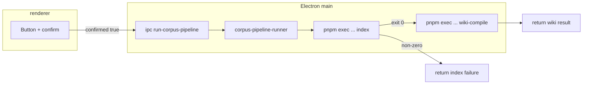

## Context

Health GUI 已透過 IPC 提供 `check-health`、`save-config-fields`、`run-stack-script`、`start-local-dependency`；`wiki-compile` 與 `index` 仍以 CLI 與排程為主。初次安裝或資料就緒後，操作者需要與文件一致的「先全庫索引、再編譯 wiki」管線，但不必離開 GUI 手動組裝終端機指令。本設計在 **Electron main** 內以可測試之 spawn 助手執行兩段子程序，renderer 僅傳遞固定形狀之 payload。

## Goals / Non-Goals

**Goals:**

- 與 `pnpm exec joplin-llm-wiki` 相同子命令語意：`index` 成功完成後再執行 `wiki-compile`，共用同一絕對 `configPath`。
- 強制確認旗標、main-only spawn、可觀察之 exit code 與有界 stdout／stderr tail（與 stack 腳本 runner 類似之緩衝策略）。
- 單飛：若管線已在執行，後續 IPC 回傳結構化「忙碌」碼而非再 spawn。

**Non-Goals:**

- 不實作即時百分比進度解析；不於此變更改寫 indexer／wiki-compiler 內部。
- 不觸發 `sqlite-sync`、`watch` 或 `lint`。
- 不要求 Electron main 使用 `process.execPath` 直跑 `bin/joplin-llm-wiki.js`（Electron 之 execPath 並非 Node）；改採與既有 Chroma 啟動一致、已為操作者依賴之 **pnpm exec** 路徑。

## Architecture Overview（Local-First Constraints）

- **本機邊界**：子程序僅存取設定檔已定義之路徑與本機 Ollama／Chroma；GUI 不新增對外 listener。
- **與 cli-rag／note-indexing 關係**：語意上等僄於操作者在 repo root 連續執行兩次 CLI；不求行數級 stdout 一致，但 argv 與工作目錄契約須可測試。

## Local-First Constraints

- 僅呼叫本機 `pnpm` 已解析之套件 bin；`config` 路徑為絕對路徑字串，不由 renderer 拼接相對片段。
- 日誌 tail 僅供本機操作者除錯；預設不寫入專案外路徑。

## Component Diagram

| 元件 | 職責 |
|------|------|
| `corpus-pipeline-runner.js`（新建） | 驗證 `confirmed === true`、單飛、依序 spawn 兩階段、彙整 tail 與 exit code |
| `main.js` | 註冊 `ipcMain.handle("run-corpus-pipeline", …)` |
| `preload.cjs` | 暴露 `runCorpusPipeline(payload)` |
| `renderer` | 按鈕、確認對話、顯示結果文字／JSON |

## Module Layout（文字樹）

- `src/health-gui/corpus/corpus-pipeline-runner.js` — 管線 spawn 邏輯（新建路徑；若實作時目錄命名微調，tasks 以模組匯出符號為準）
- `src/health-gui/main.js` — IPC 註冊
- `src/health-gui/preload.cjs` — bridge
- `src/health-gui/renderer/index.html` — 按鈕與顯示區
- `src/health-gui/renderer/app.js` — 事件繫結與確認對話
- `test/health-gui/corpus-pipeline-runner.test.js` — mock spawn 斷言 argv／cwd／順序

## Decisions

### Decision: 使用 pnpm exec 叫用 joplin-llm-wiki 子命令

**理由**：專案已假設操作者具 pnpm；`dependency-starter` 已以 `pnpm` 啟動 Chroma，環境一致。直接 `node bin/joplin-llm-wiki.js` 在 Electron main 若誤用 `process.execPath` 會踩到 Electron 非 Node 的問題。

**替代方案**：`ELECTRON_RUN_AS_NODE=1` 搭配 Electron 執行檔（較難向操作者解釋）；硬編譯系統 `node` 路徑（跨機不佳）。

### Decision: 兩階段序向執行且 index 非零則跳過 wiki-compile

**理由**：避免在索引失敗時仍消耗 wiki planner／LLM 呼叫，並與操作者心智「先能搜再編譯」一致。

**替代方案**：始終執行 wiki-compile（會製造噪音與 CONFIG／schema 錯誤堆疊）。

### Decision: 單飛鎖於 runner 模組

**理由**：長時程嵌入可能拖畫；並行兩套管線容易造成 Chroma／Ollama 資源互損。

**替代方案**：無鎖（拒絕；易誤觸）。

### Decision: 每階段 stdout／stderr 緩衝上限比照 stack runner（約 64KiB 滑動視窗，回傳 tail 512）

**理由**：與既有 `stack-script-runner` 行为一致，避免 main 記憶體膨脹。

## API / CLI Contract

**新 IPC（main handle 名稱）**：`run-corpus-pipeline`

**Payload（JSON 可序列化）**：

- `confirmed`：**必須**為嚴格布林 `true` 才啟動；否則回傳 `ok: false`、`code: "CONFIRMATION_REQUIRED"`（與 `run-stack-script` 對齊）。

**成功／失敗回傳形狀（概念性；implementer 以 TypeScript typedef 或 JSDoc 對齊）**：

- `ok: true` 僅當 **index 與 wiki-compile 皆以 exit code 0 結束**。
- `ok: false` 時帶 `code`：`CONFIRMATION_REQUIRED` | `PIPELINE_IN_FLIGHT` | `SPAWN_ERROR` | `INDEX_FAILED` | `WIKI_COMPILE_FAILED` 之一（必要時擴充，但須更新 spec）。
- 每階段含 `exitCode: number | null`、`stdoutTail`、`stderrTail`（字串；tail 長度與 stack runner 一致）。

**子程序 argv 契約**（每階段皆相同 cwd）：

- Phase A：`pnpm`，參數：`exec`, `joplin-llm-wiki`, `index`, `--config`, `<configAbs>`
- Phase B：`pnpm`，參數：`exec`, `joplin-llm-wiki`, `wiki-compile`, `--config`, `<configAbs>`

其中 `<configAbs>` 為 `path.resolve` 後之 Health GUI 啟動組態路徑；cwd 為 `path.resolve(repoRoot)`，與 `runStackScript` 一致。

## Data Model

無新增持久化結構；僅 IPC 回傳物件與 UI 字串狀態。

## Error Handling

- spawn 層級錯誤：`SPAWN_ERROR`，附訊息 tail。
- index 非零退出：不啟動 wiki-compile，回傳 `INDEX_FAILED` 與 index 段 tail。
- wiki-compile 非零退出：`WIKI_COMPILE_FAILED`。
- 管線進行中重入：`PIPELINE_IN_FLIGHT`，**不**中止既有子程序。

## Security & Privacy

- Renderer 不得傳入 shell 字串或自訂 argv；main 忽略未知欄位。
- 子程序環境繼承 `process.env`（與 stack runner），不注入遠端代理變數。

## Observability

- UI 顯示兩階段 exit code 與 tail；除錯與終端機手動執行對照。

## Migration / Phase

1. 實作 runner 與測試。
2. 接上 IPC 與 GUI。
3. 手動驗收：於本機 Chroma／Ollama 就緒時跑通一輪；故意使 index 失敗確認第二階段未啟動。

## Implementation Contract

**可觀察行為**

- 操作者在 renderer 於確認對話後觸發管線，僅 main spawn；未確認則無子程序。
- 執行順序：`index` 完成且 exit code 0 後才執行 `wiki-compile`；否則不執行 `wiki-compile`。
- 並行第二次觸發於執行中回傳 `PIPELINE_IN_FLIGHT`，且不啟動額外子程序。

**介面**

- IPC 名稱：`run-corpus-pipeline`；payload 至少含 `confirmed` 布林。
- 回傳必含兩階段各自之 `exitCode`（未完成之階段可为 `null`）與 tail 字串欄位，供 GUI 顯示。

**失敗語意**

- `confirmed !== true` → `CONFIRMATION_REQUIRED`。
- spawn 失敗 → `SPAWN_ERROR`。
- index 非零 → `INDEX_FAILED`；wiki-compile 非零 → `WIKI_COMPILE_FAILED`。

**驗收**

- `test/health-gui/corpus-pipeline-runner.test.js`（或等價路徑）mock spawn：斷言 cwd、Phase A／B argv、index 失敗時 Phase B 未呼叫、確認缺失時零 spawn。
- `pnpm test` 全綠。
- 手動：GUI 按鈕結果與連續 CLI 執行結果一致（成功／失敗類型）。

**範圍**

- **In scope**：Health GUI IPC、runner、preload、renderer 控制項與測試。
- **Out of scope**：修改 `cmd-index.js`／`wiki-compiler.js` 演算法、`sqlite-sync`、排程、結構化進度條。

## Risks / Trade-offs

- **[長時間阻擋]** → IPC Promise 會至整段管線結束才 resolve；避免 renderer 以為凍結，需在呼叫前於 UI 標示執行中且按鈕 disable（design 交付 tasks）。
- **[pnpm 缺失]** → spawn 錯誤；與既有依賴啟動相同，接受 `SPAWN_ERROR`。
- **[寫回風險]** → 確認文案須提示 `wiki-compile` 可能觸發 Joplin CLI 寫回（當設定啟用且非 dry-run）。

## REQ Traceability

| Spec REQ | 設計要點 |
|----------|-----------|
| REQ-HGUI-CORPUS-PIPELINE | IPC 名稱、payload、序向 spawn argv、單飛 |
| （各 Scenario） | 見 delta spec；測試檔對應 proposal Success Criteria 編號 |

## Open Questions

- （無）若未來需 dry-run 模式，可另開 change 在 payload 增 `dryRun` 並約束 argv。
