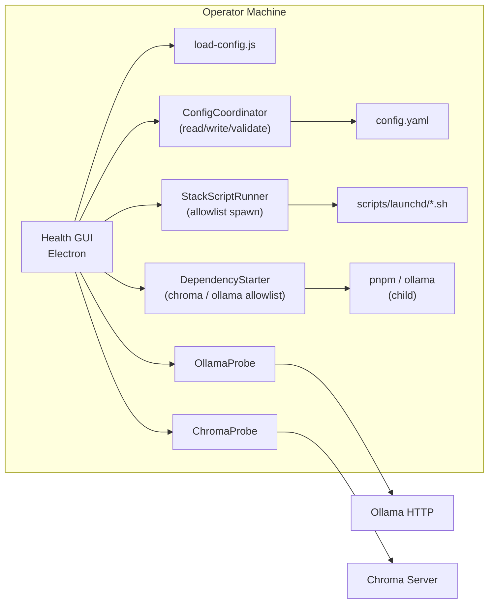

## Context

`joplin-brain` 管線依賴本機 **Ollama**（HTTP）與本機 **Chroma 伺服器**（`chromadb` JS 客戶端連線至預設 `127.0.0.1:8000`，資料目錄由 `pnpm exec chroma run --path <chroma.persist_path>` 提供）。repo 已交付 **`scripts/launchd/`** 之 install／uninstall shell 與 plist 範本（見 `scripts/launchd/README.md`）。操作員除了健康檢查外，尚需**調整 `config.yaml`**、**一鍵執行 stack 安裝／解除**，以及在日常除錯時**無須開終端機即可嘗試啟動**與 wrapper **同源**之本機 Chroma／Ollama 伺服器並讀取**連線狀態**。本設計將 Health GUI 擴充為：**設定編輯 + 依賴檢查 + 允許清單內 stack 腳本編排 + 允許清單內依賴啟動**，仍不將索引／RAG／Lint 全流程搬進 renderer。

## Architecture Overview

**Health GUI**（Electron）分四個協作區塊：（1）**HealthSnapshot** — 沿用 `loadConfig` + Ollama／Chroma 探測；（2）**ConfigCoordinator** — 讀寫 `config.yaml`，儲存前以 **`loadConfig` 成功**為闸門；（3）**StackScriptRunner** — 僅於 main 行程以 **允許清單** `spawn` repo 根目錄下之 `scripts/launchd/install-joplin-brain-stack.sh` 與 `scripts/launchd/uninstall-joplin-brain-stack.sh`；（4）**DependencyStarter**（名稱可於實作調整）— 僅於 main 以 **第二套允許清單**啟動與 `run-chroma.sh`／`run-ollama.sh` **同源 argv 語意**之本機 **Chroma**／**Ollama serve** 長駐子行程（**detached**，見決策），路徑由 `path.join(repoRoot, …)` 與 `loadConfig` 解析結果組出，禁止使用者注入任意 shell。

Jarvis／Joplin 仍負責編輯器與同步；CLI 仍為索引／RAG／Lint 主入口。

## Local-First Constraints

- 對外 HTTP 僅健康檢查指向之 **`ollama.base_url`** 與 Chroma 端點；無 SaaS。
- GUI **不得**預設綁定 `0.0.0.0`；資產載入優先 `file://`／`loadFile`。
- Stack 腳本僅影響使用者本機 LaunchAgents，**不**透過 GUI 刪除 `data/chroma/` 或 `notes_root` 內容（與現有 uninstall 腳本語意對齊）。
- Renderer **無** `child_process`、**無**任意 shell。

## Component Diagram



## Module Layout

```
src/health-gui/
  main.js
  preload.js
  config/
    config-coordinator.js   # 讀取文字／結構、暫存驗證、原子寫入
  stack/
    stack-script-runner.js   # allowlist + spawn + 輸出聚合
  deps/
    dependency-starter.js    # allowlist：pnpm chroma run / ollama serve；detached spawn
  probes/
    ollama-probe.js
    chroma-probe.js
    fs-hints.js
  renderer/
    index.html
    app.js                   # 健康／設定／日誌／確認對話
bin/joplin-brain-health-gui.js
scripts/launchd/
  install-joplin-brain-stack.sh
  uninstall-joplin-brain-stack.sh
package.json
pnpm-lock.yaml
README.md
docs/macos-launchd-stack.md
```

## Goals / Non-Goals

**Goals:**

- 健康檢查、設定儲存驗證、install／uninstall stack 一鍵執行與輸出可閱讀。
- **依賴啟動**：在確認對話後，以 allowlist 於背景啟動 Chroma／Ollama（不自動 stop）。
- **連線狀態**： renderer 依最近一次 `check-health` 之 `reachable` 呈現 Ollama／Chroma 是否已連線（與探測一致）。
- 所有衍生行程僅 main + 允許清單。

**Non-Goals:**

- YAML 註解／鍵排序完整保留（MVP 可接受 stringify；須文件警告）。
- GUI 內建全文索引進度儀表。
- 替 Ollama Desktop 或 Chroma 安裝程式。
- **自 GUI 遠端停止／kill** 已啟動之 Ollama 或 Chroma（MVP；操作員於系統層處置）。

## Decisions

### 決策：桌面載體採 Electron（主行程跑 Node 探測）

（沿用）理由：重用 `load-config.js`、`chromadb`、`child_process`。

### 決策：Ollama 探測使用 GET `/api/tags`，逾時上限獨立於管線但仍受設定啟發

（沿用）作法：`min(5000, cfg.ollama.timeout_ms)`。

### 決策：Chroma 探測重用 ChromaStore 與預設 host／port

（沿用）。

### 決策：啟動契約新增 bin/joplin-brain-health-gui.js，參數 --config 必填

（沿用）。

### 決策：安全性預設 — contextIsolation 為 true、禁用 nodeIntegration、preload 白名單 IPC

（沿用）；**新增** IPC 頻道：`save-config`、`read-config`、`run-stack-script`、**`start-local-dependency`**（皆經 main 驗證參數型別與 allowlist）。

### 決策：本機依賴一鍵啟動採獨立 allowlist（Chroma `pnpm exec chroma run`／Ollama `serve`）

**理由**：與 stack 腳本生命週期分離；語意對齊既有 `scripts/launchd/run-chroma.sh`、`run-ollama.sh`，但不強制經 bash wrapper 檔，以降低注入面。**作法**：main 依 `loadConfig(configPath)` 取得 **`chroma.persist_path` 絕對值**；`host`／`port` 使用 `process.env.CHROMA_HOST ?? '127.0.0.1'`、`Number(process.env.CHROMA_PORT ?? 8000)`（與 `ChromaProbe` 一致）；於 **repository root** `cwd` 下組固定 argv：`pnpm exec chroma run --path <persistAbs> --host <host> --port <port>`（Chroma）；`ollama serve`（Ollama，依 PATH 解析可執行檔）。**二者皆**使用 **`spawn(..., { detached: true, stdio: 'ignore' })`**（或等效），使伺服器在 GUI 關閉後仍可存續；GUI **不重定向 stdout／stderr**（與 stack 日誌區分），操作員改依 README／終端機／launchd 日誌除錯。**Alternatives**：綁定 GUI 生命週期非 detached — 與「工具視窗關閉後仍常駐」操作員預期衝突。

### 決策：啟動前若探測已連線則拒絕 spawn

**理由**：避免重複占用埠與難以理解的雙重行程。**作法**：在 `confirmed === true` 且 allowlist 通過後，main **同步／await** 呼叫現有 **probe 函式**（與 `HealthSnapshot` 相同設定）若對應 `reachable === true`，回傳結構化錯誤 **`ALREADY_RUNNING`**（不 spawn）。**Race**：極短時間窗內另一行程搶占埠 — UI 提示刷新後再試。

### 決策：DependencyStarter 單次飛行 per kind

**理由**：避免連點造成多重 spawn。**作法**：與 `check-health` 刷新類比，`start-local-dependency` 對 `chroma-server` 與 `ollama-serve` **各自**單次飛行（overlap 時回傳 `skipped` 或同等語意）。

### 決策：IPC `start-local-dependency` 列入 preload 白名單

**理由**：renderer 需觸發但不得持有 `child_process`。**作法**：payload `{ kind: 'chroma-server' | 'ollama-serve', confirmed: boolean }`；僅當 `confirmed === true` 時 spawn（與 stack 一致誠實模型）。

### 決策：設定儲存以「loadConfig 驗證闸門」為唯一真理

**理由**：與 CLI 100% 同源規則。**作法**：使用者按下儲存 → main 將草稿寫入 `*.tmp.yaml`（同目錄）→ `loadConfig(tmpPath)` 成功 → `rename` 覆蓋原檔；失敗則不覆蓋並回傳錯誤給 renderer。

### 決策：Stack 僅封裝既有 install／uninstall 腳本

**理由**：不重複 launchd 邏輯、與 `openspec/specs/macos-launchd-stack` 文件一致。**作法**：`repoRoot` 由 `path.resolve(__dirname, '../../..')` 或自 `package.json` 向上尋找鎖定；spawn `bash` + 腳本絕對路徑；固定 argv（必要時僅傳專案根），禁止拼接使用者自由文字。

## Implementation Contract

**健康檢查（沿用）**

- IPC `check-health`：`{ configPath }` → `HealthSnapshot`（見前版）；刷新單次飛行。

**設定（新增）**

- IPC `read-config`：`{ configPath }` → `{ ok: true, yamlText: string }` 或 `{ ok: false, code: 'CONFIG_INVALID', message }`。
- IPC `save-config`：`{ configPath, yamlText: string }` → main 寫暫存、`loadConfig(tmp)`，成功則原子替換；回傳 `{ ok: true }` 或 `{ ok: false, code, message }`。
- **表單 MVP**：renderer 可將若干欄位序列化為 YAML 字串（至少涵蓋 proposal 所列鍵）；進階鍵若未於表單露出，從 `read-config` 讀入之原文合并策略须在 `config-coordinator.js` 註明：**MVP 簡化**為「表單編輯鍵 + 其餘鍵自前一版 parsed doc merge 再 stringify」— 實作須在 tasks 細化为具體演算法並附單元測試。

**Stack（新增）**

- IPC `run-stack-script`：`{ kind: 'install-stack' | 'uninstall-stack', confirmed: true }` → main **首先**檢查 `confirmed === true`，否則立即拒絕且不 spawn；通過後映射到固定腳本絕對路徑並 `spawn`；回傳 `{ exitCode, stdoutTail, stderrTail }`（尾端長度對齊 specs 之 512 字元）。
- **確認**：renderer 僅在使用者於 modal 按下確認後，將 `confirmed: true` 一併送出（renderer 誠實模型；另以防呆防止誤觸）。
- **逾時**：腳本執行可設定軟逾時警告（例如 120s）但不強殺，除非使用者按「中止」（另開 IPC cancel，optional Phase 2 — MVP 可僅允許關閉視窗）。

**本機依賴啟動（新增）**

- IPC `start-local-dependency`：`{ kind: 'chroma-server' | 'ollama-serve', confirmed: true }` → main **首先**檢查 `confirmed === true`，否則立即拒絕且不 spawn；通過後 **await 對應 probe**，若 `reachable === true` 則回傳 **`code: 'ALREADY_RUNNING'`**（不 spawn）。
- 通過 probe 闸門後：`chroma-server` **SHALL** `spawn('pnpm', ['exec', 'chroma', 'run', '--path', persistAbs, '--host', host, '--port', String(port)], { cwd: repoRoot, detached: true, stdio: 'ignore' })`（若平台需 `shell: true` 則於 tasks 明示並維持 argv 不注入使用者字串）；`ollama-serve` **SHALL** `spawn('ollama', ['serve'], { cwd: repoRoot, detached: true, stdio: 'ignore' })`（`ollama` 由 PATH 解析）。
- 成功 spawn 時回傳 `{ ok: true, pid: number }`（或同等結構）；spawn 同步錯誤回傳 `{ ok: false, code: 'SPAWN_ERROR', message }`。單次飛行重叠時回傳 `{ skipped: true }`（或同等）。
- **Renderer**：健康區 **SHALL** 依最近一次成功 `check-health` 之 `ollama.reachable`／`chroma.reachable` 顯示「已連線／未連線」（或同等繁中語意，與 JSON 一致）。

**範圍邊界**

- **In scope**：上述 IPC、兩類 allowlist spawn（stack + dependency）、設定闸門、README／docs 交叉連結、連線狀態標示。
- **Out of scope**：自動偵測並 kill 使用者其他 Ollama 行程、非 macOS 平台之 systemd 安裝、**收集 detached 子行程之 stdout／stderr 於 GUI**（MVP）。

## API/CLI Contract

| 項目 | 說明 |
|------|------|
| 啟動 | `node bin/joplin-brain-health-gui.js --config <path>` |
| 退出碼 | `0` 關閉；`1` 參數錯誤 |
| joplin-brain CLI | 仍無強制子命令變更 |

## Data Model

- `HealthSnapshot`（沿用）。
- `StackRunHandle`：進程 pid、累積輸出環形緩衝（上限例如 32KiB／頻道）。

## Error Handling

- 設定：`loadConfig` 錯誤原文不可曝 secrets；截斷過長路徑展示。
- Stack：非零退出碼標紅；spawn ENOENT 明示「找不到 bash／腳本」。
- **Dependency**：`ALREADY_RUNNING` 以文案提示刷新；`SPAWN_ERROR` 不泄漏 PATH 上敏感 token。

## Security & Privacy

- Allowlist 外路徑拒絕。
- 日誌區不得自動上傳。
- `notes_root` 路徑可在 UI 顯示但不掃描檔案內容。

## Observability

- main `console.error` 記錄 spawn 異常。
- GUI 日誌區保留最近一次 stack 執行輸出。
- **Dependency**：detached 啟動不重定向輸出 → README 載明除錯須依終端機／launchd 日誌／Activity Monitor。

## Migration/Phase

**Phase 1**：表單 MVP + install／uninstall + 健康檢查。

**Phase 2（optional）**：進階 YAML 原始碼編輯器、合并保留註解之外部函式庫評估。

## REQ Traceability

| REQ ID | 設計對應 |
|--------|-----------|
| REQ-HGUI-LOCALBOUND | Local-First、BrowserWindow |
| REQ-HGUI-CONFIG | loadConfig 展示一致 |
| REQ-HGUI-CONFIG-EDIT | ConfigCoordinator、save IPC |
| REQ-HGUI-STACK-LIFECYCLE | StackScriptRunner |
| REQ-HGUI-OLLAMA | ollama-probe |
| REQ-HGUI-CHROMA | chroma-probe |
| REQ-HGUI-UX | refresh、日誌區 |
| REQ-HGUI-OBS | fs-hints |
| REQ-HGUI-NOTESROOT | 顯示路徑 |
| REQ-HGUI-DEP-START | DependencyStarter、`start-local-dependency` IPC |
| REQ-HGUI-DEP-STATUS | renderer 連線狀態標示 |

## Risks / Trade-offs

- **Detached 子行程**：GUI 關閉後行程仍存續 → 文件載明；操作員需自行管理生命週期。
- **YAML 格式化**：可能與使用者手排格式不同 → README 警告 + 備份。
- **表單／全文合并複雜度**：實作與測試须在 tasks 列細。

## Migration Plan

1. 實作 IPC 與 runner。
2. 更新 README：`docs/macos-launchd-stack.md` 加入「亦可用 GUI」一句；補充 **依賴一鍵啟動**（detached、`ALREADY_RUNNING`、不重定向輸出）。
3. `pnpm test` 全綠。

## Open Questions

- Windows／Linux 是否在後續 change 提供對等非 launchd stack UI。
