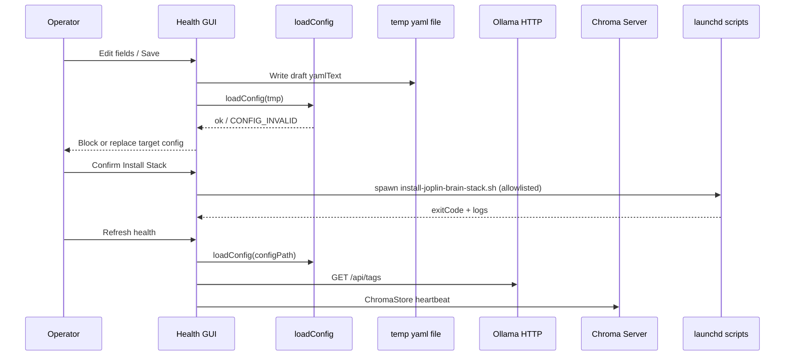
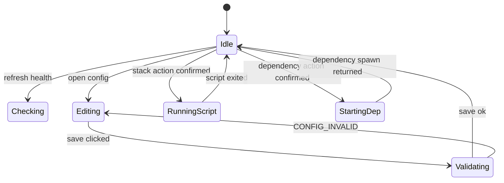

# local-runtime-health-gui Specification

## Purpose

Provide a **local-only graphical operator console** that verifies **Ollama** and **Chroma** prerequisites for `joplin-brain`, **edits `config.yaml` with the same validation semantics as `loadConfig`**, **runs allowlisted `scripts/launchd/` install/uninstall helpers** with explicit confirmation and visible logs, and **starts allowlisted local Chroma and Ollama server processes** from the Electron main process—while **surfacing reachability-based running indicators** for both dependencies — without moving indexing, RAG, or lint pipelines into the renderer.

## System Goal & Scope

The Health GUI SHALL help an operator (1) determine **Ollama** reachability and configured model presence, (2) determine **Chroma server** reachability aligned with `ChromaStore`, (3) **read and save** `config.yaml` such that saved files pass `loadConfig`, (4) **spawn only** the shipped **`scripts/launchd/install-joplin-brain-stack.sh`** and **`scripts/launchd/uninstall-joplin-brain-stack.sh`** from the repository root with captured stdout/stderr and exposed exit codes, and (5) **spawn only allowlisted local dependency starters** for **Chroma** and **Ollama** as specified in this document, after confirmation and probe gates.

## Components & Interfaces

| Name | Inputs | Outputs | Errors | Idempotent |
|------|--------|---------|--------|------------|
| IPC `check-health` | `{ configPath: string }` | `HealthSnapshot` | `CONFIG_INVALID` skips probes | Yes |
| IPC `read-config` | `{ configPath: string }` | YAML text or error | read failure / invalid encodings | Yes |
| IPC `save-config` | `{ configPath: string, yamlText: string }` | ok / structured error | `CONFIG_INVALID` on validation failure | Yes (overwrite same path) |
| IPC `run-stack-script` | `{ kind: 'install-stack' \| 'uninstall-stack', confirmed: boolean }` | exitCode + output tails | spawn failures; rejection when `confirmed` is not boolean `true` | No |
| IPC `start-local-dependency` | `{ kind: 'chroma-server' \| 'ollama-serve', confirmed: boolean }` | ok + pid or structured error | `CONFIG_INVALID` skips; `ALREADY_RUNNING`; `confirmed` gate | No |
| `loadConfig` | path string | `AppConfig` | `CONFIG_INVALID` | Yes |
| `OllamaProbe` | `base_url`, timeout budget | tags-derived status | encoded in snapshot | Yes |
| `ChromaProbe` | persist path + env host/port | heartbeat status | encoded in snapshot | Yes |

## Data Flow & State Machine

## Events & Triggers

| Event | Trigger | System response |
|-------|---------|-------------------|
| Save config | Operator confirms save | Validate via temp `loadConfig`; atomic replace or reject |
| Install stack | Operator confirms + IPC | Spawn install script from repo root |
| Uninstall stack | Operator confirms + IPC | Spawn uninstall script |
| Start Chroma server | Operator confirms + IPC | Probe gate then allowlisted spawn |
| Start Ollama serve | Operator confirms + IPC | Probe gate then allowlisted spawn |
| Health refresh | Operator clicks refresh | Run probes single-flight |

## Config & Env Vars

| Key | Type | Default | Required | Notes |
|-----|------|---------|----------|-------|
| `ollama.base_url` | string | `http://127.0.0.1:11434` | Yes | Editable in GUI MVP |
| `ollama.embed_model` | string | `bge-m3` | Yes | Editable |
| `ollama.chat_model` | string | `gemma2:2b` | Yes | Editable |
| `chroma.persist_path` | string | `data/chroma` | Yes | Editable |
| `notes_root` | string | required | Yes | Editable |
| `ollama.timeout_ms` | number | `120000` | Yes | Editable optional in MVP if exposed |
| `CHROMA_HOST` / `CHROMA_PORT` | env | `127.0.0.1` / `8000` | No | Display in GUI |

## ADDED Requirements

### Requirement: REQ-HGUI-DEP-STATUS Surface dependency reachability as operator-visible connection status

After each completed successful health rebuild (`check-health` returning `ok: true` on the snapshot), the system SHALL render operator-visible status text for **Ollama** and **Chroma** that distinguishes **reachable** versus **not reachable** using `HealthSnapshot.ollama.reachable` and `HealthSnapshot.chroma.reachable` respectively. The displayed labels SHALL remain consistent with those boolean fields until the next completed refresh replaces the snapshot.

#### Scenario: SCN-HGUI-DEP-STATUS labels track reachable flags

- **WHEN** the latest health snapshot has `ollama.reachable: true` and `chroma.reachable: false`
- **THEN** the GUI shows Ollama as reachable (connected) and Chroma as not reachable (not connected), using the project's localized strings

##### Example: Operator-visible pairing

| Field values | Expected minimum UI semantics |
|--------------|----------------------------------|
| `ollama.reachable=true`, `chroma.reachable=false` | Ollama shown as connected; Chroma shown as not connected |
| `ollama.reachable=false`, `chroma.reachable=true` | Ollama shown as not connected; Chroma shown as connected |

### Requirement: REQ-HGUI-DEP-START Allowlisted local dependency starters

The system SHALL expose `start-local-dependency` handled only in the Electron **main** process. The renderer SHALL NOT execute shell commands.

The IPC payload SHALL include `kind` equal to exactly `chroma-server` or `ollama-serve` and SHALL include `confirmed` as boolean `true` when the operator accepted a confirmation modal for that specific `kind`. The main process SHALL reject the request without spawning when `confirmed` is not boolean `true`.

Before spawning, the main process SHALL compute reachability for the requested dependency using the **same configuration path and probe semantics** as `check-health` (including `loadConfig` success). If the dependency is already reachable (`reachable: true` for that subsystem), the main process SHALL NOT spawn and SHALL return a structured error with code **`ALREADY_RUNNING`**.

For `kind: chroma-server`, the main process SHALL spawn **`pnpm`** with fixed arguments **`exec`, `chroma`, `run`, `--path`, `<persistPathAbsolute>`, `--host`, `<host>`, `--port`, `<port>`** where `<persistPathAbsolute>` is `AppConfig.chroma.persist_path` after `loadConfig`, and `<host>` / `<port>` match the Chroma probe defaults (`process.env.CHROMA_HOST ?? '127.0.0.1'`, `Number(process.env.CHROMA_PORT ?? 8000)`). The child process working directory SHALL be the repository root detected by the Health GUI.

For `kind: ollama-serve`, the main process SHALL spawn **`ollama`** with fixed arguments **`serve`**. The child process working directory SHALL be the repository root detected by the Health GUI.

Both starters SHALL use a **detached** spawn configuration so closing the GUI does not terminate the servers by default. Standard output and standard error SHALL NOT be required to be captured into the GUI logs in MVP.

The system SHALL enforce **single-flight** per `kind` for `start-local-dependency`: overlapping requests SHALL not spawn a second concurrent child for the same `kind` while the prior spawn handshake is still in progress.

#### Scenario: SCN-HGUI-DEP-01 Main rejects missing confirmation

- **WHEN** main receives `start-local-dependency` with `kind: chroma-server` and `confirmed` omitted or set to `false`
- **THEN** main returns an error response without spawning any child process

#### Scenario: SCN-HGUI-DEP-02 Main rejects when already reachable

- **WHEN** main receives `start-local-dependency` with `kind: chroma-server`, `confirmed: true`, and the Chroma probe reports `reachable: true`
- **THEN** main returns `ALREADY_RUNNING` without spawning

#### Scenario: SCN-HGUI-DEP-03 Chroma starter uses configured persist path

- **WHEN** `loadConfig` resolves `chroma.persist_path` to an absolute path `/tmp/fixture-chroma` and `CHROMA_HOST`/`CHROMA_PORT` are unset
- **THEN** the spawned argv includes `--path`, `/tmp/fixture-chroma`, `--host`, `127.0.0.1`, `--port`, `8000` in that fixed arrangement (verified by unit tests with a mocked `spawn`)

### Requirement: REQ-HGUI-LOCALBOUND Local-first GUI exposure

The system SHALL NOT bind any HTTP listener to `0.0.0.0` as part of the MVP Health GUI. If the implementation starts an HTTP server for assets, it SHALL bind to `127.0.0.1` only and SHALL document the port in `README.md`.

#### Scenario: SCN-HGUI-05 Default packaging uses file loading or loopback-only server

- **WHEN** the operator launches the MVP Health GUI using the documented command
- **THEN** no service listens on `0.0.0.0` for the GUI transport (either no listener exists or only `127.0.0.1` is bound)

### Requirement: REQ-HGUI-CONFIG Shared configuration semantics

The system SHALL call `loadConfig` from `src/config/load-config.js` with the operator-supplied `--config` path before running probes. The rendered `ollama.base_url`, `ollama.embed_model`, `ollama.chat_model`, and resolved `chroma.persist_path` SHALL match the returned `AppConfig` object fields after each successful reload.

#### Scenario: SCN-HGUI-04 Same values as CLI config load

- **WHEN** a valid `config.yaml` is supplied
- **THEN** the GUI displays `base_url` and `persist_path` strings identical to `AppConfig.ollama.base_url` and `AppConfig.chroma.persist_path`

### Requirement: REQ-HGUI-CONFIG-EDIT Validated configuration persistence

The system SHALL implement `save-config` such that it SHALL NOT replace the target configuration file unless a temporary file containing the candidate YAML successfully loads via `loadConfig` at that temporary absolute path. On validation failure, the system SHALL leave the original configuration file unchanged and SHALL return a structured error referencing `CONFIG_INVALID` semantics.

#### Scenario: SCN-HGUI-06 Invalid YAML blocked

- **WHEN** the operator submits YAML that fails `loadConfig` validation
- **THEN** the original `config.yaml` bytes remain unchanged and the UI shows the validation error

#### Scenario: SCN-HGUI-07 Valid save loads in CLI

- **WHEN** the operator saves a valid configuration through the GUI
- **THEN** `pnpm exec joplin-brain index --config <same-path> --help` returns exit code 0 (help path) or loads config without `CONFIG_INVALID` for the next real command invocation described in acceptance tests

### Requirement: REQ-HGUI-STACK-LIFECYCLE Allowlisted LaunchAgent stack scripts

The system SHALL expose actions that map exactly to:

1. `scripts/launchd/install-joplin-brain-stack.sh`
2. `scripts/launchd/uninstall-joplin-brain-stack.sh`

resolved under the repository root. The system SHALL spawn those scripts only from the Electron **main** process using an absolute path join from the detected repo root. The system SHALL NOT accept arbitrary shell strings from the renderer.

The IPC payload for `run-stack-script` SHALL include `kind` equal to `install-stack` or `uninstall-stack` and SHALL include `confirmed` equal to boolean `true`. The main process SHALL reject the request without spawning when `confirmed` is not boolean `true`. The renderer SHALL set `confirmed` to `true` only after the operator accepts a confirmation modal for that specific `kind`.

After completion, the system SHALL display the process exit code and a bounded tail of stdout and stderr (at least the last **512** characters per stream, or the full stream text if shorter).

#### Scenario: SCN-HGUI-08 Main rejects missing confirmation flag

- **WHEN** main receives `run-stack-script` with `kind: install-stack` and `confirmed` omitted or set to `false`
- **THEN** main returns an error response without spawning any child process

#### Scenario: SCN-HGUI-09 Exit code and logs visible

- **WHEN** the install script exits with non-zero
- **THEN** the GUI shows exit code non-zero and stderr tail content is visible to the operator

### Requirement: REQ-HGUI-OLLAMA Ollama reachability and model presence

The system SHALL perform an HTTP GET to `{base_url}/api/tags` using a fetch implementation with an `AbortSignal` timeout of `min(5000, cfg.ollama.timeout_ms)` milliseconds. The system SHALL parse model names from the response body field `models[].name` when HTTP status is success. The system SHALL compute `missingModels` as the subset of `{cfg.ollama.embed_model, cfg.ollama.chat_model}` not present in the parsed name list. If the request fails, `reachable` SHALL be false and `error` SHALL contain a non-empty summary string.

#### Scenario: SCN-HGUI-01 Daemon down

- **WHEN** nothing accepts TCP connections for the configured Ollama host/port (simulated connection refusal in tests or real environment)
- **THEN** the Ollama panel shows `reachable: false` with a human-readable error summary

#### Scenario: SCN-HGUI-02 Models missing

- **WHEN** Ollama responds with HTTP 200 and a tags payload that omits `cfg.ollama.embed_model`
- **THEN** `missingModels` contains that embed model name and the UI offers copy-ready `ollama pull <name>` text for each missing model

### Requirement: REQ-HGUI-CHROMA Chroma server reachability aligned with ChromaStore

The system SHALL construct `ChromaStore` from `src/vector/chroma-store.js` using `persistPath: cfg.chroma.persist_path`, default `host` from `process.env.CHROMA_HOST ?? '127.0.0.1'`, and default `port` from `Number(process.env.CHROMA_PORT ?? 8000)`. The system SHALL call `heartbeat()` on that instance. If `heartbeat()` throws, `reachable` SHALL be false and `error` SHALL contain a non-empty summary. If `heartbeat()` succeeds, `reachable` SHALL be true.

#### Scenario: SCN-HGUI-03 Chroma server down but persist path writable

- **WHEN** `heartbeat()` fails due to network error while the persist directory parent is writable
- **THEN** the Chroma panel shows `reachable: false` AND the UI shows the documented hint containing `pnpm exec chroma run --path` followed by the resolved persist path

### Requirement: REQ-HGUI-UX Operator guidance and refresh semantics

The system SHALL provide a refresh control that triggers a full health snapshot rebuild. The system SHALL prevent overlapping refresh jobs (if a refresh is running, subsequent clicks SHALL be ignored until completion). The full refresh SHALL complete within **10 seconds** wall time unless `CONFIG_INVALID` prevents probes from starting.

#### Scenario: SCN-HGUI-UX-REFRESH single-flight

- **WHEN** the operator clicks refresh twice within 200 milliseconds while probes take longer than 200 milliseconds
- **THEN** only one concurrent probe round executes until it finishes

### Requirement: REQ-HGUI-OBS Filesystem hint for persist directory

The system SHALL check that the parent directory of `cfg.chroma.persist_path` exists and is writable using `fs.promises.access` (or equivalent). If not writable, `filesystem.persistParentWritable` SHALL be false and `filesystem.detail` SHALL contain a non-empty explanation string.

#### Scenario: SCN-HGUI-03-PERSIST Persist parent not writable

- **WHEN** the parent directory denies write access for the current OS user
- **THEN** `persistParentWritable` is false and the UI surfaces `filesystem.detail` without crashing

### Requirement: REQ-HGUI-NOTESROOT Display-only notes root context

The system SHALL display the configured `notes_root` absolute path string after successful `loadConfig`. The system SHALL NOT bulk-read Markdown files from `notes_root` during MVP health checks.

#### Scenario: SCN-HGUI-NOTESROOT path shown

- **WHEN** configuration loads successfully
- **THEN** the UI includes the `notes_root` path text exactly as resolved by `loadConfig`

## Acceptance Tests

| ID | Command / action | Expected |
|----|------------------|----------|
| AT-HGUI-01 | `pnpm test` health-gui unit tests | Mocked fetch / stub Chroma / config coordinator |
| AT-HGUI-02 | Manual: invalid YAML save | SCN-HGUI-06 |
| AT-HGUI-03 | Manual: install script invoked | SCN-HGUI-08 / 09 |
| AT-HGUI-04 | Run `loadConfig` in `test/health-gui/config-save-validation.test.js` on the path written by `save-config` | Resolves without `CONFIG_INVALID` after a valid GUI save fixture |
| AT-HGUI-05 | `pnpm test` `test/health-gui/dependency-starter.test.js` (or equivalent) | SCN-HGUI-DEP-01/02/03 plus spawn argv assertions |

## Risks & Assumptions

- **Assumption**: macOS operators using stack scripts follow `docs/macos-launchd-stack.md`.
- **Risk**: YAML round-trip loses comments — documented in proposal Non-goals.
