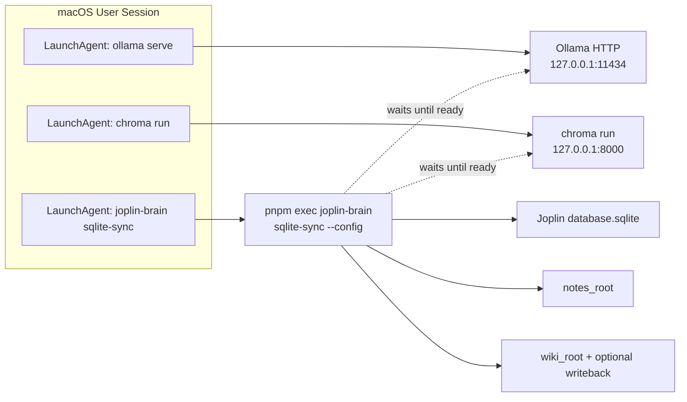

## Context

目前營運者需在終端機手動啟動 `pnpm exec chroma run`（或同等常駐）與 `pnpm exec joplin-brain sqlite-sync`，關閉視窗或登出後行程即停止；`docs/scheduling-examples.md` 僅片段提示 launchd。**Jarvis** 仍負責編輯器內即時 RAG；**joplin-brain** 負責批次匯出、索引、wiki-compile 與可選 Joplin CLI 寫回。此設計將**部署面**補齊：以 **LaunchAgent**（每使用者 GUI session）包裝長駐 `sqlite-sync`，並用文件與腳本規範 PATH、工作目錄與日誌導向。

## Goals / Non-Goals

**Goals:**

- 提供可版控之 **LaunchAgent plist 範本** 與 **安裝／卸載腳本**，使**本機 Ollama（`ollama serve`）**、**Chroma（`pnpm exec chroma run …`）**、以及 **`sqlite-sync`** 均可在登入後由 launchd 載入（可選 **KeepAlive**）；並以 **sqlite-sync wrapper** 輪詢依賴 HTTP 端點或逾時明確失敗。
- 說明與 **Joplin CLI 寫回**相容之 **EnvironmentVariables**（含 PATH 涵蓋 `joplin`、`ollama`、`pnpm`）。
- 將三支服務之 stdout／stderr 導向可讀**日誌檔**，便於比對 Ollama／Chroma 心跳與 `cmd-sqlite-sync` 之週期 JSON summary。

**Non-Goals:**

- 不由本 change **下載或打包** Ollama／Chroma 安裝包（僅假設已安裝並可從 PATH 或 plist 指定絕對路徑呼叫）。
- 不實作 Linux **systemd** 單元檔（可於 README 一行連結手動替代方案）。
- 不修改 `src/cli.js` 子命令語意；不改 `sqlite-sync` 迴圈邏輯（僅包裝啟動）。

## Architecture Overview（Local-First Constraints）

- launchd **只**執行本機已安裝之 `ollama`、`pnpm`／`node`、專案內 `pnpm exec chroma` / `joplin-brain`；不引入對外公開之**新** listening 服務 beyond 本機 loopback 上既有的 Ollama／Chroma 行為（與 README 一致）。
- **一鍵全堆疊**包含三支 **LaunchAgent**；啟動順序由系統並行載入，**不靠** undefined 檔名排序保證—**sqlite-sync** wrapper SHALL 以 HTTP 就緒檢查處理競態。

## Component Diagram



## Module Layout（交付物目錄）

相對於專案根目錄之預期樹狀結構（實作階段建立）：

```
docs/
  macos-launchd-stack.md
scripts/
  launchd/
    install-joplin-brain-stack.sh
    uninstall-joplin-brain-stack.sh
    run-ollama.sh
    run-chroma.sh
    run-sqlite-sync.sh
    com.joplin-brain.ollama.plist.example
    com.joplin-brain.chroma.plist.example
    com.joplin-brain.sqlite-sync.plist.example
```

（plist 之 `com.github.USER.*` 為範例 Bundle ID 模板；安裝腳本或文件 SHALL 說明替換為全域唯一 label。）

**既有專案樹（沿用，不變更語意）**：`src/**/*.js`、`bin/joplin-brain.js`、`package.json`、`pnpm-lock.yaml`、`config.yaml.example`、`data/chroma/`、`reports/`。

## Decisions

### Decision: 採 LaunchAgent（每使用者）而非系統層 LaunchDaemon

**理由**：`joplin-brain`、pnpm、與常見 Homebrew 路徑多綁在使用者 shell 環境；LaunchAgent 於 GUI 登入後載入，與 **~/Library/LaunchAgents** 慣例一致，較少權限坑。**Alternatives**：LaunchDaemon（需 root、PATH 更難調）— 否決，除非未來有多使用者伺服器需求。

### Decision: 以極薄 **wrapper 腳本** 作為 ProgramArguments 首個 argv，集中 export PATH

**理由**：plist 內硬編長 PATH 難維護；單一 `scripts/launchd/run-sqlite-sync.sh` 可先 `source` 使用者自選之 env 檔（例如與 repo 同層之 `.env.launchd`，**不**提交 git），再 `cd` 至 repo root 執行 `pnpm exec`。**Alternatives**：僅 plist `EnvironmentVariables`— 可並存，但腳本較利於除錯與使用者覆寫。

### Decision: sqlite-sync、Chroma、Ollama 分離為三支 LaunchAgent

**理由**：三者崩潰與 **KeepAlive** 策略不同；獨立日誌便於區分「模型伺服器」「向量伺服器」「排程管線」問題。**Alternatives**：單一 mega-wrapper 先後啟動三者—**否決**（單一長行程難獨立重啟、混合日誌）。

### Decision: sqlite-sync wrapper 內建依賴就緒等待

**理由**：launchd 不保证載入順序；在 `run-sqlite-sync.sh` 內對 `ollama.base_url` 與 Chroma host/port 做有限次輪詢（可環境變數覆寫逾時與間隔），逾時打印明確錯誤到 stderr 後**以非零退出**（讓 `launchctl`／日誌可見），避免 silent hang。**Alternatives**：僅文件請使用者手動啟動順序—與「一鍵」衝突，降為補充說明。

### Decision: 日誌寫入使用者指定之 ~/Logs 或 repo 外路徑

**理由**：避免誤將日誌 commit；**StandardOutPath**／**StandardErrorPath** 指向如 `${HOME}/Library/Logs/joplin-brain/`。**Alternatives**：寫入 repo 下 `logs/`— 須 .gitignore，可作次選在文件說明。

## Implementation Contract（交付給 apply 之可觀測契約）

**Behavior**

- 成功安裝後，登入即載入 **Ollama、Chroma、sqlite-sync** 三支 job；Ollama／Chroma 使用獨立 wrapper（`run-ollama.sh`、`run-chroma.sh`）寫入各自 StandardOutPath／StandardErrorPath。
- `sqlite-sync` 之 `run-sqlite-sync.sh` 在執行 `pnpm exec joplin-brain sqlite-sync` 前，SHALL 完成對 **Ollama HTTP** 與 **Chroma HTTP** 之就緒檢查（預設 host/port 對齊 README：`127.0.0.1:11434` 與 `127.0.0.1:8000`，得依 `.env.launchd` 覆寫），逾時則列印錯誤並**非零退出**。
- 行程標準輸出 SHALL 可被導向檔案，使營運者能觀察與既有實作一致之 JSON summary 行（每週期 `cmd-sqlite-sync` 於非 dry-run 且設間隔時之 `cycle` 物件）。

**Interface / 安裝腳本**

- `scripts/launchd/install-joplin-brain-stack.sh` SHALL 接受 `REPO_ROOT`、`CONFIG_ABSPATH`、可選 label 後綴，並將 **三份** plist 複製至 `~/Library/LaunchAgents/`，依序或以文件說明之順序呼叫 `launchctl bootstrap`（失敗則非零退出）；**uninstall** 腳本 SHALL **bootout** 並刪除**三支** plist。

**plist 契約**

- SHALL 含 **Label**（唯一）、**WorkingDirectory**（repo root）、**ProgramArguments**（wrapper 或明確之 `pnpm exec ...`）、可選 **RunAtLoad** `true`、可選 **KeepAlive** `true`、**StandardOutPath**／**StandardErrorPath**。
- SHALL NOT 內嵌任何雲端 API 金鑰；若需 PATH，以 `EnvironmentVariables` 或 wrapper 注入。

**Failure modes**

- 安裝腳本：權限不足、plist 路徑已存在、`launchctl` 拒絕— 非零退出並 stderr 說明；不預設靜默失敗。
- 執行期：Ollama／Chroma 不可用時維持既有 CLI exit code（例如 **2**）行為；launchd 可因 **KeepAlive** 重啟行程— 文件 SHALL 警告無限重啟與 log 暴長之風險。

**Acceptance criteria（實作完成時可驗證）**

- 乾淨使用者執行 install 後，`launchctl print gui/$(id -u)/` 可見**三支**相關 Label；日誌於首次週期前可見 Ollama／Chroma 啟動輸出、於首次週期後可見 `sqlite-sync` JSON summary。
- 執行 uninstall 後，該 label 不再出現於使用者 LaunchAgents 載入清單；無残留 `joplin-brain sqlite-sync` child 針對該 label（以文件步驟驗證）。

**Scope boundaries**

- **In scope**：全堆疊 shell／plist／`docs/macos-launchd-stack.md`、選擇性更新 `README.md`；含 **依賴就緒等待**之 `run-sqlite-sync.sh`。
- **Out of scope**：修改 Node 應用程式碼、新增 HTTP 服務、雲端部署、Windows 工作排程器。

## REQ Traceability

| 設計小節 | 建議 REQ ID（見 specs） |
|----------|-------------------------|
| 全堆疊三支 plist + 等待腳本 | REQ-MLS-FULL-STACK |
| 安裝／卸載腳本介面 | REQ-MLS-INSTALL-UX |
| 日誌與可觀測性 | REQ-MLS-OBSERVABILITY |
| 全本機邊界 | REQ-MLS-LOCAL-ONLY |

## API/CLI Contract（無變更）

維持既有：`joplin-brain sqlite-sync`、`index`、`watch`、`wiki-compile`、`ask`、`lint`；exit code 與 `JOPLIN_CLI_FAILED` 等與 `src/cli.js` 一致。

## Data Model（無變更）

不涉及新持久化結構；沿用 `config.yaml` 與 `joplin_sqlite_sync` 區塊。

## Error Handling

- 腳本使用 `set -euo pipefail`（或文件說明之等價嚴格模式）；失敗時退出碼非零。
- 文件列出常見錯誤：**CONFIG_INVALID**、Chroma 連線失敗、Joplin CLI 找不到、`database_path` 與實際 `database.sqlite` 不一致（含誤用非預設 Profile 路徑）。

## Security & Privacy

- plist 與腳本 SHALL NOT 印出完整 `database_path` 於世界可讀日誌若使用者未選擇；範本使用 placeholder。
- 僅本機檔案系統；無新增對外連線。

## Observability

- **StandardOutPath**／**StandardErrorPath** 必配置；建議 rotation 由使用者用 `newsyslog` 或手動截斷（文件說明，非強制實作工具）。

## Risks / Trade-offs

- **[Risk]** launchctl 子命令在不同 macOS 版本差異 → **緩解**：腳本偵測失敗時印出備援指令（bootstrap ↔ load）。
- **[Risk]** KeepAlive 導致崩潰循環 → **緩解**：文件建議先不加 KeepAlive 直至穩定；或限制 **ThrottleInterval**。
- **[Risk]** 與 Joplin Desktop 同時存取 SQLite → **緩解**：沿用既有只讀開啟與 busy_timeout；文件重申備份。

## Migration Plan

1. 使用者準備 `config.yaml`（`joplin_sqlite_sync.enabled: true`、`database_path` 指向 Desktop 之 **`database.sqlite`**—在預設 Profile 佈局下常為 **`$HOME/.config/joplin-desktop/database.sqlite`**、`schedule.every_seconds: 600`、寫回相關 `joplin_cli`）。
2. 手動確認單次 `sqlite-sync` exit 0。
3. 執行 install 腳本、檢查日誌。
4. Rollback：執行 uninstall；停止 Chroma plist 若啟用。

## Open Questions

- plist **Label** 之全域名稱由使用者自訂還是由腳本依 repo 路徑雜湊產生— 建議腳本預設 `com.joplin-brain.sqlite-sync.<簡短雜湊>` 以避免衝突，於 tasks 實作時決定。

## Migration/Phase

- Phase 1：文件 + **Ollama + Chroma + sqlite-sync** 三支 LaunchAgent 與 stack 安裝／卸載腳本。
