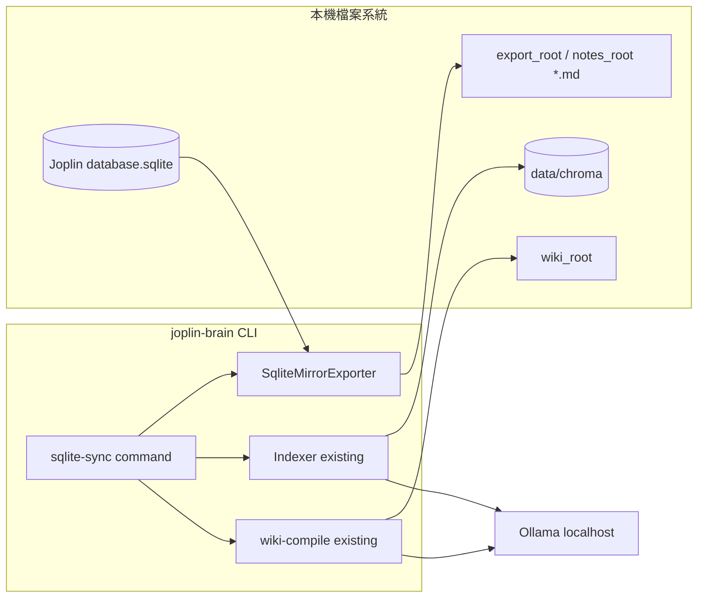

## Context

joplin-brain 現以 `notes_root` 內 Markdown 檔作為 Indexer／wiki-compile 輸入；可選的 `joplin_cli` 僅做 preflight，不負責匯出。**本倉庫慣例**：`config.yaml.example` 以 `./notes_root`（倉庫根目錄下資料夾）為預設筆記根，並以 `.gitignore` 排除該目錄，避免筆記內容進版控。使用者希望在 Joplin Desktop 未開啟或僅有資料庫檔時，仍能批次從 `database.sqlite` 匯出筆記，再銜接既有 Chroma＋Ollama 管線。本設計新增上游 **SqliteMirrorExporter** 與 CLI 子命令，維持全本機、無雲端依賴。

## Goals / Non-Goals

**Goals:**

- 以 **唯讀** 方式讀取 Joplin Desktop SQLite，將可解讀筆記匯出為 UTF-8 Markdown 檔樹。
- 支援 **單次** 執行完成「匯出 →（可選）index →（可選）wiki-compile」鏈，退出碼與既有 CLI 慣例相容。
- 支援 **可選的內建定時迴圈**（同一 Node 行程內 `setInterval`）或文件化的外部 cron／launchd 呼叫單次命令（兩者擇一或並存）。

**Non-Goals:**

- 不修改 Joplin 資料庫內容；不透過 Joplin Cloud／Server REST 拉取。
- 不實作多使用者同步、衝突合併、或即時雙向編輯。
- 不在 MVP 內保證與 Joplin Profile 內 `.md` 快取位元組級一致（僅保證由 SQLite 匯出之鏡像邏輯一致）。

## Architecture Overview（Local-First Constraints）



- **網路**：除 `ollama.base_url` 外不新增對外連線。
- **資料**：向量仍只寫入 `chroma.persist_path`；SQLite 僅讀。

## Module Layout（文字樹）

```
notes_root/                       # 預設筆記樹（gitignore，不進版控）
.gitignore                        # 含 notes_root/
src/
  cli.js                          # 註冊子命令 sqlite-sync、說明文字
  commands/
    index.js                      # switch 加上 sqlite-sync
    cmd-sqlite-sync.js            # 子命令：匯出 + 可選呼叫 runIndex / runWikiCompile
  joplin/
    cli-runner.js                 # 既有（不取代）
    sqlite/
      exporter.js                 # 開啟 DB、查詢 notes、寫入 md 檔
      joplin-schema.js            # 表／欄位名稱常數、Joplin schema 版本註記
      paths.js                    # 安全檔名、sandbox 於 export_root 之下
  config/
    load-config.js                # 新增 joplin_sqlite_sync 區塊驗證
bin/
  joplin-brain.js                 # 既有入口
package.json                      # 新增 better-sqlite3（或核准之同等唯讀方案）
pnpm-lock.yaml
config.yaml.example               # 範例欄位
data/chroma/                      # gitignore 持久化
reports/                          # gitignore
```

## Component Diagram（對齊 Scheduler／Exporter／Indexer）

| 元件 | 職責 | 輸入 | 輸出 |
|------|------|------|------|
| **SqliteMirrorExporter** | 唯讀 SQLite → Markdown 樹 | `database_path`, `export_root` | 寫入檔案、統計計數 |
| **SqliteSyncCommand** | 編排匯出與下游 | `AppConfig`, CLI flags | 行程退出碼、JSON 日誌列 |
| **Indexer（既有）** | chunk + embed | `notes_root` | Chroma upsert |
| **wiki-compile（既有）** | LLM 產 wiki | `wiki_root`, schema | wiki 檔案 |

## Decisions

### Decision: 倉庫根目錄 `notes_root` 不納入版控

- **理由**：筆記為個人資料，與 `data/`、`wiki_root/` 等同屬執行期產物或外匯入內容；預設排除可降低誤提交與憑證外洩風險。
- **契約**：`.gitignore` 列入 `notes_root/`；`config.yaml.example` 明示 `notes_root: ./notes_root`；克隆後目錄可不存在，由第一次匯出或手動 `mkdir` 建立。
- **與 sqlite-sync 關係**：Exporter 之 `export_root`／`notes_root`（MVP 路徑一致）常落於此目錄；mirror 刪除僅影響本機忽略樹，不影響 Git 工作樹。

### Decision: 採用 better-sqlite3 以 URI file 唯讀模式開啟 SQLite

- **理由**：成熟、可下推 `mode=ro`／`immutable=1`（實作細節於 apply 階段驗證），效能足夠批次讀取 notes。
- **替代方案**：`sql.js` 純 WASM（較慢、記憶體占用大）；`node:sqlite`（需 Node 22+ 且政策需與專案 LTS 對齊）。
- **後果**：原生模組需與使用者平台相容；CI 矩陣需涵蓋安裝。

### Decision: 匯出根目錄預設等於 `notes_root` 但強烈建議獨立 `export_root`

- **理由**：避免誤刪使用者於 Profile 內手動維護之 Markdown；允許 `export_root` 與 `notes_root` 不同時，以 **相同路徑** 或 **同步步驟** 銜接（見 Implementation Contract）。
- **預設策略**：設定檔若省略 `export_root`，則匯出寫入 `notes_root` 需在 proposal 層級已告知風險；實作 SHALL 在啟動時若偵測與 Joplin Profile 已知路徑重疊則 `emitErr` 警告模式或拒絕（細節見 spec）。

### Decision: 管線編排採「同一子命令內呼叫既有函式」而非另開行程

- **理由**：降低環境差異；重用 `createIndexRuntime`、`runWikiCompile` 等既有匯入點。
- **替代方案**：shell 包 `joplin-brain index`（較難在 Windows／pnpm 間維持一致）。

### Decision: 定時排程優先支援外部排程器；內建 `--every <seconds>` 為可選

- **理由**：符合專案「無常駐服務」文化，但滿足「定時」需求不需強迫使用者寫 cron。
- **行為**：`--every` 僅在子命令明示時啟用；預設單次運行結束即退出。

## Implementation Contract

### Behavior

- 操作者執行 `joplin-brain sqlite-sync --config <path>` 時：
  1. 讀取設定；若 `joplin_sqlite_sync.enabled` 為 false，命令 SHALL 立即以退出碼 0 輸出一則 JSON 說明「skipped」並返回（不中斷其他命令）。
  2. 若 enabled 為 true：以唯讀開啟 `joplin_sqlite_sync.database_path`，將所有 **可匯出** 筆記（見 spec 排除規則）寫入 `export_root`（若未設定則為 `notes_root`）。
  3. **Mirror 刪除**：當 `reconcile_mode` 為 `mirror` 時，Exporter SHALL 刪除 `export_root` 內已不存在於資料庫之對應 `.md`（僅限 export_root 之下，禁止路徑逃逸）；`leave` 則不刪除。
  4. 匯出成功後，若 `pipeline.run_index` 為 true，則呼叫既有索引流程（與 `index` 命令相同副作用）。若 `pipeline.run_wiki_compile` 為 true，則呼叫既有 `wiki-compile` 流程。
  5. 任一步驟失敗：後續步驟 SHALL NOT 執行（除非 spec 另行定義 `continue_on_export_error`）；行程以非零退出碼結束，stderr 印出單列 JSON `{"error": "<CODE>", "message": "..."}`，與 `cli.js` 慣例一致。

### Interface / data shape（config.yaml）

| key | 型別 | 預設 | 必填 | 說明 |
|-----|------|------|------|------|
| `joplin_sqlite_sync.enabled` | bool | false | 否 | 為 false 時子命令不做事 |
| `joplin_sqlite_sync.database_path` | string | — | 當 enabled=true | SQLite 檔案絕對或相對於設定檔目錄之路徑 |
| `joplin_sqlite_sync.export_root` | string | `""` | 否 | 空字串表示使用 `notes_root` |
| `joplin_sqlite_sync.reconcile_mode` | `mirror` \| `leave` | `mirror` | 否 | 是否刪除過期 md |
| `joplin_sqlite_sync.busy_timeout_ms` | int | 5000 | 否 | SQLITE_BUSY 重試窗口 |
| `joplin_sqlite_sync.max_export_attempts` | int | 5 | 否 | 開啟或讀取失敗時重試次數 |
| `joplin_sqlite_sync.pipeline.run_index` | bool | true | 否 | |
| `joplin_sqlite_sync.pipeline.run_wiki_compile` | bool | true | 否 | |
| `joplin_sqlite_sync.schedule.every_seconds` | int \| null | null | 否 | 非 null 時啟用內建迴圈（亦可用 CLI `--every` 覆寫） |

子命令 CLI 旗標（於 apply 實作，契約層預留）：

| 旗標 | 說明 |
|------|------|
| `--every <sec>` | 覆寫 `schedule.every_seconds` |
| `--dry-run` | 只驗證 DB 可開啟與筆記計數，不寫檔、不跑下游 |

### Failure modes

| 條件 | CODE | 退出碼 |
|------|------|--------|
| 設定無效 | `CONFIG_INVALID` | 1 |
| 資料庫無法開啟（逾重試） | `SQLITE_OPEN_FAILED` | 1 |
| 匯出寫入失敗 | `SQLITE_EXPORT_FAILED` | 1 |
| Ollama／Chroma 失敗 | 沿用既有 `OLLAMA_UNAVAILABLE`／`CHROMA_ERROR` | 2 |

### Acceptance criteria（供 reviewer／測試）

1. 以 fixtures：內含 3 筆 notes 之最小 SQLite（由測試建置或簽入 fixture），執行 `pnpm exec joplin-brain sqlite-sync --config <fixture.yaml>`，`export_root` 出現 3 個 `.md`，stdout 最後一列 JSON 含 `exported_notes: 3`。
2. 將 `pipeline.run_wiki_compile` 設 false、`run_index` true，觀察 Chroma upsert 發生且未呼叫 wiki planner（以 mock 或日誌斷言，於 apply 選定策略）。
3. DB 被佔用時：`busy_timeout_ms`＋重試後仍失敗 SHALL 回 `SQLITE_OPEN_FAILED`，且不觸發 index。

### Scope boundaries

- **In scope**：SQLite → Markdown 匯出、鏡像刪除、`sqlite-sync` 子命令、設定解析、與既有 index／wiki-compile 編排。
- **Out of scope**：解析 Joplin 複雜附件二進位、OCR、E2EE 解密（無法讀取之列 SHALL 跳過並計入 skipped，详见 spec）。

## Traceability（REQ 對照）

| Design 區塊 | Spec REQ ID（預期） |
|-------------|---------------------|
| 唯讀開啟＋重試 | REQ-JSQ-SQLITE-RO |
| 匯出檔案布局與 mirror | REQ-JSQ-EXPORT-MIRROR |
| 管線編排與失敗停滯 | REQ-JSQ-PIPELINE-ORDER |
| 全本機與離線 | REQ-JSQ-LOCAL-FIRST |
| 定時語意 | REQ-JSQ-SCHEDULE |
| 倉庫 notes 目錄 | REQ-JSQ-REPO-NOTES-LAYOUT |

## API／CLI Contract 摘要

- 新增命令字：`sqlite-sync`（與既有 `index`／`wiki-compile` 並列）。
- `--config` 為必填（與其他命令一致）。
- 說明文字加入全域 help 與 command help。

## Data Model（匯出檔）

- 檔名：`{sanitized_title}__{note_id}.md` 或僅 `{note_id}.md`（擇一於 apply 固定；需冪等與唯一性）。
- 檔案內容：Joplin note `body` 欄位 UTF-8；前置可選 YAML frontmatter 附 `joplin_note_id`、`updated_time`（若 spec 要求）。

## Error Handling

- SQLITE_BUSY：在 `busy_timeout_ms` 內等待；重試計數耗盡則失敗。
- 取代字元 `\uFFFD`：該筆記錄入 `skipped_notes`，理由 `INVALID_UTF8`。
- 路徑逃逸：任何計算出的相對路徑若在 `export_root` 之外，命令 SHALL 中止並 `SQLITE_EXPORT_FAILED`。

## Security & Privacy

- 資料庫路徑由使用者設定；程式 SHALL NOT 上傳內容。
- 唯讀模式降低 Joplin 寫入時誤傷風險（仍非零：讀取時檔案損毀）。

## Observability

- 每輪匯出結束印出一列 JSON 至 stdout：`{ "exported_notes", "written_files", "skipped_notes", "deleted_files", "duration_ms" }`（欄位以 spec 為準）。
- stderr 錯誤維持單列 JSON（與 `emitErr`）。

## Migration / Phase

1. **Phase A**：匯出＋index，預設關閉 wiki-compile 以利漸進導入。
2. **Phase B**：開啟 wiki-compile；外部 cron 接入。
3. **Rollback**：`enabled: false`；移除 sqlite-sync 子命令註冊即可回復純檔案輸入（資料面無需遷移）。

## Risks / Trade-offs

- [風險] Joplin schema 升級導致欄位漂移 → [緩解] 將支援的版本號寫入 `joplin-schema.js`；測試對最小 fixtures 斷言。
- [風險] 原生模組於使用者機器建置失敗 → [緩解] 文件載明 Node／build 需求；考慮預編譯二進位發行（非 MVP）。
- [風險] mirror 刪除誤刪使用者檔 → [緩解] 預設獨立 `export_root`；危險路徑拒絕。

## Open Questions

- Joplin `notes` 表在特定外掛／加密情境下的列過濾規則是否需可設定白名單 notebook？
- `export_root`≠`notes_root` 時，index 應讀哪一路徑？（建議：`notes_root` SHALL 等於實際索引根；若以 rsync 銜接，列為進階文件而非 MVP 程式行為。MVP 契約：**Exporter 寫入之目錄路徑與 `notes_root` 必須相同，或設定明確的 `export_root` 並在文件中要求使用者將 `notes_root` 指向該路徑**。）

待 apply 階段：將 Open Question 第一項收斂為 spec 之 `is_todo` 或具體 SHALL。

