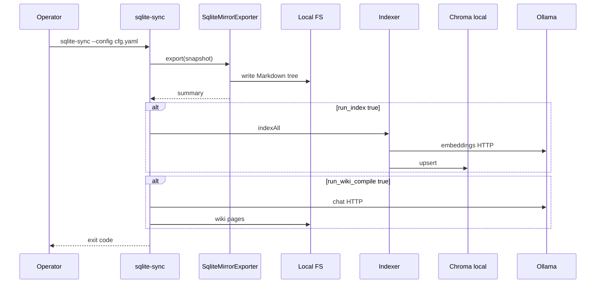
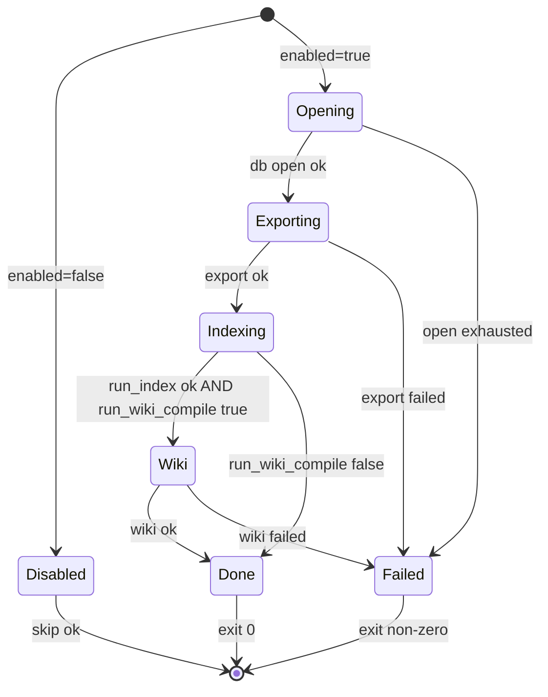

# joplin-sqlite-sync Specification

## Purpose

Define how joplin-brain SHALL read Joplin Desktop SQLite in read-only mode, export Markdown into the configured notes tree, optionally on a schedule, and orchestrate the existing local Chroma indexing and LLM wiki-compile pipeline without introducing non-local network dependencies.

## ADDED Requirements

### Requirement: REQ-JSQ-LOCAL-FIRST Local execution and network boundary

The system SHALL execute SQLite export, Markdown writes, Chroma persistence, and orchestration entirely on the local filesystem of the operator workstation.

The system SHALL NOT open outbound HTTP connections except to `ollama.base_url` when `pipeline.run_index` or `pipeline.run_wiki_compile` is true.

The system SHALL NOT connect to remote vector databases, remote SQLite proxies, or third-party SaaS APIs as part of this capability.

#### Scenario: SCN-JSQ-LF-01 Export-only run uses no HTTP

- **WHEN** `joplin_sqlite_sync.enabled` is true
- **AND** `joplin_sqlite_sync.pipeline.run_index` is false
- **AND** `joplin_sqlite_sync.pipeline.run_wiki_compile` is false
- **THEN** the `sqlite-sync` command SHALL complete without opening outbound HTTP connections

#### Scenario: SCN-JSQ-LF-02 Downstream uses localhost Ollama only

- **WHEN** `joplin_sqlite_sync.pipeline.run_index` is true
- **AND** embeddings are required
- **THEN** the system SHALL send embedding HTTP requests only to `ollama.base_url`

### Requirement: REQ-JSQ-CONFIG Configuration surface

The system SHALL extend `config.yaml` with a `joplin_sqlite_sync` mapping containing at least:

| Key | Type | Default | Required when enabled |
| --- | ---- | ------- | ---------------------- |
| `enabled` | boolean | false | — |
| `database_path` | string | — | required |
| `export_root` | string | `""` | — |
| `reconcile_mode` | string enum | `mirror` | — |
| `busy_timeout_ms` | integer | 5000 | — |
| `max_export_attempts` | integer | 5 | — |
| `pipeline.run_index` | boolean | true | — |
| `pipeline.run_wiki_compile` | boolean | true | — |
| `schedule.every_seconds` | integer or null | null | — |

The system SHALL resolve relative `database_path` values relative to the config file directory, identical to `notes_root` resolution.

The system SHALL treat `export_root` equal to `""` as "use `notes_root` as the export directory".

The system SHALL reject invalid combinations at config load time with `CONFIG_INVALID` when `enabled` is true and `database_path` is missing or empty.

For MVP, the system SHALL reject configuration where resolved `export_root` is not identical to resolved `notes_root` (after path normalization), because the existing Indexer reads only `notes_root`.

#### Scenario: SCN-JSQ-CFG-01 Missing database path fails fast

- **WHEN** `joplin_sqlite_sync.enabled` is true
- **AND** `database_path` is empty
- **THEN** config loading SHALL fail with `CONFIG_INVALID`

##### Example: relative database path resolution

- **GIVEN** config file `/repo/my.config.yaml` sets `database_path: joplin/database.sqlite`
- **WHEN** the loader resolves paths
- **THEN** the resolved database path SHALL be `/repo/joplin/database.sqlite`

### Requirement: REQ-JSQ-SQLITE-RO Read-only SQLite access with busy handling

The system SHALL open the Joplin SQLite database using a read-only SQLite connection mode suitable for concurrent Joplin Desktop usage.

The system SHALL retry open and read operations up to `max_export_attempts` when SQLITE_BUSY or equivalent transient errors occur, respecting `busy_timeout_ms` between attempts.

If all attempts fail, the system SHALL abort `sqlite-sync` with error code `SQLITE_OPEN_FAILED` and SHALL NOT run `pipeline.run_index` or `pipeline.run_wiki_compile` in the same invocation.

#### Scenario: SCN-JSQ-SQL-01 Busy database eventually succeeds

- **WHEN** the first open attempt returns SQLITE_BUSY
- **AND** a later attempt succeeds within retry limits
- **THEN** export proceeds and the command exit code SHALL be 0 if downstream steps also succeed

#### Scenario: SCN-JSQ-SQL-02 Permanent open failure stops the pipeline

- **WHEN** the database file does not exist at the resolved path
- **THEN** the command SHALL exit with code 1
- **AND** stderr SHALL contain a single JSON object with `"error":"SQLITE_OPEN_FAILED"`

### Requirement: REQ-JSQ-EXPORT-MIRROR Markdown export and reconciliation

The system SHALL read note records from the Joplin SQLite schema supported by this repository (documented in source as a pinned schema version) and SHALL write one UTF-8 Markdown file per exported note under the export directory.

The system SHALL skip notes that are not representable as UTF-8 Markdown body text without silent data corruption; skipped notes SHALL be counted in the export summary output.

The system SHALL sanitize file names and relative paths so that no output path escapes below the export directory; if a safe path cannot be constructed, the note SHALL be skipped with a recorded reason.

When `reconcile_mode` is `mirror`, the system SHALL delete Markdown files under the export directory that no longer correspond to an exported note id from the current database snapshot after a successful export pass.

When `reconcile_mode` is `leave`, the system SHALL NOT delete Markdown files for notes removed from the database.

#### Scenario: SCN-JSQ-EXP-01 Mirror deletes stale files

- **GIVEN** export directory contains `aa111111111111111111111111111111.md` from a prior run
- **WHEN** the current database snapshot contains no note with id `aa111111111111111111111111111111`
- **AND** `reconcile_mode` is `mirror`
- **THEN** that file SHALL be deleted during the reconcile phase

##### Example: export counts

| exported_rows | skipped_invalid_utf8 | written_files |
| ------------- | -------------------- | ------------- |
| 1200 | 3 | 1197 |

### Requirement: REQ-JSQ-PIPELINE-ORDER Orchestration order and failure gating

When `joplin_sqlite_sync.enabled` is false, the `sqlite-sync` command SHALL exit 0 without writing files and without running downstream pipelines, emitting a machine-readable "skipped" status on stdout.

When `enabled` is true, the system SHALL execute steps in order:

1. Export Markdown files (export + reconcile)
2. If `pipeline.run_index` is true, run the existing index command runtime (Chroma init + source indexing + wiki collection indexing when configured)
3. If `pipeline.run_wiki_compile` is true, run the existing wiki-compile command runtime

If export fails, the system SHALL NOT execute step 2 or 3.

If step 2 fails, the system SHALL NOT execute step 3.

Failures from downstream steps SHALL preserve existing error codes: infrastructure failures (Ollama unavailable, Chroma unavailable) SHALL use the same exit codes as `index` and `wiki-compile` today.

#### Scenario: SCN-JSQ-PIPE-01 Export failure skips index

- **WHEN** export terminates with `SQLITE_EXPORT_FAILED`
- **THEN** Chroma MUST NOT be mutated in that invocation

#### Scenario: SCN-JSQ-PIPE-02 Index failure skips wiki-compile

- **WHEN** `pipeline.run_index` is true
- **AND** indexing fails with `CHROMA_ERROR`
- **THEN** wiki-compile MUST NOT start in the same invocation

### Requirement: REQ-JSQ-SCHEDULE Optional periodic re-run in-process

When `schedule.every_seconds` is null and the operator does not pass a CLI override, the system SHALL run a single export+pipeline cycle and exit.

When `schedule.every_seconds` is a positive integer, the system SHALL repeat the cycle indefinitely with an interval of that many seconds until the process receives SIGINT or SIGTERM, where each cycle starts only after the previous cycle completes.

The system SHALL log each completed cycle summary to stdout as one JSON line per cycle.

#### Scenario: SCN-JSQ-SCH-01 Interval mode runs at least twice

- **GIVEN** `schedule.every_seconds` is 3600
- **WHEN** the operator starts the command and the first two cycles complete successfully
- **THEN** stdout SHALL contain at least two JSON summary lines with monotonically increasing timestamps or cycle counters

### Requirement: REQ-JSQ-REPO-NOTES-LAYOUT Repository-local notes directory and version control exclusion

The project layout for joplin-brain SHALL document a default `notes_root` path of `./notes_root` (a directory at the repository root) in `config.yaml.example`.

The repository SHALL list `notes_root/` in `.gitignore` so Markdown note files under that directory are not tracked by Git by default.

#### Scenario: SCN-JSQ-REPO-01 Note files under notes_root are ignored by Git

- **GIVEN** the repository `.gitignore` contains a `notes_root/` entry
- **WHEN** the operator creates a file `notes_root/example.md`
- **THEN** `git check-ignore -q notes_root/example.md` SHALL exit with status 0 on systems where Git is available

## Components & Interfaces

| Name | Input | Output | Errors | Idempotent |
| --- | --- | --- | --- | --- |
| SqliteMirrorExporter | DB path, export directory, reconcile mode | File writes, counters | SQLITE_OPEN_FAILED, SQLITE_EXPORT_FAILED | Yes for identical DB snapshot |
| SqliteSyncCommand | AppConfig, CLI flags | Exit code, JSON summaries | CONFIG_INVALID, downstream codes | No across DB changes |

## Data Flow & State Machine

## Events & Triggers

| Trigger | Source | Action |
| --- | --- | --- |
| Manual CLI | Operator | One cycle or interval loop |
| External scheduler | cron / launchd | Invoke CLI single cycle |

## Risks & Assumptions

- ASSUME: The SQLite file is a Joplin Desktop database compatible with the pinned schema constants used by the implementation.
- ASSUME: Operators accept that mirror reconciliation deletes files under `notes_root` when notes are deleted in Joplin.
- RISK: Encrypted or undecryptable notes exist; mitigation: skip and count, never write gibberish as if valid.

## Acceptance Tests

1. Fixture SQLite with three notes: running `pnpm exec joplin-brain sqlite-sync --config <path>` with pipelines disabled SHALL create three Markdown files and stdout SHALL report `written_files` equal to 3.
2. Enable `pipeline.run_index` with a local Chroma and Ollama test double or local services: after sqlite-sync, a follow-up search or internal heartbeat SHALL succeed (exact assertion delegated to implementation tests).
3. Force SQLITE_BUSY in a test hook: retries SHALL be observed up to `max_export_attempts` before failure.
4. Layout policy: `.gitignore` includes `notes_root/`, and `config.yaml.example` documents `notes_root: ./notes_root`, satisfying `REQ-JSQ-REPO-NOTES-LAYOUT` and SCN-JSQ-REPO-01 via `git check-ignore` when Git is available.

