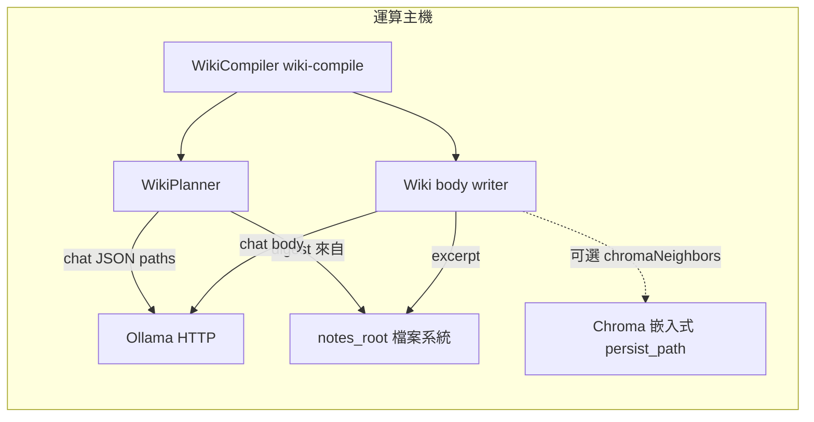

## Context

現行 `wiki-compile` 以 WikiPlanner（Ollama chat）輸出路徑清單，並以 **`summarizeSourcesForPlanner`** 僅餵入 **字典序排序之前 40 個**來源 Markdown 的路徑與 mtime；正文階段 **`readSourcesExcerpt`** 只讀 **前五檔**。此設計對「Karpathy hub 增量」尚可，但若操作者希望在 **離線／批次**下讓規劃與撰寫能反映更大比例之 `notes_root`，會出現系統性偏誤。**本 change 不改變** `notes_root` 唯讀邊界、**不預設**改為雲端 LLM／遠端向量庫。

## Goals / Non-Goals

**Goals:**

- G-A：**corpus mode 規劃為預設開啟**（鍵省略時視為真），對齊主題式全筆記庫 wiki；仍可 **`corpus_mode_enabled: false`** 回復舊 Compact digest／短 excerpt 自動化相容路徑。
- G-B：**撰寫階段**能依目標 wiki 路徑從 **`notes_root` 直讀**與／或 **本機 Chroma `collection_sources`** 拉回與該頁主旨相稱之片段（top_k 預設 8，可設定），並在 collection 不可用時 **明示降級**。
- G-C：**契約化**新設定鍵、CLI／錯誤語意、與既有 `max_pages_per_run`、`--dry-run`、**`joplin_wiki_writeback`** 的組合關係，並以自動測試鎖定迴歸。

**Non-Goals:**

- 不保證單次 invocation 內覆蓋 **每一則**原始筆記各自生成獨立長文頁；全庫覆蓋由操作者以 **多輪執行**與 digest offset／rotation 策略達成。
- 不引入遠端 Chroma、雲端 embedding、或新增對外公開 HTTP 服務。
- 不修改 Joplin Desktop／Jarvis 外掛原始碼。

## Decisions

### Decision: `wiki_ingest.corpus_mode_enabled` 預設 true，對齊主題式個人知識庫之全筆記庫 LLM-wiki（ingest）

**理由**：產品敘事已轉為 **預設面向整庫規劃與 excerpts**；舊輕量行為可由 **顯式 false** 鎖 CI／極資源環境。**傳統替代**：維持預設 false 可避免 tokens 暴增，但拖累主題式 PKM 默認心智模型，故此處 **採 ingest 決策**。**緩解**：以 **`corpus_digest_max_files`** 與 **`max_pages_per_run`** 硬上限＋紀錄化 **BREAKING** 通告控制衝擊。

### Decision: 將 corpus 設定置於 **`wiki_ingest` 之下**為巢狀子鍵或同層欄位延伸

**理由**：與現有 **`max_pages_per_run`**、planner rounds 同源載入 **`load-config.js`**；減少頂層碎片化。**替代方案**：獨立 `wiki_corpus` 頂層物件：可加讀性但未來易與 ingest budget 分叉，故次選。

### Decision: corpus-mode 下 excerpt 來源採 **`filesystem_wide_digest` + 可選 `chroma_neighbors`**

**理由**：filesystem digest 對應無索引機；Chroma neighbors 對應已跑過 `index` 的情境。**替代方案**：僅 embeddings 新路徑：強制先做 index、不利輕量測試。**替代方案**：永遠全檔正文：超限 context，故否決。

### Decision: Planner 對 Ollama 仍只發 HTTP chat；對 Chroma 僅經 **本機 embed client**（制内模組呼叫），不把 Chroma 當對外公開 HTTP 相依

**理由**：對齊「全本機」與既有 **REQ-WI-003**。若 excerpt 組裝程式碼會 **同步讀 chromadb SDK**，視為本地程序庫存取 **`chroma.persist_path`**，而非新的「外向 HTTP」。**備註**：此決策將以 **delta spec**（wiki-ingest 或 wiki-corpus-llm）用 **ADDED Requirement** 寫清楚，以免與舊 REQ 解讀衝突。

### Decision: 降級順序：**Chroma 查詢失敗或集合空**時回退到 **僅基於 filesystem 的字典序 excerpt 策略**，並視需要於 stderr 發出單行 JSON 警告碼（與 `PLAN_BELOW_MIN` 風格一致）

**理由**：可觀測、可測；避免阻斷整批編譯。

## Architecture Overview（本機邊界）



- **不得**將筆記內容送往 `ollama.base_url` 以外之 HTTP SaaS。
- **Chroma** 僅接觸 **`config.chroma.persist_path`**。

## Module Layout（文字樹，相對於 repo root）

```
src/wiki/wiki-planner.js         # planner 提要組裝；corpus 分支
src/wiki/wiki-compiler.js        # excerpt 組裝、compile 總編排
src/wiki/corpus-context.js       # 新增：digest 視窗計算與 excerpts 協調（或由上述二檔承載——以下稱 CorpusContext 責務）
src/config/load-config.js        # 新欄位驗證與預設
src/commands/cmd-wiki-compile.js # 若需額外 argv 轉發
src/vector/chroma-store.js       # 可重用查詢 collection_sources 之薄包裝（若已存在則擴充）
test/wiki-separation.test.js     # 迴歸 + corpus fixture
config.yaml.example
README.md
bin/joplin-llm-wiki.js
package.json
pnpm-lock.yaml
```

（`data/chroma/`、`reports/` 仍為執行時資料目錄，規格不強制納入模組變更。）

## API / CLI Contract

- **CLI**：既有 `pnpm exec joplin-llm-wiki wiki-compile --config <path> [--dry-run]`；若實作採用 **覆寫旗標**，可新增選用 `--corpus` 或依 **config-only** 切換；**design 建議以 config 為主、CLI 為選配**，避免 Health GUI spawn argv 失配。若新增 argv，**Health GUI corpus 管線**文件 SHALL 註明是否需同步。
- **Exit codes**：維持 `src/cli.js` 既有語意；corpus 模式若 Chroma 不可用品嘗試降級後 **仍**失敗，回傳既有 **1** 或 **2**（若牽涉 `CHROMA_ERROR` 定義則在 tasks 對齊 `emitErr` 表）。
- **可觀測 stdout**：成功時仍輸出單行 JSON summary；可擴充欄位例如 `corpus_mode: true`、`digest_files_included: N`，**不破壞**既有鍵解析者（加欄位非 breaking）。

## Data Model（設定欄位，抽象契約）

| Key | Type | Default | Required | Meaning |
|-----|------|---------|----------|---------|
| `wiki_ingest.corpus_mode_enabled` | boolean | true（鍵省略亦 true） | no | Notebook-wide corpus 啟閉 |
| `wiki_ingest.corpus_digest_max_files` | number | （design 交由 tasks：建議區間 ≥40 且 ≤1000） | no | 單輪送入 planner digest 的來源檔上限 |
| `wiki_ingest.corpus_digest_offset` | number | 0 | no | 以 **`discoverMarkdown` 字典序列表**為基礎之起始位移（環狀 modulo） |
| `wiki_ingest.corpus_writer_excerpt_mode` | string enum | （tasks：`filesystem_slice`／`filesystem_plus_chroma`） | no | excerpt 策略 |
| `wiki_ingest.corpus_chroma_top_k` | number | 8 | no | 每目標 wiki 路徑自 `collection_sources` 取證數 |

（實際預設與區間 **`load-config` 驗證**細節見 tasks；上表為行為契約骨架。）

## Error Handling（摘錄）

- **Collection 缺失／查詢丟錯**：降級並附帶 **`CORPUS_CHROMA_DEGRADED`** 級別之 stderr JSON one-liner（欄位名由實作定稿）。
- **`corpus_digest_max_files` 與來源數為 0**：沿用既有 **NO_SOURCE_MARKDOWN** 語意。
- **Ollama 逾時**：與現行 **`wiki-compile`** 失敗語意一致。

## Security & Privacy

- 全數文字仍在本機進程記憶體與本機檔案系統／Chroma 目錄內往返；不向第三方雲端上傳。

## Observability

- stderr 結構化單行 JSON 告警（不降級視為 **`warning`**、不可恢復視為 **`error`**），與 **`PLAN_BELOW_MIN`** 風格一致。

## Migration / Phase

- **Phase 1**：載入設定、digest 視窗、`filesystem` excerpt 強化。
- **Phase 2**：接 Chroma excerpt、降級策略、端到端 fixture 測試。
- **Rollback**：升級運維可於 YAML 加注 **`wiki_ingest.corpus_mode_enabled: false`** 復原 pre-change **`wiki-compile`** digest／輕 excerpt 路徑；另需發布紀錄引導依賴舊 CI 的流程。

## Implementation Contract（交付給 apply 之行為總約）

**Behavior**：當設定省略 **`wiki_ingest.corpus_mode_enabled`** 鍵時（視為 **`true`**）或明示 **`true`**，且 **`notes_root`** 底下存在符合 **`notes_glob`** 之 Markdown：**WikiPlanner SHALL** 將 **`min(totalMarkdownFiles, corpus_digest_max_files)`** 條目依 **REQ-WCC-002** 納入 Ollama planner prompt（受 **`corpus_digest_max_files`** cap）；writer 依 **REQ-WCC-003** 組 excerpt；chromaugmented 模式下 **MUST** 試採 **`collection_sources`**，`top_k` ≤ **`corpus_chroma_top_k`**，不足時 stderr JSON **`CORPUS_CHROMA_DEGRADED`** 並改用 filesystem excerpts。當 **`corpus_mode_enabled`** 為 **false**，全流程 MUST match ingest 前 **REQ-WI-001〜REQ-WI-020**／既有測快照。

**Failure modes**：Ollama 不可用時 **不改**現有退出碼分類策略；Chroma 僅影響 excerpt  richness，不降級後不得留下半寫入之 wiki partial——若單頁撰寫失敗，流程 MUST abort 對應 **`wiki-compile`** 錯誤碼與現行一致。

**Acceptance**：`pnpm test` 含：**(a)** YAML **省略 corpus key** ⇒ widening；**(b)** `corpus_mode_enabled: false` ⇒ legacy digest／excerpt 計數對照；並含 mock Chroma 分支（若適用）。**Scope boundaries**：**in scope**：planner／writer／config／tests／release notes（BREAKING）；**out of scope**：向量 re-index 算法、Lint／ask 行為改版。

## Risks / Trade-offs

| 風險 | 緩解 |
|------|------|
| Ollama 成本暴增 | digest **`corpus_digest_max_files`** cap、**max_pages_per_run**，並允許運維顯式 false |
| 長 digest 弱化 JSON planner 結構輸出品質 | rounds 沿用 `wiki_ingest.max_planner_rounds`；另可於 tasks 建議對模型發 `jsonMode` 仍成立 |
| Chroma/SDK 競爭與 indexer | 文件建議错峰；讀為唯讀查詢，**不於 wiki-compile** 強制鎖 indexer |

## Open Questions（於 apply 可收斂）

- 「由 path derive chroma query」是否要送 **embedding** 再行 similarity：MVP **可僅 lexical／metadata filter**以降低耦合；若要 embed，須評估對 Ollama 額外 round-trip。
- `corpus_digest_offset` 是否要持久化 checkpoint 檔：**首版可由操作者輪替 offset**；將來可并入 separate change。

## REQ Traceability（設計對規格条目）

| Spec capability | Requirement IDs |
|-----------------|-----------------|
| wiki-corpus-llm | REQ-WCC-001〜（見 spec 檔） |
| wiki-ingest (delta) | REQ-WI-030（示例編號於 spec 落定） |
| compiled-wiki (delta) | REQ-WIKI-015（示例） |
