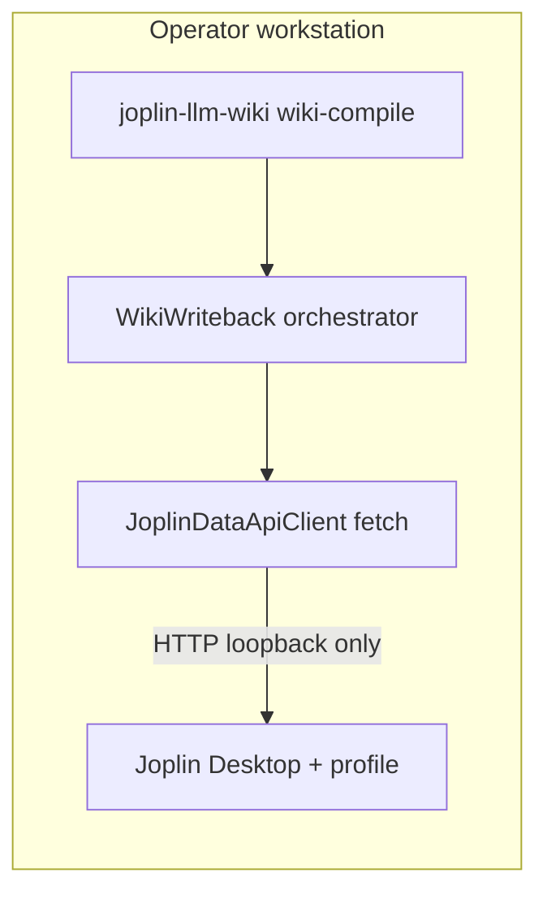

## Context

目前 `wiki-compile` 寫回由 `src/joplin/wiki-writeback.js` 透過 **`joplin` 終端機 CLI** 子程序完成：`use`／`ls -f json`／`mkbook`／`mknote`／`set`。依賴 CLI 之 JSON 形狀與錨點行為，對操作者另要求安裝 CLI 並維護與 Desktop 相同 Profile。Joplin Desktop 內建 **Data API（REST）**（Clipper 設定取得 token），為官方支援之本機整合介面，適合作為唯一寫回適配層。

## Goals / Non-Goals

**Goals:**

- 以 **HTTP Data API** 完成與現版等價之 **父筆記本／主題子資料夾／note 標題 upsert**。
- **load-config**：写回啟用時改為校驗 **`joplin_data_api`**（base URL、token、逾時），**不再**強制 `joplin_cli.enabled` + `command`。
- **預檢**：写回與 `index` 等共用預檢改為呼叫 Data API（唯讀／輕量），捨棄 `joplin_cli.preflight_argv`。
- **錯誤面**：維持 stderr **單行 JSON**；新增／對應 **`JOPLIN_DATA_API_*`** 碼（對照表見 Implementation Contract）。
- **測試**：以 mock **`fetch`**（或注入 `requestFn`）為主，避免依賴系統 PATH 之 `joplin` 執行檔。

**Non-Goals:**

- 不以 Data API 取代 `joplin_sqlite_sync` 大宗匯出。
- 不支援遠端 Joplin Server 為預設目標（host 允許清單限本機）。
- 不實作批量刪除 Joplin note／資料夾。

## Architecture Overview



写回編排仍由 `WikiWriteback` 持有業務規則（主題正規化、批次 upsert 順序）；**HTTP 細節**封裝於新模組（命名見 Module Layout），以便單元測試替換傳輸層。

## Local-First Constraints

- Data API **base URL** 經 **`URL` 剖析**後，`hostname` SHALL 為 `127.0.0.1`、`localhost` 或 `::1`（大小寫不敏感）；**scheme** SHALL 為 `http` 或 `https`（本機常見為 `http`）。不符則 **CONFIG_INVALID**（於 load-config）。
- 除既有 **`ollama.base_url`** 與上述 **Joplin API URL** 外，写回模組 SHALL NOT 對其他主機發送請求。
- **token** SHALL NOT 寫入結構化 log／telemetry 之明文；錯誤訊息僅允許「缺失／過期」類別文字。

## Component Diagram

見上 **Architecture Overview** flowchart。序列層級：写回批次開始 → preflight GET → 確保父資料夾 → 每主題子資料夾 → 每檔 note PUT/POST 對應官方資源路徑（細節於 Implementation Contract 對齊 Joplin REST）。

## Module Layout（文字樹）

```
src/joplin/wiki-writeback.js          # 改為呼叫 Data API client（行為契約不變）
src/joplin/data-api-client.js         # 新建：請求組裝、授權標頭、錯誤映射、逾時
src/joplin/cli-runner.js              # 縮減或移除写回路徑引用；index 預檢遷移後視情況刪除 CLI 預檢
src/config/load-config.js             # joplin_data_api 區塊與 CONFIG_INVALID 規則
src/commands/cmd-index.js             # 預檢改 Data API
bin/joplin-llm-wiki.js
package.json
pnpm-lock.yaml
config.yaml.example
test/joplin-wiki-writeback.test.js
test/joplin-data-api-client.test.js   # 新建（若拆分）
```

## API／CLI Contract（操作者可見）

| 命令／事件 | 輸入 | 輸出／副作用 | 錯誤碼 |
| ---------- | ---- | ------------ | ------ |
| `wiki-compile`（写回啟用、非 dry-run） | `wiki_root` 檔案批次 + config | Joplin 樹 upsert | `JOPLIN_DATA_API_FAILED`、`JOPLIN_DATA_API_WRITE_FAILED`、`CONFIG_INVALID` |
| `wiki-compile --dry-run` | 同上 | 無 mutating API | — |
| `index`（若保留 Joplin 預檢） | config | preflight 成功即繼續 | `JOPLIN_DATA_API_FAILED` |

**Exit code**：延續 `src/cli.js` 對 Joplin 相關失敗之 **exit 1** 對應；精確映射於 tasks 更新測試断言。

## Decisions

### Decision: 採 Joplin Data API 取代終端機 CLI 作為写回唯一機制

**理由**：REST 契約較穩定；避免剖析 CLI JSON 與 `use` 錨點漂移；減少使用者安裝負擔。  
**替代方案**：保留雙模式（CLI + API）— **否**，維護兩套適配成本高；若過渡需要，僅允許短周期 feature flag（tasks 明確移除時限）。

### Decision: 使用原生 `fetch`（Node 20+）並支援注入 `fetch` 以利測試

**理由**：零新增依賴；與現有專案一致。  
**替代方案**：`undici`／`axios`— **否**，除非 fetch 在目標平台證實不足。

### Decision: Host allow-list 於 load-config 硬擋

**理由**：將「意外連到區網／雲端 API」拒於啟動階段，符合本機優先威脅模型。  
**替代方案**：執行時警告— **否**，normative 須 fail-fast。

### Decision: 重試次數沿用 `joplin_wiki_writeback.max_cli_attempts` 鍵名或更名為中性 `max_transport_attempts`

**理由**：避免 BREAKING 更名浪潮；若更名則於 spec／README 單次載明 migration。**建議**：implementation 階段優先 **保留現鍵** 並將語意註解為「写回傳輸重試（API）」；若程式碼可讀性不足再引入別名鍵（別名為 ADDED spec）。

### Decision: 錯誤碼引入 `JOPLIN_DATA_API_FAILED`（連線／認證／4xx 預檢）與 `JOPLIN_DATA_API_WRITE_FAILED`（upsert 階段）

**理由**：與既有 `JOPLIN_CLI_*` 對稱，便於文件與監控。舊碼 **deprecated**：README 說明對照表一季後移除 CLI 碼引用（tasks）。

## Implementation Contract

**Behavior**

- 写回啟用且非 `--dry-run`：對 Joplin 之 **資料夾建立與 note upsert** 僅經 Data API；不得 spawn `joplin_cli.command` 改寫 profile。
- `--dry-run`：不得發送會建立／更新／刪除資源之 HTTP 方法（GET／HEAD 預檢若需要，須在 spec 明示為允許）。
- 父／子資料夾與 note 標題語意維持 **REQ-JWKB-NOTEBOOK-TREE**／**REQ-JWKB-NOTE-UPSERT**（行為不變，實作載體改為 API）。

**Interface／data shape**

- Config 新增 `joplin_data_api` mapping（精確鍵名與預設值以 **openspec delta** 為準），至少：`base_url`（string）、`token`（string）、`timeout_ms`（number）。
- HTTP：`Authorization` 標頭格式 SHALL 對齊 Joplin 官方 Data API（token 傳遞方式於實作對照官方文件）；所有請求附逾時中止。

**Failure modes**

- base URL 非 allow-list → **CONFIG_INVALID**（啟動）。
- token 無效或 Desktop 未開 API → **JOPLIN_DATA_API_FAILED**（預檢或首次請求）。
- upsert 過程不可恢復失敗 → **JOPLIN_DATA_API_WRITE_FAILED**（exit 1、stderr 單行 JSON）。

**Acceptance criteria**

- `pnpm exec node --test test/joplin-wiki-writeback.test.js`（更新後）通過；CLI argv mock 已替換為 fetch mock。
- 手動：`Desktop` 開啟 Clipper、填入 config、`wiki-compile` 非 dry-run 後 **note-wiki** 樹可見更新（README 步驟）。

**Scope boundaries**

- **In**：写回、写回預檢、`index` 與写回共用之 Joplin 預檢遷移、load-config、`config.yaml.example`、README。
- **Out**：sqlite-sync、Chroma、Ollama planner、向量索引。

## Traceability（REQ 對照）

| Proposal／Design 焦點 | Spec REQ |
| --------------------- | -------- |
| Loopback allow-list + token | REQ-JDA-ALLOWLIST、REQ-JDA-CONFIG |
| HTTP client + preflight | REQ-JDA-CLIENT、REQ-JDA-PREFLIGHT |
| 写回語意由 CLI 換 API | REQ-JWKB-DATA-API-WRITE（ADDED）、REQ-JWKB-CLI-WRITE（REMOVED） |
| 本機邊界鬆綁允許 API | REQ-JWKB-LOCAL-FIRST（MODIFIED） |

## Data Model

沿用 Joplin 資源模型：**Folder**（`type_: 2`）與 **Note**（`type_: 1`）；client 以 API JSON 欄位為準，不得假設 CLI `ls` 專屬形狀。

## Error Handling

- 將 HTTP status／network code 映射為單一 **`message`** 字串（不含 token）；**`error`** 鍵為規格所列枚舉。
- 重試：僅對 **逾時、連線重設、503** 等可恢復類別（精確表於 tasks／實作註解）。

## Security & Privacy

- token 存於 config；建議文件提醒 **檔案權限**。
- 禁止 debug log 打印完整 request headers。

## Observability

- 維持現有 stderr JSON；可選計數器鍵（`writeback_written` 等）不改語意。

## Migration／Phase

1. 新增 `joplin_data_api` 與 client；写回路徑切換。
2. 更新測試與 README；**CONFIG_INVALID** 訊息指引由 CLI 遷移。
3. 移除写回對 `cli-runner` 之依賴；`cmd-index` 預檢切換。
4. （可選）移除 `joplin_cli` 區塊之若餘無引用鍵— **須另評估** 是否仍有其他指令使用（見 tasks）。

## Risks / Trade-offs

- **[Risk] Desktop 版 API 行為差異** → Mitigation：載明支援之最低 Joplin 版；手動矩陣一行。
- **[Risk] 使用者未開 Clipper API** → Mitigation：預檢錯誤訊息鏈結 README 截圖步驟。
- **[Trade-off] 失去 CLI 除錯情境** → Mitigation：保留 `curl` 等價疑難排解節。

## Open Questions

- `joplin_cli` 是否在全系統完全移除，或保留給未來非写回用途— **於 tasks 清查 import 後決議**。
