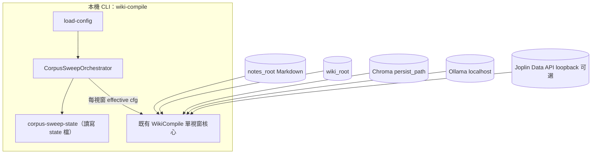

## Context

Corpus 模式下，`summarizeSourcesForPlanner` 與 writer excerpt 共享同一組 `corpus_digest_offset`／`corpus_digest_max_files` 視窗語意（見既有 `wiki-corpus-llm`／`wiki-ingest`）。今日 offset 僅來自靜態 YAML，操作者若要覆蓋大型筆記庫必須手動改檔或多重 shell 腳本；提案要求在**單次 `wiki-compile` 進程**內可選地自動進位 offset、持久化進度，並在達上限或完成一輪掃掠時可續跑下一機會。

## Goals / Non-Goals

**Goals:**

- 提供可關閉的 sweep 模式：在同一 CLI invocation 內連續執行多個 digest 視窗，每視窗仍走既有 planner→writer→（dry-run／寫檔／可選 Data API 寫回）管線。
- 以**獨立 state 檔**保存下一個 offset 與簡易指紋；**不**覆寫使用者 `config.yaml`。
- 暴露可測的 telemetry（視窗數、是否 truncated、state 路徑、指紋是否重置）。

**Non-Goals:**

- 不保證「每一則 Markdown 生成一篇 wiki」；不將「全庫頁面枚舉」列為完成條件。
- 不改 Jarvis／Joplin 編輯器行為；不引入遠端協調。

## Architecture Overview（Local-First Constraints）

- 所有狀態檔路徑預設解析為本機絕對路徑（相對路徑相對於設定檔目錄或專案約定之根目錄，於 `load-config` 與實作契約中固定其一）。
- Sweep 不新增對外 HTTP；寫回仍遵守既有 `joplin_data_api` loopback 規則。
- Ollama／Chroma 呼叫模式與現版相同；成本隨「視窗數 × 每視窗 planner／writer 呼叫」上升，必須以 `max_windows_per_invocation` 預設上限護欄。

### Component Diagram（Mermaid flowchart）



### Module Layout（文字樹）

```text
bin/joplin-llm-wiki.js          # CLI 入口（增列 sweep 相關 argv／說明）
src/cli.js                      # 參數解析轉交 commands
src/commands/cmd-wiki-compile.js # 觸發 sweep 外層迴圈或委派
src/wiki/wiki-compiler.js       # 單視窗編譯核心（接受 effective offset）
src/wiki/wiki-planner.js        # digest 組裝（沿用 rotatedSlice）
src/wiki/corpus-slice.js        # 環狀切片（既有）
src/wiki/corpus-sweep-state.js  # **新增**：state 序列化／指紋檢查／原子寫入
src/config/load-config.js       # **修改**：wiki_ingest.corpus_auto_sweep.* 驗證
config.yaml.example             # 範例鍵
README.md                       # 操作說明與限制
test/wiki-separation.test.js    # SCN：多視窗 dry-run
test/config-schema.test.js      # YAML 驗證
package.json / pnpm-lock.yaml
```

## Decisions

### 決策 A：單進程外層迴圈 vs 外部 shell

採用 **CLI 單進程外層迴圈**（`CorpusSweepOrchestrator`）：較易於共用 Chroma handle／logger／錯誤碼，且符合使用者「一次指令跑多視窗」預期；外部 shell 輪詢保留為進階手動選項，不由本 change 取代。

### 決策 B：state 檔格式與預設位置

採用 **JSON state 檔**，預設路徑：`wiki_root` 目錄底下 **`.joplin-llm-wiki/corpus-sweep-state.json`**（目錄自動建立），可由 `wiki_ingest.corpus_auto_sweep.state_path` 覆寫為絕對或設定檔相對路徑。

**理由**：與 git 狀態分離（多數 wiki_root 已獨立於 notes）；操作者可選移出至 `data/`。

### 決策 C：指紋（fingerprint）不匹配時的行為

當 state 內記錄之 **`markdown_file_count`**（以 `discoverMarkdown` 結果長度為準）與當前 discovery 不一致時：**視為筆記樹漂移**，實作 SHALL **重設 sweep**：`next_offset = 0`、清除累計視窗計數（或僅重置 offset 並記錄 telemetry `CORPUS_SWEEP_FINGERPRINT_RESET`），避免基於過時排序繼續滑動。

### 決策 D：offset 進位步長

新增 `wiki_ingest.corpus_auto_sweep.step_files`，整數，預設 **等於** `corpus_digest_max_files`。允許較小步長製造重疊視窗（進階）；步長上限 MUST ≤ `corpus_digest_max_files` 或在校驗時拒絕 **`CONFIG_INVALID`**（避免語意矛盾）。

### 決策 E：REQ-WI-001（max_pages_per_run）適用範圍

每個 sweep **視窗**獨立適用 `max_pages_per_run`；整個 invocation 的總頁數上限為「視窗數 × max_pages_per_run（理論上界）」，並受 planner 實際回傳較少路徑時自然降低。

### 決策 F：`filesystem_plus_chroma` 互動

Writer 側 `bumpedCorpusSliceStart` 仍以「該視窗的 effective `corpus_digest_offset`」為基底再加 wiki path hash bump；**不得**在 sweep 視窗之間共享錯誤的 cached slice。每視窗重新計算 digest／slice。

### 決策 G：dry-run 與 state

`wiki_ingest.corpus_auto_sweep.advance_state_on_dry_run` 預設 **false**：dry-run 僅模擬當前視窗，不寫 state；設為 **true** 時允許預演排程在不寫 wiki 檔案前提下推進 offset（stderr MUST 出現警示鍵）。

## Implementation Contract

**Behavior**

- 當 `wiki_ingest.corpus_auto_sweep.enabled` 為 true（且 corpus mode 有效）時，`wiki-compile` SHALL 在進入第一視窗前載入 state；依序對最多 `max_windows_per_invocation` 個視窗執行編譯核心。
- 每視窗開始前：將 **effective** `corpus_digest_offset` 設為 `state.next_offset`（modulo 檔案總數之列運算與現行 `rotatedSlice` 一致）。
- 每視窗結束且非 dry-run（或 `advance_state_on_dry_run=true`）：更新 `state.next_offset := (state.next_offset + step_files) % max(totalFiles,1)`，遞增 `windows_completed_total`，寫回原子 replace。
- 若本 invocation 已執行視窗數達 `max_windows_per_invocation` 且尚未完成全庫非重疊覆蓋，stdout／JSON summary MUST 標記 **`corpus_sweep_truncated`: true**。
- 完成一輪（語意：自 offset 0 起以 step 前進直至回到即將與首視窗起點對齊——實作可用「本次 invocation 起始 `next_offset` 記為 `s0`，當 advance 後再次等於 `s0` 且至少跑過一視窗」判定 wrap）時 telemetry MUST 含 **`corpus_sweep_cycle_complete`: true**。

**Interface／data shape（state 檔 JSON）**

- `schema_version`：數字，現為 **1**。
- `next_offset`：非負整數，語意與 YAML `corpus_digest_offset` 對齊（每視窗 advancement 後更新）。
- `markdown_file_count`：上次成功寫入 state 時之 discovery 計數。
- `step_files`：上次使用的步長（避免設定漂移時無聲錯位；與 cfg 不一致時以 cfg 為準並更新本欄）。
- `updated_at_ms`：整數時間戳。

**Failure modes**

- state 檔不可寫：SHALL 使 `wiki-compile` 以 **`CORPUS_SWEEP_STATE_IO`**（或併入既有錯誤碼家族）失敗退出，stderr 附路徑。
- `CONFIG_INVALID`：當 sweep 啟用但 `corpus_mode_enabled` 為 false，或 step／上限超出約束。

**Acceptance（實作者驗收）**

- `pnpm test` 新增／更新 SCN：fixture 至少 3 個 markdown、`corpus_digest_max_files=1`、`step_files=1`、`max_windows_per_invocation≥3`，斷言三次視窗後 offset／digest 旋轉（mock ollama）。
- config-schema 測試覆蓋預設值與非法組合。

**Scope boundaries**

- In scope：CLI／設定／state／telemetry／單元與整合測試。
- Out scope：保證 wiki 頁面與筆記 1:1、GUI、遠端鎖。

### Traceability（REQ 對照）

| 設計段落 | 將落到規格 ID |
|----------|----------------|
| 多視窗外層迴圈 | REQ-WI-CORPUS-SWEEP-001 |
| state 檔與指紋 | REQ-WI-CORPUS-SWEEP-002 |
| digest offset 進位語意 | REQ-WCC-CORPUS-SWEEP-001 |
| dry-run 是否推進 state | REQ-WI-CORPUS-SWEEP-003 |

## API／CLI Contract

- YAML（`wiki_ingest` 底下巢狀物件）：
  - `corpus_auto_sweep.enabled`：boolean，預設 false。
  - `corpus_auto_sweep.max_windows_per_invocation`：整數 1–500，預設 20。
  - `corpus_auto_sweep.step_files`：選填；省略時於 load-config 解析為 `corpus_digest_max_files`。
  - `corpus_auto_sweep.state_path`：選填字串路徑。
  - `corpus_auto_sweep.advance_state_on_dry_run`：boolean，預設 false。
- CLI（擇一實作，任務階段敲定並更新 help）：例如 **`wiki-compile --corpus-sweep`** 等同 enabled 旗標覆寫為 true（僅限該次 invocation）。

## Data Model

見 Implementation Contract 之 JSON。原子寫入建議：寫入暫存檔後 `rename` 同目錄覆蓋。

## Error Handling

- `CONFIG_INVALID`：設定組合不合法。
- `CORPUS_SWEEP_STATE_IO`：state 讀寫失敗。
- 既有 `WIKI_COMPILE_ABORT`：單視窗內失敗時整個 invocation SHALL 非零退出並保留 state 於「該視窗開始前」快照（不得半視窗 advance）。

## Security & Privacy

- State 檔僅含計數／offset／時間戳，不含筆記內文；路徑須落在使用者可控本機目錄。

## Observability

- stderr JSON lines：`CORPUS_SWEEP_WINDOW`（window_index、effective_offset、digest_count）。
- 最終 stdout summary JSON（若既有）擴充 `corpus_sweep` 物件。

## Migration／Phase

- Phase 1：實作與測試、README／config.yaml.example。
- Rollback：關閉 `corpus_auto_sweep.enabled` 或刪除 state 檔；行為回到單視窗。

## Risks / Trade-offs

- [LLM 成本隨視窗線性上升] → 預設 `max_windows_per_invocation=20` 與 README 警示。
- [指紋過粗：檔案數相同但置換內容] → 文件說明限制；Future：可加 content hash 抽樣。
- [dry-run 不推進 state 與使用者預期不符] → `advance_state_on_dry_run` 顯式開關。

## Open Questions

- CLI 旗標與 YAML 優先序（建議：CLI 僅覆寫 enabled，其它仍以 YAML 為準）。
- `corpus_sweep_cycle_complete` 是否在跨 invocation 累計——首版建議僅描述單 invocation 內 wrap；跨 invocation 完整覆蓋由操作者多次執行完成。
