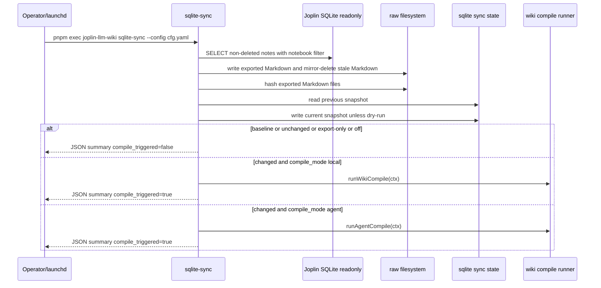

## Context

現行 `sqlite-sync` 已能用唯讀 SQLite 讀取 Joplin Desktop database.sqlite，並把符合 notebook filter 的筆記匯出成 `raw/<joined-notebook-slug>/<safe-title>.md`。匯出完成後，CLI 目前只依 `joplin_sqlite_sync.pipeline.run_wiki_compile` 觸發本機 `wiki-compile`，沒有判斷本輪 raw 是否真的變更，也不能由同一個排程設定改跑 `agent-compile`。

此設計補上 raw change gate：`sqlite-sync` 每輪匯出後產生 exported Markdown snapshot，與上一輪 state 比對；有新增、更新、刪除時才進入 compile decision。當 `raw/` 已有資料且操作者只想建立 baseline 時，`sqlite-sync --snapshot-only` 可獨立從現有 raw Markdown 建立 snapshot，不重新讀取 Joplin SQLite。Joplin Desktop 繼續負責筆記編輯與同步，Jarvis 繼續負責 Joplin 內即時輔助，joplin-llm-wiki 負責本機匯出、wiki 編譯、query、lint 與可選寫回；Health GUI 需讓這些主要 CLI 工作流都有對應分頁。

## Goals / Non-Goals

**Goals:**

- 在 `sqlite-sync` 中偵測 exported raw Markdown 的新增、更新、刪除。
- 以 `joplin_sqlite_sync.pipeline.compile_mode` 選擇 raw 變更後執行 `wiki-compile`、`agent-compile` 或不編譯。
- 保留未設定 `compile_mode` 時的 `run_wiki_compile` 相容行為。
- 提供 `sqlite-sync --snapshot-only`，用於 raw 已存在時建立 baseline snapshot。
- 補齊 Health GUI 主要 CLI 分頁：Query、Lint，以及 Pipeline 內的建立 snapshot 動作。
- 讓 JSON summary、文件、Cursor rule、Cursor skill、Cursor hook README 都反映新語意。

**Non-Goals:**

- 不恢復 `watch`、`index`、RAG、Chroma 或 embedding vector 管線。
- 不允許 config 指定任意 shell command。
- 不改變 `wiki-compile` 或 `agent-compile` 生成 wiki 的內容規則。
- 不把 GUI 做成任意 shell 執行器；每個分頁只能呼叫固定、白名單化的 CLI workflow。
- 不新增或啟用 Cursor hook，只更新既有 hook 文件。

## Architecture Overview

`sqlite-sync` 仍是唯一自動入口。它先完成 SQLite 匯出與 mirror reconcile，再把本輪 exported Markdown 轉成 snapshot。snapshot state 只描述 raw 匯出結果，不描述 wiki 編譯結果。

```mermaid
flowchart TD
  subgraph Local[本機工作站]
    DB[Joplin database.sqlite]
    Export[sqlite-sync export]
    Raw[raw/*.md]
    State[.joplin-llm-wiki/sqlite-sync-state.json]
    Gate[raw change gate]
    SnapshotOnly[snapshot-only baseline]
    LocalCompile[wiki-compile + Ollama]
    AgentCompile[agent-compile + local codex exec]
    Query[query tab]
    Lint[lint tab]
    Wiki[wiki/summaries|concepts|indexes]
  end

  DB --> Export --> Raw
  Export --> Gate
  Raw --> Gate
  Raw --> SnapshotOnly --> State
  State <--> Gate
  Gate -->|compile_mode local and changed| LocalCompile --> Wiki
  Gate -->|compile_mode agent and changed| AgentCompile --> Wiki
  Gate -->|off or unchanged| Done[no compile]
  Wiki --> Query
  Raw --> Query
  Wiki --> Lint
```

## Local-First Constraints

- SQLite 讀取維持唯讀 database.sqlite，不新增 Joplin Data API 讀取流程。
- State 寫入 repo-local `.joplin-llm-wiki/sqlite-sync-state.json`；不得寫入 `raw/`，避免 source evidence 混入控制檔。
- `compile_mode: local` 沿用既有本機 Ollama 路線；`compile_mode: agent` 沿用本機 `codex exec`，不描述為 OpenAI API billing。
- GUI Query 與 Lint 分頁只 spawn 本機 `pnpm exec joplin-llm-wiki query|lint`，不接受 renderer 傳入任意 shell 字串。
- 不新增遠端資料庫、遠端向量服務、公網 listener 或第三方 SaaS endpoint。

## Component Diagram



Snapshot-only 不進入上列 SQLite export sequence。它從已設定的 `raw` 與 `raw_glob` 掃描 Markdown，建立與 export cycle 相同 schema 的 state，輸出 `snapshot_only: true`、`change_detection: "snapshot_created"`、`compile_triggered: false`。

## Module Layout

```text
src/
  commands/
    cmd-sqlite-sync.js      # export + change gate + compile decision
    cmd-agent-compile.js    # existing Codex Agent runner reused by sqlite-sync
    cmd-wiki-compile.js     # existing local compile runner reused by sqlite-sync
  config/
    load-config.js          # compile_mode parsing and legacy fallback
  joplin/sqlite/
    exporter.js             # exported Markdown result remains source of truth
    sync-state.js           # new snapshot hash/state helper
  health-gui/
    main.js                 # fixed IPC handlers for snapshot/query/lint
    preload.cjs             # exposed renderer APIs
    renderer/index.html     # Query and Lint tab markup
    renderer/app.js         # tab interactions and bounded output rendering
bin/
  joplin-llm-wiki.js
config.yaml.example
README.md
docs/
  llm-knowledge-flow.md
  scheduling-examples.md
  macos-launchd-stack.md
.cursor/
  rules/joplin-brain-config.mdc
  skills/joplin-brain-dev/SKILL.md
  hooks/README.md
```

## API/CLI Contract

`joplin_sqlite_sync.pipeline.compile_mode` accepts exactly `local`, `agent`, or `off`. If absent, config loading derives it from legacy `run_wiki_compile`: true becomes `local`, false becomes `off`. If both are present, `compile_mode` is authoritative and `run_wiki_compile` remains accepted for backward-compatible YAML.

`sqlite-sync` JSON summary SHALL include:

| Field | Meaning |
| --- | --- |
| `raw_changed` | boolean, true only when added, updated, or deleted raw Markdown is detected |
| `change_detection` | `baseline`, `changed`, `unchanged`, or `dry_run` |
| `changed_files` | object with integer `added`, `updated`, and `deleted` |
| `compile_mode` | resolved `local`, `agent`, or `off` |
| `compile_triggered` | boolean, true only when a compile runner was invoked |

`sqlite-sync --snapshot-only` bypasses SQLite export and compile. It scans existing `raw` Markdown, writes state, and emits all summary fields plus `snapshot_only: true`. If no matching Markdown exists under `raw`, it fails with a stable configuration/runtime error and does not write an empty baseline.

Health GUI tab contract:

| Tab | CLI workflow | Behavior |
| --- | --- | --- |
| Health | health snapshot probes | Existing dependency/config status |
| Config | config read/save | Existing validated config editing |
| Notebooks | `sqlite-sync --list-notebooks-json` and notebook filter save | Existing notebook selection |
| Pipeline | `sqlite-sync --export-only`, `wiki-compile`, `agent-compile`, `sqlite-sync --snapshot-only` | Existing compile workflows plus independent raw snapshot baseline |
| Query | `query` and optional `query --confirm-capture` | Ask from knowledge base and confirm pending captures |
| Lint | `lint` | Run filesystem lint and display bounded stdout/stderr tails |
| LaunchAgent | launchd install/uninstall scripts | Existing stack management |

Failure modes reuse existing CLI errors. Invalid compile mode throws `CONFIG_INVALID`. Agent runner failures preserve `CODEX_CLI_UNAVAILABLE`, `CODEX_USAGE_LIMIT`, and `AGENT_COMPILE_FAILED`. Local compile failures preserve existing `wiki-compile` errors.

## Data Model

State file path defaults to `.joplin-llm-wiki/sqlite-sync-state.json` under the repository/config execution root used by this project. The state file contains only JSON serializable metadata:

```json
{
  "schema_version": 1,
  "updated_at_ms": 0,
  "export_root": "/absolute/path/to/raw",
  "files": {
    "notebook-slug/title.md": {
      "joplin_note_id": "note-id",
      "sha256": "hex-content-hash"
    }
  }
}
```

The comparison key is raw-relative Markdown path. A path in current but not previous counts as added. A path in both with different `sha256` or different `joplin_note_id` counts as updated. A path in previous but not current counts as deleted.

First successful non-dry-run export without existing state writes baseline state and reports `change_detection: baseline`, `raw_changed: false`, and `compile_triggered: false`.

Snapshot-only writes the same state shape as an export cycle but sets `change_detection: "snapshot_created"` in the summary. It is intended for raw trees that already exist before enabling change-gated sync.

## Error Handling

- Export failure aborts before state write and before compile.
- State read failure caused by malformed JSON is treated as no valid state: the next successful non-dry-run export establishes a new baseline and emits an operator-visible warning in stderr or summary.
- State write failure aborts with a stable state I/O error code and does not trigger compile, because future change detection would be unreliable.
- `--export-only` writes state after successful export but never triggers compile.
- `--snapshot-only` fails without writing state when `raw` has no matching Markdown, because an empty baseline would hide a missing export/setup problem.
- Dry-run reads existing state to compute would-change summary, but does not write state and does not trigger compile.

## Security & Privacy

The change does not read secrets except existing config. It does not send raw note contents to new endpoints. Hashing happens locally with Node crypto. `compile_mode` is an enum, so config cannot inject arbitrary shell strings.

## Observability

The JSON summary is the primary operator signal for cron and launchd logs. `compile_triggered`, `compile_mode`, `raw_changed`, and changed file counters make it possible to explain why a scheduled cycle did or did not compile. Documentation must tell operators to inspect stdout/stderr logs for these fields.

Health GUI must render bounded stdout/stderr tails for Query and Lint just like existing pipeline logs. Snapshot-only renders the same summary fields operators see in CLI logs.

## Decisions

### Decision: Use a compile_mode enum instead of two booleans or a command string

`local | agent | off` is unambiguous and prevents invalid combinations such as both local and agent enabled. A command string was rejected because it would expand the config surface into shell execution policy.

### Decision: Store raw snapshot state outside raw

State belongs under `.joplin-llm-wiki/`, not `raw/`, because `raw/` is source evidence and is mirrored from Joplin in common configurations. Keeping state outside raw avoids accidental deletion by mirror reconcile and avoids polluting source discovery.

### Decision: First run establishes baseline without compiling

First run after enabling change detection can see every exported file as new. Treating that as a baseline avoids accidental full-library compile in background launchd jobs. Operators can still run `wiki-compile` or `agent-compile` manually when they want an initial full build.

### Decision: Compare raw-relative path plus content hash and Joplin id

The exported Markdown body includes frontmatter with stable Joplin identity. Comparing path, note id, and SHA-256 detects created, edited, renamed, and deleted raw Markdown without depending on Joplin `updated_time` precision.

### Decision: Provide snapshot-only as a sqlite-sync option and GUI pipeline action

Snapshot state belongs to `sqlite-sync`, so the independent baseline action remains under the same command family. A separate top-level command was rejected because it would duplicate config loading and state semantics.

### Decision: Add fixed GUI tabs for query and lint instead of a generic command runner

The GUI exposes major CLI workflows without becoming a shell frontend. Dedicated Query and Lint tabs keep renderer payloads structured and allow main-process handlers to spawn fixed command argv only.

## Implementation Contract

- Behavior: `sqlite-sync` exports first, evaluates raw changes, then conditionally runs exactly one compile runner according to resolved compile mode.
- Interface: config accepts `joplin_sqlite_sync.pipeline.compile_mode`; `sqlite-sync --snapshot-only` establishes a baseline from existing raw; summary emits `raw_changed`, `change_detection`, `changed_files`, `compile_mode`, `compile_triggered`, and `snapshot_only` for snapshot-only runs.
- GUI behavior: Health GUI exposes fixed tabs for Health, Config, Notebooks, Pipeline, Query, Lint, and LaunchAgent; Query and Lint tabs call fixed IPC handlers with bounded outputs, and Pipeline includes a snapshot-only action.
- Acceptance: tests prove baseline, unchanged, added, updated, deleted, dry-run, export-only, snapshot-only, local mode, agent mode, off mode, and GUI tab/IPC coverage for query and lint.
- In scope: config parsing, state helper, sqlite-sync orchestration, GUI snapshot/query/lint entrypoints, CLI help, docs, Cursor rule/skill/hook README, unit tests.
- Out of scope: generated wiki content changes, actual Joplin Data API writeback behavior, Health GUI UX changes, and new enabled Cursor hooks.

## Risks / Trade-offs

- [Risk] State corruption could hide a needed compile → Mitigation: malformed state becomes baseline with visible warning; state write failure aborts before compile.
- [Risk] First-run baseline skips a compile an operator expected → Mitigation: docs instruct initial manual compile when enabling scheduled sync on an existing raw tree.
- [Risk] Agent mode can be expensive or unavailable in launchd sessions → Mitigation: docs state `codex exec` must be installed and logged in; existing Codex error codes remain surfaced.
- [Risk] Hashing every exported Markdown adds work each cycle → Mitigation: note libraries under 10k are acceptable; hashing only Markdown output avoids DB-specific change semantics.
- [Risk] GUI command coverage can drift from CLI names → Mitigation: add tests or content assertions that tabs/IPC cover `sqlite-sync`, `wiki-compile`, `agent-compile`, `query`, `lint`, and LaunchAgent workflows.

## Migration/Phase

1. Add config parser support and tests for `compile_mode` with legacy fallback.
2. Add snapshot state helper and tests for comparison semantics.
3. Wire `sqlite-sync` to state + compile decision, add `--snapshot-only`, and extend JSON summary.
4. Add Health GUI snapshot action, Query tab, and Lint tab with fixed IPC handlers.
5. Update CLI help, docs, Cursor assets, and scheduling guidance.
6. Run full tests and Spectra validation.

Rollback is config-only for operators: set `compile_mode: off` or use `--export-only`. Deleting the state file forces a new baseline on the next successful export.

## Open Questions

None. The plan locks first-run behavior as baseline-only, trigger scope as any raw Markdown change, config interface as `compile_mode` enum, snapshot-only as `sqlite-sync --snapshot-only`, and GUI coverage as fixed tabs for the major CLI workflows.
