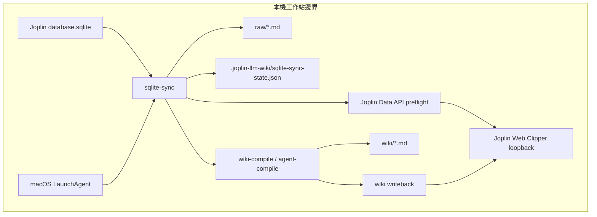

## Context

`sqlite-sync` 目前負責從本機 Joplin SQLite 匯出 `raw/`、建立 raw snapshot、比對 `.joplin-llm-wiki/sqlite-sync-state.json`，再依 `joplin_sqlite_sync.pipeline.compile_mode` 呼叫 `wiki-compile` 或 `agent-compile`。實測顯示 raw 變更可被偵測，agent compile 也會寫入 `wiki/`；但 Joplin Data API token 失效時，writeback 在最後回傳 `JOPLIN_DATA_API_WRITE_FAILED`，LaunchAgent 退出碼為 1。

現況的耐久性問題有兩個：第一，snapshot state 在 downstream 成功前已更新，因此 downstream 失敗後下一輪可能判定 raw 未變而不重試；第二，LaunchAgent 只有 `RunAtLoad`，非零退出後不會自動恢復輪詢。這個設計將 `sqlite-sync` 的 commit point 後移，並讓 macOS job 對 transient failure 有受控重啟能力。

## Architecture Overview

`sqlite-sync` 仍是唯一 change gate；它不監聽檔案事件，而是在 in-process polling 或外部排程啟動時執行一輪。新語意將一輪拆成 prepare、preflight、downstream、commit 四段：

1. prepare：匯出 Joplin SQLite 到 raw，建立 current snapshot，與 previous snapshot 比對。
2. preflight：若本輪需要 downstream compile 且 writeback 啟用，先驗證 Data API reachability 與 token。
3. downstream：依 compile mode 呼叫 local 或 agent compile；compile 內既有 writeback 仍負責實際 upsert。
4. commit：只有不需要 downstream、或 downstream 成功時，才寫入新的 sqlite-sync snapshot state。

LaunchAgent 的 shell wrapper 在啟動 `sqlite-sync` 前會讀取同一份 config。它必須先解析 `joplin_sqlite_sync.pipeline.compile_mode`，再決定 readiness gate：`agent` 模式不等待 Ollama，因為 agent compile 使用 Codex CLI；`local` 模式仍等待 Ollama，因為 local wiki compile 需要本機 Ollama chat。



## Local-First Constraints

- 所有持久資料仍只寫在 repo 工作目錄、`raw/`、`wiki/`、`.joplin-llm-wiki/`、以及 Joplin Desktop 本機 profile。
- Joplin Data API 僅允許 loopback host，沿用既有 `joplin_data_api.base_url` allowlist。
- 不新增遠端服務、背景 HTTP server、遠端 vector database 或雲端 LLM API。
- LaunchAgent 只啟動本機 shell shim 與 `pnpm exec joplin-llm-wiki sqlite-sync`。

## Component Diagram

同 Architecture Overview Mermaid 圖。關鍵 ownership：LaunchAgent 只負責程序生命週期；`sqlite-sync` 負責 raw change gate 與 state commit；compile command 負責 wiki generation；writeback module 負責 Joplin Data API upsert 與 preflight。

## Module Layout

```text
bin/
  joplin-llm-wiki.js
src/
  cli.js
  commands/
    cmd-sqlite-sync.js
    cmd-wiki-compile.js
    cmd-agent-compile.js
  joplin/
    data-api-client.js
    wiki-writeback.js
  joplin/sqlite/
    exporter.js
    sync-state.js
scripts/
  launchd/
    com.joplin-brain.sqlite-sync.plist
    install-joplin-brain-stack.sh
    shims/joplin-llm-wiki-sqlite-sync
config.yaml.example
package.json
pnpm-lock.yaml
raw/
wiki/
.joplin-llm-wiki/
reports/
```

## Goals / Non-Goals

**Goals:**

- 讓 compile 或 writeback 失敗後的 raw 變更仍可被下一輪自動重試。
- 在 writeback token 無效時提早失敗，避免昂貴的 agent compile 先大量執行。
- 讓 LaunchAgent 對非零退出有受控重啟，不讓一次 transient failure 永久停止輪詢。
- 保持 CLI JSON summary 足以判讀 state 是否提交、downstream 是否觸發、失敗在哪一段。

**Non-Goals:**

- 不更改 wiki 內容生成策略、planner 規則、summary/concept/index 格式。
- 不自動修改 Joplin token 或存取 Joplin 設定檔中的秘密。
- 不為歷史上已提交 state 的失敗批次做自動修復。
- 不新增 UI、Joplin plugin、遠端服務或第三方 queue。

## Decisions

### Decision: Defer sqlite-sync snapshot commit until downstream success

`cmd-sqlite-sync` 將 current snapshot 視為 pending state。若本輪不需要 downstream，例如 baseline、`--export-only`、`compile_mode: off`、raw unchanged，則維持既有行為，在 export 與比對完成後寫入 state。若 raw changed 且 compile mode 是 `local` 或 `agent`，則先執行 preflight 與 downstream；只有 downstream resolve 成功後才呼叫 snapshot state atomic write。

替代方案是保留現有 state 寫入時機並另存 retry marker。這會產生第二份狀態機，需要處理 marker 與 snapshot 不一致；後移 commit point 更簡單，也符合「state 表示已成功處理到這個 raw snapshot」的語意。

### Decision: Add writeback preflight before automatic compile

當 writeback enabled 且本輪會進入 compile，`sqlite-sync` 在呼叫 `runWikiCompile` 或 `runAgentCompile` 前執行 preflight。preflight 使用既有 Data API client 對 loopback endpoint 做非破壞性驗證，例如讀取 API ping 或讀取/查詢必要 notebook 前先確認 token 可被接受。若 Joplin 回 403 invalid token，流程在 compile 前以 `JOPLIN_DATA_API_FAILED` 或更具體的 stable code 結束。

替代方案是在 writeback 階段才失敗。這保留現況，但會浪費 agent compile 時間，也會產生「wiki 已寫、Joplin 未寫」的半成功結果。

### Decision: Preserve writeback as compile-owned commit stage

實際 Joplin upsert 仍由 `wiki-compile` / `agent-compile` 的 writeback path 執行，而不是在 `sqlite-sync` 新增第二套 writeback command。`sqlite-sync` 只負責 preflight、downstream orchestration、state commit decision。這避免分裂「哪些 wiki 檔要寫回」的選擇邏輯。

替代方案是新增 standalone writeback CLI 讓 failed batch 可手動補寫。這可作為未來 enhancement，但不是本次耐久修正的最小必要範圍。

### Decision: Use LaunchAgent KeepAlive for non-zero exits with throttle

plist 範本加入 `KeepAlive` dictionary，設定 `SuccessfulExit` 為 false，並加入 `ThrottleInterval`。這讓 token 暫時錯誤、Ollama 暫時不可用或 agent failure 造成的非零退出可被 macOS 重啟，但成功退出不會循環。當 config 使用 `schedule.every_seconds` 時，正常情況下程序會常駐輪詢；若程序意外非零退出，launchd 才補救。

替代方案是在 plist 加 `StartInterval`。這會和 `schedule.every_seconds` 形成雙重排程，容易產生重疊程序，因此不採用為預設。

### Decision: Gate Ollama readiness by resolved compile mode

`run-sqlite-sync.sh` 在執行 `pnpm exec joplin-llm-wiki sqlite-sync` 前，先以本機 Node.js 腳本或現有 CLI/config loader 讀取 resolved `joplin_sqlite_sync.pipeline.compile_mode`。當 mode 是 `agent` 或 `off` 時，wrapper 不等待 `ollama.base_url`；當 mode 是 `local` 時，wrapper 保留現有 Ollama readiness 等待，避免 local compile 立即因 Ollama unavailable 失敗。若未能讀取 config，wrapper 應 fail closed：回報 config/readiness 錯誤並退出非零，讓 LaunchAgent throttle/retry 接手。

替代方案是永遠不做 Ollama readiness，讓 CLI 自己失敗。這對 agent mode 是正確方向，但會讓 local mode 的常見啟動順序更吵；依 compile mode 分流能保留 local mode 的 operator experience。

### Decision: Keep summaries machine-readable and operator-readable

`sqlite-sync` JSON summary 增加 state commit 與 downstream 欄位，例如 `state_committed`, `state_commit_reason`, `downstream_triggered`, `downstream_status`, `writeback_preflight_status`。stderr error object 保持單行 JSON 且使用既有 CLI error code mapping。這讓 launchd log 可以直接診斷 retry 是否還會發生。

替代方案是只依 exit code 判斷。exit code 可被 launchd 使用，但不足以讓 operator 判斷是 raw unchanged、preflight failed、compile failed 還是 writeback failed。

## API/CLI Contract

| Interface | Input | Output | Error codes | Idempotency |
| --- | --- | --- | --- | --- |
| `joplin-llm-wiki sqlite-sync --config <path>` | config path, optional `--every`, `--export-only`, `--snapshot-only`, `--dry-run` | one JSON summary per cycle | `SQLITE_OPEN_FAILED`, `SQLITE_EXPORT_FAILED`, `JOPLIN_DATA_API_FAILED`, `JOPLIN_DATA_API_WRITE_FAILED`, `AGENT_COMPILE_FAILED`, `WIKI_COMPILE_ABORT` | Re-running after downstream failure retries same raw snapshot because state is not committed |
| writeback preflight helper | loaded config and writeback scope | success result with Data API reachable and token accepted | `JOPLIN_DATA_API_FAILED` | Non-mutating; repeated calls do not create notebooks or notes |
| `scripts/launchd/run-sqlite-sync.sh` readiness gate | repo root and config path | starts sqlite-sync after mode-appropriate readiness checks | config/readiness shell errors, downstream CLI errors | Agent mode never blocks on Ollama; local mode waits for configured Ollama endpoint |
| LaunchAgent plist | installed repo root and config path | launchd-managed process | non-zero command exit triggers throttled restart | Repeated restarts run one sqlite-sync process at a time under launchd supervision |

## Data Model

`sqlite-sync-state.json` format does not need schema changes. The semantic change is that the state file represents the newest raw snapshot that has either required no downstream work or has completed downstream work successfully. A current snapshot built during a failed compile is transient and MUST NOT replace the state file.

Cycle summary adds non-breaking fields:

```json
{
  "raw_changed": true,
  "compile_mode": "agent",
  "compile_triggered": true,
  "downstream_status": "failed",
  "writeback_preflight_status": "passed",
  "state_committed": false,
  "state_commit_reason": "downstream_failed"
}
```

## Error Handling

- SQLite open/export failures keep current behavior: no downstream compile, no state commit for the failed cycle.
- Writeback preflight failure exits non-zero before compile and leaves previous snapshot state unchanged.
- Compile failure exits non-zero and leaves previous snapshot state unchanged.
- Writeback failure from inside compile exits non-zero and leaves previous snapshot state unchanged because `sqlite-sync` only commits after downstream returns success.
- LaunchAgent wrapper readiness failure exits non-zero before sqlite-sync starts. Agent mode MUST NOT fail only because Ollama is unreachable; local mode may fail readiness if Ollama stays unreachable until timeout.
- `--export-only`, `--snapshot-only`, dry-run, baseline, unchanged raw, and `compile_mode: off` retain explicit skip semantics in JSON summaries.

## Security & Privacy

The change does not introduce new credential storage. Token validation uses the configured local Data API token and loopback URL constraints already enforced by config loading. Error output must not print token values. LaunchAgent plist still contains paths and environment variables only; it must not embed Joplin tokens directly.

## Observability

- stdout per cycle remains JSON and now states whether snapshot state was committed.
- stderr remains single-line JSON for CLI-level failures.
- docs instruct operators to inspect `sqlite-sync.log`, `sqlite-sync.err.log`, `launchctl print`, and the mtime of `.joplin-llm-wiki/sqlite-sync-state.json`.
- tests assert that invalid token failures happen before compile invocation, making logs shorter and clearer.

## Implementation Contract

**In scope**

- `sqlite-sync` treats current snapshot as pending while downstream is required.
- `sqlite-sync` commits state immediately only for paths that intentionally skip downstream: dry-run never commits, `--snapshot-only` commits its explicit baseline, `--export-only` commits export state, first baseline commit remains baseline, unchanged raw may refresh state metadata, and `compile_mode: off` commits after export.
- Automatic compile paths with writeback enabled perform a non-mutating Data API preflight before invoking local or agent compile.
- LaunchAgent templates and installer output include non-zero-exit restart with throttle.
- LaunchAgent wrapper readiness is compile-mode aware: agent mode skips Ollama readiness, local mode waits for Ollama readiness, off mode skips Ollama readiness.
- Tests cover state commit timing, retry after downstream failure, invalid token preflight before compile, and plist keys.

**Out of scope**

- Standalone writeback CLI.
- Automatic token discovery or token repair.
- Repairing state files produced by older versions.
- Changing wiki file naming or source selection.

**Acceptance criteria**

- A unit test creates a previous snapshot, simulates a changed current raw snapshot, injects a failing compile function, runs sqlite-sync, and verifies the state file still equals the previous snapshot.
- A second test reruns with a successful compile function and verifies state advances to the current snapshot.
- A writeback preflight test injects invalid token response and verifies compile function call count is zero.
- A launchd plist test verifies `KeepAlive.SuccessfulExit` is false and `ThrottleInterval` is present for sqlite-sync.
- A launchd wrapper test verifies agent mode starts sqlite-sync without probing Ollama, while local mode probes Ollama before starting sqlite-sync.
- `pnpm test` passes.

## Traceability

| Proposal goal | Spec scenario |
| --- | --- |
| G1 retry-safe downstream failure | SCN-JSQ-RETRY-01, SCN-JSQ-RETRY-02 |
| G2 writeback preflight before compile | SCN-JWKB-PREFLIGHT-01, SCN-JWKB-PREFLIGHT-02 |
| G3 LaunchAgent restart with throttle | SCN-MLS-RESTART-01 |
| G4 agent mode skips Ollama readiness | SCN-MLS-READINESS-AGENT-01, SCN-MLS-READINESS-LOCAL-01 |
| G5 local-first boundary | SCN-JSQ-LOCAL-RETRY-01, SCN-JWKB-PREFLIGHT-LOCAL-01, SCN-MLS-LOCAL-RESTART-01 |

## Migration/Phase

1. Implement tests for current failing behavior: downstream failure currently advances state and invalid token reaches writeback after compile.
2. Change `cmd-sqlite-sync` orchestration to defer state commit for downstream-required cycles.
3. Add writeback preflight helper and wire it into automatic compile orchestration.
4. Update LaunchAgent wrapper readiness, plist template, installer output, and docs.
5. Run `pnpm test` and manually inspect generated plist content.

Operators must reinstall or reload the LaunchAgent to receive plist changes. Existing config files remain valid; invalid writeback token now fails earlier.

## Risks / Trade-offs

- [Risk] Repeated writeback failure can repeatedly trigger compile after launchd restarts. → Mitigation: Data API preflight catches invalid token before compile, and LaunchAgent throttle limits restart frequency.
- [Risk] A successful wiki filesystem write followed by failed writeback leaves generated wiki files newer than committed state. → Mitigation: state remains old so retry can run; docs explain this partial local-output state.
- [Risk] LaunchAgent KeepAlive can surprise users who expect one-shot failure. → Mitigation: document the behavior and keep `SuccessfulExit` false so successful one-shot exits do not loop.
