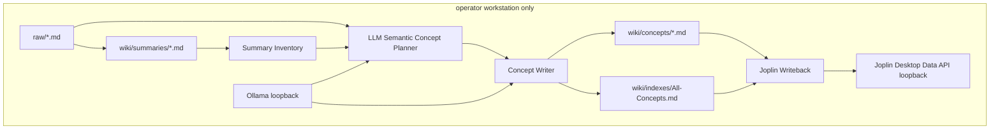
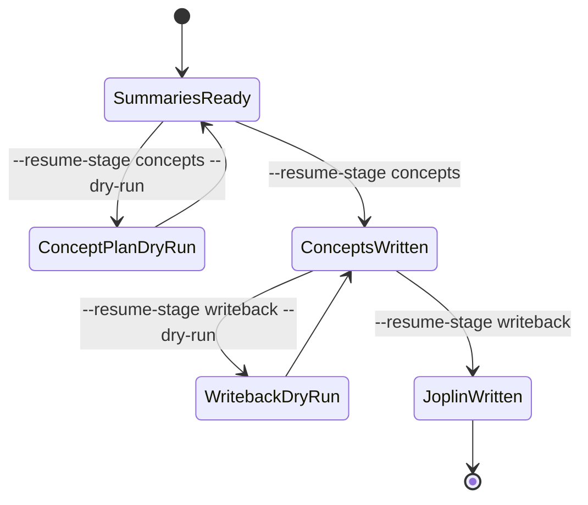

## Context

目前 local `wiki-compile` 的 planner 先決定 `wiki/` path，再由 writer 依 corpus slice 產生內容；在 corpus mode 與 `filesystem_slice` 下，同一視窗內多個 concept 可能讀到同一批 raw excerpt，導致 concept 檔名、frontmatter title、H1 與正文證據不一致。`agent-compile` 則由 Codex agent 直接讀 raw 並寫 wiki，缺少後置 canonicalization 與 collision 檢查。Joplin 寫回目前以 topic notebook 加 note title upsert，會更新完全同名筆記，但不會辨識近似概念、舊錯誤 concept，或從概念階段接續而略過 summaries。Joplin 官方 Data REST API 支援 `POST /notes` 建立、`PUT /notes/:id` 局部更新 note 欄位、`DELETE /notes/:id` 刪除且預設移到 trash，因此流程可以安全地先在 filesystem 完成 canonical concept，再用 REST API 更新、建立或在明確 cleanup 模式移除舊 note。

本設計修正的是 compiled wiki 的 concept 層與寫回層，不重開 raw 匯出、sqlite polling、RAG 或 Chroma 索引。使用者已暫停排程，因此 implementation 可先以 CLI、fixture 與 dry-run 完成驗證，再恢復 `sqlite-sync`。

## Architecture Overview

編譯流程拆成三個可觀測階段：summary、concept、writeback。summary 階段仍負責產生每個來源摘要；concept 階段改以 summary inventory 與 raw evidence 建立 canonical concept plan；writeback 階段可只接收 concepts/indexes 的 relPaths。接續模式會從 `wiki/summaries/*.md` 掃描既有摘要，產生 `concepts/*.md` 與 `indexes/All-Concepts.md`，並在寫回時只處理這些 downstream paths。

### Component Diagram



## Local-First Constraints

- local route 只呼叫 `ollama.base_url`，預設 loopback。
- writeback 只呼叫 `joplin_data_api.base_url`，且仍受既有 loopback validation 約束。
- 不新增 Chroma、embedding 或遠端服務依賴；concept resume 使用 filesystem summaries/raw。
- `raw/` 仍唯讀；所有輸出限制在 `wiki/summaries/*.md`、`wiki/concepts/*.md`、`wiki/indexes/All-Sources.md`、`wiki/indexes/All-Concepts.md`。

## Module Layout

```text
src/
  commands/
    cmd-wiki-compile.js
    cmd-agent-compile.js
  wiki/
    wiki-compiler.js
    wiki-planner.js
    topic-path-heuristic.js
    frontmatter.js
  joplin/
    wiki-writeback.js
  config/
    load-config.js
bin/
  joplin-llm-wiki.js
package.json
pnpm-lock.yaml
config.yaml.example
data/chroma/
reports/
```

## Goals / Non-Goals

**Goals:**

- 建立 canonical concept plan，使 slug、title、H1、source_refs 與正文使用同一主題證據。
- 提供 `wiki-compile` 接續模式，只從 summaries 產生 concepts/indexes 與可選 Joplin 寫回。
- 讓 Joplin writeback 回報 concept collisions、orphan candidates 與實際寫入 relPaths。
- 讓 agent route 完成後也通過同一套 concept/writeback 後置檢查。
- 讓 Joplin writeback 使用官方 REST API 的 create/update/delete 能力：一般寫回只 create/update，cleanup/repair 才可把 orphan concept 移到 trash。

**Non-Goals:**

- 不在一般 compile/writeback 中清理 Joplin 端舊筆記；cleanup/repair 必須由明確選項觸發。
- 不新增 Web UI。
- 不重新導入 RAG、Chroma 或 embeddings。
- 不變更 sqlite-sync 的 polling 語意。
- 不用字串相似、slug 相似或 title 完全相同取代 LLM 對主題語意關係的判斷。

## Decisions

### Decision 1: Use summary inventory as concept resume input

接續模式以既有 `wiki/summaries/*.md` 為主要輸入，讀取 frontmatter `source_refs`、`domain`、`title` 與正文摘要，再必要時補 raw excerpt。這比重跑 raw-to-summary 省 token，也比只看 raw filenames 更穩定。

Alternative reviewed: 從 raw 重新 planner 全庫 concept。拒絕，因為會再次消耗 token 且無法利用已產生 summaries。

### Decision 2: Use LLM semantic judgment for concept identity

Concept canonicalization 以 LLM 讀取 candidate concepts、summary excerpts、source_refs 與既有 canonical concepts 後判斷「同一主題」或「不同主題」。字串正規化、slug、title similarity 只能用於候選召回與穩定檔名，不得作為最終合併判準。輸出檔的 filename slug、frontmatter `title`、body H1 必須同源；若 LLM 判斷候選屬於既有 canonical concept，系統合併至既有 canonical concept，並在 JSON summary 中回報 merge count、decision reason 與 confidence。

Alternative reviewed: 只靠 Joplin note title 去重。拒絕，因為錯誤已發生在 filesystem wiki 層，Joplin 只能看到最後 body。

### Decision 3: Separate downstream relPaths for writeback

`runWikiWriteback` 保持接收 relPaths，但 compile summary 必須明確傳入 downstream paths。接續模式只傳 `concepts/*.md` 與 `indexes/All-Concepts.md`；一般 full compile 可仍傳本輪寫入頁面。Dry-run 回傳 would_write、collision、orphan candidates，不做 mutating API call。

Alternative reviewed: agent-compile 成功後永遠寫回整個 wiki。拒絕，因為會重送 2,000 多個 summaries，浪費時間且放大 collision 風險。

### Decision 4: Keep cleanup explicit and non-destructive by default

Joplin orphan concept 僅預設回報，不自動刪除。若 implementation 加入 cleanup/repair 選項，必須要求明確 flag，且 dry-run 顯示 note title、folder、note id、原因與將執行的 REST action。刪除使用 `DELETE /notes/:id` 的預設 trash 行為，不使用 permanent delete 作為預設。

Alternative reviewed: 寫回後自動刪掉沒有對應 wiki relPath 的 concept notes。拒絕，因為使用者可能在 Joplin 手動改過舊筆記。

### Decision 5: Use Joplin REST update before create and trash only for explicit cleanup

Writeback 對 current canonical concept 的處理順序是：先以 repo-managed identity marker 或現有 canonical title 找候選 note；唯一命中時用 `PUT /notes/:id` 局部更新 `body`，必要時更新 `title` 與 `parent_id`；沒有命中時才用 `POST /notes` 建立；多筆命中時 dry-run 回報 collision，non-dry-run fail。Orphan cleanup 僅在 explicit cleanup/repair mode 使用 `DELETE /notes/:id` 移到 trash。

Alternative reviewed: 每次都用 `POST /notes` 建立新 concept。拒絕，因為官方 REST API 已支援局部更新，重複建立會放大目前的 concept 污染。

## API/CLI Contract

| Name | Input | Output | Error code | Idempotency |
|------|-------|--------|------------|-------------|
| `joplin-llm-wiki wiki-compile --resume-stage concepts` | config path, existing `wiki/summaries/*.md`, optional dry-run | JSON summary with `resume_stage`, `summaries_read`, `concepts_written`, `indexes_written`, `writeback_written` | `WIKI_COMPILE_ABORT`, `CONFIG_INVALID` | Re-running updates same canonical concept files |
| `joplin-llm-wiki wiki-compile --resume-stage writeback` | existing `wiki/concepts/*.md` and indexes | JSON summary with downstream writeback counts | `JOPLIN_DATA_API_FAILED`, `JOPLIN_DATA_API_WRITE_FAILED` | Upsert by canonical note title |
| `joplin-llm-wiki agent-compile` | raw list and config | agent writes wiki, then post-check/writeback summary | `CODEX_CLI_UNAVAILABLE`, `CODEX_USAGE_LIMIT`, `AGENT_COMPILE_FAILED` | Post-check normalizes canonical concepts before writeback |
| `runWikiWriteback(..., { cleanupOrphans })` | canonical wiki relPaths and explicit cleanup flag | create/update counts, orphan candidates, trash count | `JOPLIN_DATA_API_WRITE_FAILED` | Update existing note before create; trash only with explicit cleanup |

## Data Model

Concept plan item:

```json
{
  "slug": "depression-support-and-psychoeducation",
  "title": "憂鬱症陪伴、心理衛教與求助",
  "source_refs": ["a. Podcast-素材/example.md"],
  "summary_refs": ["summaries/a-podcast-example.md"],
  "merged_from": ["憂鬱症支持與心理衛教"],
  "semantic_decision": {
    "relation": "same_topic",
    "confidence": "high",
    "reason": "Both candidate concepts synthesize depression support and psychoeducation sources."
  }
}
```

Compiled concept frontmatter remains compatible with `compiled-wiki`: `source_refs`, `compiled_at`, `compiler_revision`, `domain`, `title`. Additional fields are optional and must not be required for existing query/read behavior.

## Data Flow & State Machine



## Events & Triggers

- Manual recovery: operator runs concept resume after pausing schedule.
- Scheduled recovery: sqlite-sync can later invoke normal compile again after raw changes, but this change does not require changing polling behavior.
- Dry-run review: operator inspects planner merges, collisions, and orphan candidates before mutating wiki/Joplin.

## Error Handling

- No summaries in concept resume: fail with `WIKI_COMPILE_ABORT` and JSON/stderr hint naming `wiki/summaries/*.md` as required input.
- Canonical collision with incompatible source_refs: do not overwrite silently; report conflict count and fail non-dry-run unless an explicit merge policy is configured.
- Joplin duplicate title in folder: preserve existing `JOPLIN_DATA_API_WRITE_FAILED`; dry-run must surface duplicates before mutation.
- LLM semantic relation confidence is low: dry-run reports the candidate merge; non-dry-run keeps candidates separate unless an explicit accept policy is configured.
- Agent output missing required frontmatter or mismatched concept H1/title: report `AGENT_COMPILE_FAILED` before writeback.
- Joplin cleanup requested without dry-run confirmation: fail with `JOPLIN_DATA_API_WRITE_FAILED` and do not delete notes.

## Security & Privacy

The change keeps all source note content on the local machine. It does not add external HTTP hosts, cloud LLM APIs, remote vector stores, or public services. Logs and JSON summaries must avoid printing Joplin Data API token values. Raw source excerpts used for model prompts remain local Ollama or local Codex agent execution.

## Observability

Compile JSON summaries must expose `resume_stage`, `summary_paths_read`, `concept_paths_planned`, `concept_paths_written`, `canonical_merge_count`, `semantic_decision_count`, `low_confidence_semantic_decision_count`, `concept_collision_count`, `writeback_relpaths`, `writeback_created_count`, `writeback_updated_count`, `writeback_trashed_count`, `writeback_collision_count`, and `writeback_orphan_candidate_count`. Warnings must retain existing stderr JSON style for planner fallback and add stable warning names for concept canonical merges, low-confidence semantic decisions, and writeback orphan candidates.

## Implementation Contract

Behavior: An operator with completed summaries can resume from concept generation or Joplin writeback without regenerating all summaries. Concepts produced by either local or agent route must be canonicalized by LLM semantic judgment before writeback, and repeated runs must update the same canonical files and Joplin notes.

Interface/data shape: `wiki-compile` accepts a resume stage for `concepts` and `writeback`. Concept resume reads `wiki/summaries/*.md`, asks the local LLM for semantic same-topic decisions, writes only `wiki/concepts/*.md` and `wiki/indexes/All-Concepts.md`, and returns the JSON observability fields listed above. Writeback resume reads existing concepts/indexes and passes only those relPaths to `runWikiWriteback`, which uses REST create/update/delete capabilities according to the selected mode.

Failure modes: Missing summaries, incompatible canonical collisions, low-confidence semantic merges, invalid concept frontmatter, Joplin duplicates, and cleanup without explicit confirmation are surfaced as stable failures. Dry-run never mutates `wiki/` or Joplin. Non-dry-run never mutates `raw/`. Default non-dry-run writeback can create or update Joplin notes but must not delete them.

Acceptance criteria: Unit tests cover concept-only resume, writeback-only resume, canonical merge stability across two runs, agent post-check failure on mismatched concept title/body, and Joplin dry-run collision/orphan reporting. CLI dry-run output is deterministic enough for tests to assert counts and relPaths.

Scope boundaries: In scope are `wiki-compile`, `agent-compile` post-checks, compiled concept files, All-Concepts index, and Joplin wiki writeback. Out of scope are sqlite polling changes, source summary regeneration strategy, RAG, Chroma, GUI, and automatic destructive Joplin cleanup.

## Traceability

| Requirement | Design section |
|-------------|----------------|
| SCN-WI-CONCEPT-CANON-01 | Decisions 1 and 2, Data Model |
| SCN-WI-CONCEPT-SEMANTIC-01 | Decision 2, Data Model |
| SCN-WI-RESUME-CONCEPTS-01 | API/CLI Contract, Data Flow & State Machine |
| SCN-WIKI-CONCEPT-CONSISTENCY-01 | Data Model, Error Handling |
| SCN-JWKB-CONCEPT-COLLISION-01 | Decisions 3 and 4, Observability |
| SCN-JWKB-CONCEPT-UPSERT-01 | API/CLI Contract, Implementation Contract |
| SCN-JWKB-REST-CAPABILITY-01 | Decision 5, API/CLI Contract |

## Risks / Trade-offs

- [Risk] Similar-title normalization merges concepts that must stay separate → Mitigation: dry-run reports `merged_from` and source counts; incompatible source_refs fail non-dry-run.
- [Risk] LLM semantic judgment merges concepts incorrectly → Mitigation: low-confidence decisions remain dry-run/report-only unless explicitly accepted; tests cover distinct-title same-topic and similar-title distinct-topic cases.
- [Risk] Existing Joplin duplicate notes block writeback → Mitigation: dry-run reports duplicates and non-dry-run preserves current explicit failure instead of guessing.
- [Risk] Agent route ignores prompt constraints → Mitigation: run post-check before writeback and classify mismatches as `AGENT_COMPILE_FAILED`.
- [Risk] Concept resume quality depends on previous summaries → Mitigation: use raw source_refs as fallback evidence for writer prompts.

## Migration/Phase

1. Implement concept resume in dry-run mode with summary inventory and canonical planning.
2. Enable non-dry-run concept writes and All-Concepts update.
3. Add writeback-only resume, Joplin REST update-before-create, and dry-run collision/orphan reporting.
4. Add agent post-check and downstream-only writeback.
5. Add explicit cleanup/repair mode that moves orphan notes to trash only after dry-run review.
6. Re-enable schedule only after CLI dry-run and targeted tests pass.

## Open Questions

- Whether explicit Joplin cleanup belongs in the first apply pass or behind a documented repair-only flag after orphan reporting proves useful.
