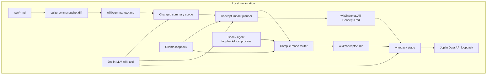
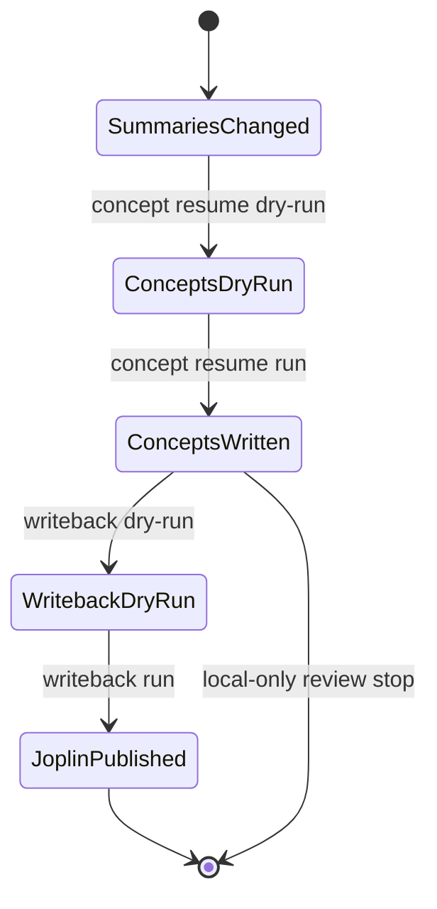

## Context

目前 `wiki-compile --resume-stage concepts` 已能從既有 `wiki/summaries/*.md` 建立 canonical concepts，但使用者真正需要的產品邊界是：local 與 agent 兩個模式都先把本機 concept 全部編完並可檢查，再由獨立 writeback 階段寫入 Joplin。這個邊界對修復已污染的 Joplin concepts 很重要，因為一旦錯誤 concept 被同步到 `@llm-wiki/wiki/concepts`，後續清理成本會高於只修 filesystem `wiki/concepts/`。

`sqlite-sync` 已能偵測 raw snapshot 變動並在 downstream 成功後才提交 state；本變更把 downstream 從「raw changed 後依 `compile_mode` 跑一次 compile」細分為「summary 變動集合 → concept impact scope → local 或 agent concept compile → downstream writeback relPaths」。GUI 目前是 Health GUI，但實際承擔 config、pipeline、query、lint、LaunchAgent 與即將加入的 concept resume 操作，因此使用者可見名稱改為 Joplin-LLM-wiki tool。

相關能力：`wiki-ingest`、`joplin-wiki-writeback`、`joplin-sqlite-sync`、`local-runtime-health-gui`。

## Architecture Overview



## Local-First Constraints

- `raw/` 仍是本機唯讀來源；本變更不修改 raw export 與 mirror 語意。
- Concept compile 只讀本機 `wiki/summaries/*.md` 與必要 raw evidence；local mode 只呼叫 loopback Ollama，agent mode 只透過本機 `codex exec`。
- Writeback 只在 writeback stage 呼叫 loopback Joplin Data API。
- 不新增 Chroma、RAG、embedding、遠端資料庫或雲端 LLM。
- GUI 只呼叫固定白名單 IPC/CLI action，不提供任意 shell command runner。

## Component Diagram

同 Architecture Overview。GUI 與 CLI 共用同一組 stage contract：local/agent concept dry-run、local/agent concept compile、writeback dry-run、writeback run。

## Module Layout

```text
src/
  commands/
    cmd-wiki-compile.js
    cmd-agent-compile.js
    cmd-sqlite-sync.js
  wiki/
    wiki-compiler.js
    wiki-planner.js
    frontmatter.js
  joplin/
    wiki-writeback.js
    data-api-client.js
  health-gui/
    main.js
    preload.cjs
    corpus/corpus-pipeline-runner.js
    health-snapshot.js
    renderer/index.html
    renderer/app.js
bin/
  joplin-llm-wiki.js
  joplin-llm-wiki-health-gui.js
package.json
pnpm-lock.yaml
config.yaml.example
docs/
  llm-knowledge-flow.md
  scheduling-examples.md
reports/
```

## Goals / Non-Goals

**Goals:**

- Local and agent concepts are fully written to local wiki before any Joplin writeback for concept resume.
- Raw changes trigger scoped downstream concept rebuilds and scoped writeback relPaths in both `compile_mode: local` and `compile_mode: agent`.
- GUI exposes fixed local/agent concept/writeback stage actions and displays stage results.
- User-visible GUI name becomes Joplin-LLM-wiki tool while keeping existing executable compatibility.

**Non-Goals:**

- No automatic permanent deletion of Joplin notes.
- No new vector index, RAG, Chroma, embedding, hosted service, or Python runtime.
- No redesign of SQLite export, notebook selection, snapshot baseline, or polling semantics.
- No arbitrary command runner in GUI.

## Decisions

### Decision 1: Concept resume never writes to Joplin

`wiki-compile --resume-stage concepts` and `agent-compile --resume-stage concepts` SHALL stop after writing local `wiki/concepts/*.md` and `wiki/indexes/All-Concepts.md`. They may report `writeback_relpaths` as the next-stage candidate set, but they SHALL NOT call mutating Joplin Data API endpoints even when `joplin_wiki_writeback.enabled` is true.

Alternative reviewed: keep current optional auto-writeback after concept resume. Rejected because it collapses review and publish into one operation and can re-pollute Joplin.

### Decision 2: Writeback stage is the publish boundary

`wiki-compile --resume-stage writeback` and `agent-compile --resume-stage writeback` become the only concept resume paths that publish to Joplin. Dry-run inspects collisions/orphans and non-dry-run upserts only completed downstream relPaths.

Alternative reviewed: add a new publish command. Rejected for now because existing resume-stage contract already names the phase and keeps CLI surface smaller.

### Decision 3: Incremental raw changes carry summary scope into concept planning

When `sqlite-sync` detects raw changes and downstream compile changes summaries, the orchestration SHALL preserve changed summary relPaths and pass them into concept impact planning for both local and agent compile modes. The planner SHALL expand from changed summaries to existing concepts using `summary_refs`, `source_refs`, canonical metadata, and LLM semantic judgment when needed. The compile summary SHALL expose changed summaries, candidate concepts, written concepts, compile adapter, and writeback relPaths.

Alternative reviewed: always rerun all concepts after any raw change. Rejected because it wastes tokens and increases Joplin writeback churn.

### Decision 4: GUI wraps fixed local and agent stage actions and keeps single-flight protection

The GUI SHALL expose fixed actions for both adapters: local concept dry-run, local concept compile, local writeback dry-run, local writeback run, agent concept dry-run, agent concept compile, agent writeback dry-run, and agent writeback run. Each action spawns the same CLI argv as documented and uses existing single in-flight locking.

Alternative reviewed: add a freeform CLI input. Rejected because this GUI is an operator tool with safe fixed workflows, not a shell.

### Decision 5: Rename only user-visible GUI branding first

The visible window title, main heading, and documentation SHALL use Joplin-LLM-wiki tool. Existing binary and internal path names remain compatible unless a separate migration change explicitly renames executables.

Alternative reviewed: rename executable and folder paths immediately. Rejected because it would break current docs, launch shortcuts, and tests unrelated to product behavior.

## API/CLI Contract

| Name | Input | Output | Error code | Idempotency |
| --- | --- | --- | --- | --- |
| `wiki-compile --resume-stage concepts` | existing summaries, optional changed summary scope | JSON with `compile_adapter: local`, `resume_stage: concepts`, `summary_paths_read`, `changed_summary_paths`, `concept_paths_planned`, `concept_paths_written`, `writeback_relpaths` | `WIKI_COMPILE_ABORT`, `OLLAMA_UNAVAILABLE` | Re-running updates same local canonical concept files |
| `wiki-compile --resume-stage writeback` | existing concepts and All-Concepts | JSON with `compile_adapter: local`, `resume_stage: writeback`, `writeback_relpaths`, create/update/collision/orphan counts | `JOPLIN_DATA_API_FAILED`, `JOPLIN_DATA_API_WRITE_FAILED` | Re-running updates same Joplin notes |
| `agent-compile --resume-stage concepts` | existing summaries, optional changed summary scope | JSON with `compile_adapter: agent`, `resume_stage: concepts`, changed/planned/written concept fields, `writeback_relpaths` | `CODEX_CLI_UNAVAILABLE`, `CODEX_USAGE_LIMIT`, `AGENT_COMPILE_FAILED` | Re-running updates same local canonical concept files |
| `agent-compile --resume-stage writeback` | existing concepts and All-Concepts | JSON with `compile_adapter: agent`, `resume_stage: writeback`, writeback counts | `JOPLIN_DATA_API_FAILED`, `JOPLIN_DATA_API_WRITE_FAILED` | Re-running updates same Joplin notes |
| `sqlite-sync` downstream local or agent mode | raw snapshot diff, resolved `compile_mode` | JSON includes raw change fields, `compile_mode`, `compile_adapter`, and concept/writeback stage fields when summaries changed | existing sqlite/downstream errors | State commits only after downstream success |
| GUI concept dry-run action | config path, adapter local or agent | operation log and parsed JSON payload | `PIPELINE_IN_FLIGHT`, command exit failure | Non-mutating |
| GUI concept compile action | config path, adapter local or agent | operation log and parsed JSON payload | `PIPELINE_IN_FLIGHT`, command exit failure | Updates local wiki only |
| GUI writeback dry-run action | config path, adapter local or agent | operation log and parsed JSON payload | `PIPELINE_IN_FLIGHT`, command exit failure | Non-mutating |
| GUI writeback run action | config path, adapter local or agent | operation log and parsed JSON payload | `PIPELINE_IN_FLIGHT`, command exit failure | Upserts Joplin notes |

## Data Model

Concept stage JSON fields:

```json
{
  "resume_stage": "concepts",
  "compile_adapter": "local",
  "summary_paths_read": ["summaries/a.md"],
  "changed_summary_paths": ["summaries/a.md"],
  "concept_paths_planned": ["concepts/topic.md"],
  "concept_paths_written": ["concepts/topic.md"],
  "writeback_relpaths": ["concepts/topic.md", "indexes/All-Concepts.md"],
  "writeback_deferred": true
}
```

SQLite downstream summary fields:

```json
{
  "raw_changed": true,
  "changed_raw_paths": ["notebook/a.md"],
  "changed_summary_paths": ["summaries/a.md"],
  "concept_paths_written": ["concepts/topic.md"],
  "writeback_relpaths": ["concepts/topic.md", "indexes/All-Concepts.md"],
  "state_committed": true
}
```

GUI IPC action names should be stable strings such as `concept-resume-dry-run`, `concept-resume-run`, `agent-concept-resume-dry-run`, `agent-concept-resume-run`, `writeback-resume-dry-run`, `writeback-resume-run`, `agent-writeback-resume-dry-run`, and `agent-writeback-resume-run`.

## Data Flow & State Machine



## Events & Triggers

- Manual repair: operator pauses schedule and uses CLI or GUI stage actions.
- Automatic raw change: `sqlite-sync` detects raw changes, writes changed summaries, computes concept impact scope, writes concepts, and publishes only downstream relPaths if writeback is enabled.
- GUI operation: user clicks a fixed stage action; GUI blocks concurrent pipeline actions until the command exits.

## Error Handling

- Concept resume with no summaries fails with `WIKI_COMPILE_ABORT`.
- Concept stage Joplin mutation attempt is treated as a test failure and must not happen in production flow.
- Writeback dry-run reports collisions/orphans without mutation.
- Writeback non-dry-run fails on duplicate titles instead of choosing one note.
- SQLite downstream failure keeps snapshot state uncommitted.
- GUI command failure surfaces exit code, stderr tail, and stable action id.

## Security & Privacy

All source content stays on the local workstation before explicit publication. Local concept generation uses loopback Ollama, and agent concept generation uses the local `codex exec` adapter. Joplin writeback uses loopback Data API only. GUI does not expose a shell or remote service. Logs must not include Joplin token values.

## Observability

CLI and GUI summaries SHALL expose at least: `compile_adapter`, `resume_stage`, `changed_summary_paths`, `summary_paths_read`, `concept_paths_planned`, `concept_paths_written`, `writeback_relpaths`, `writeback_deferred`, `writeback_collision_count`, `writeback_orphan_candidate_count`, `writeback_created_count`, and `writeback_updated_count` where applicable.

## Implementation Contract

Behavior: A user can compile concepts through local Ollama or Codex agent mode, inspect files and telemetry, then publish to Joplin in a separate stage. Raw changes can produce scoped concept updates and scoped Joplin writeback in both `compile_mode: local` and `compile_mode: agent` without regenerating or resending unchanged summaries. The GUI presents the same stage actions under the name Joplin-LLM-wiki tool.

Interface/data shape: `wiki-compile --resume-stage concepts` and `agent-compile --resume-stage concepts` write local concept outputs and return `writeback_deferred: true`; neither mutates Joplin. `wiki-compile --resume-stage writeback` and `agent-compile --resume-stage writeback` consume completed concept/index files and mutate Joplin when not dry-run. `sqlite-sync` forwards changed summary scope into downstream concept planning for the resolved adapter and outputs changed/written/writeback relPaths plus adapter metadata. GUI IPC action ids are fixed and map to the CLI contracts in API/CLI Contract.

Failure modes: missing summaries, Ollama failure, invalid concept evidence, Joplin Data API failures, duplicate Joplin note titles, and GUI in-flight conflicts are surfaced as stable command or IPC failures. Dry-run is always non-mutating. Snapshot state is not committed when downstream concept compile or writeback fails.

Acceptance criteria: targeted node tests cover concept stage no-writeback, writeback-only publish, sqlite-sync incremental concept scope, GUI argv mapping, GUI rename, and no token leakage. `spectra validate stage-concept-writeback-gui-tool` and `spectra analyze stage-concept-writeback-gui-tool --json` pass without Critical or Warning findings.

Scope boundaries: In scope are local and agent CLI stage behavior, sqlite-sync downstream scope propagation for `compile_mode: local|agent`, Joplin writeback relPath filtering, GUI fixed actions, GUI visible rename, and docs. Out of scope are executable rename, arbitrary GUI command runner, permanent Joplin delete, vector/RAG features, and Jarvis integration.

## Risks / Trade-offs

- [Risk] Incremental scope misses a related concept → Mitigation: expand from changed summaries through `summary_refs`, `source_refs`, and existing canonical metadata; expose candidate counts in telemetry.
- [Risk] Incremental scope becomes too broad → Mitigation: report changed summaries and planned concepts so operators can detect near-full rebuilds.
- [Risk] Users expect concept compile to write Joplin because writeback is enabled → Mitigation: output `writeback_deferred: true` and document the writeback stage.
- [Risk] GUI buttons trigger long-running commands repeatedly → Mitigation: reuse single in-flight operation lock and show current action status.

## Migration/Phase

1. Change local and agent CLI stage tests and behavior so concept resume never mutates Joplin.
2. Add incremental summary/concept scope telemetry and sqlite-sync orchestration tests for `compile_mode: local|agent`.
3. Add GUI local/agent stage actions and rename visible branding.
4. Update docs and examples.
5. Run targeted tests, full `pnpm test`, Spectra validation, and archive after implementation.

## Open Questions

- Whether incremental concept scope should include an explicit CLI option for `--changed-summary <path>` in addition to internal sqlite-sync forwarding.
- Whether future cleanup mode should be exposed in GUI after orphan dry-run output is stable.
