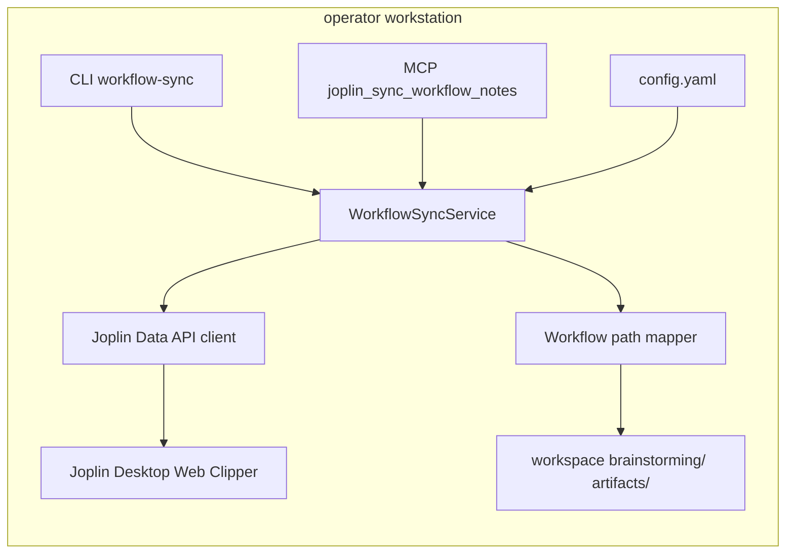
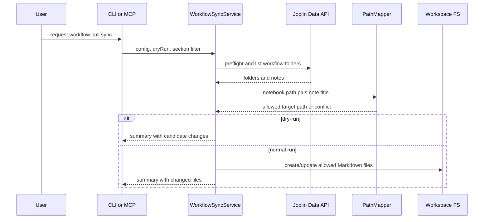
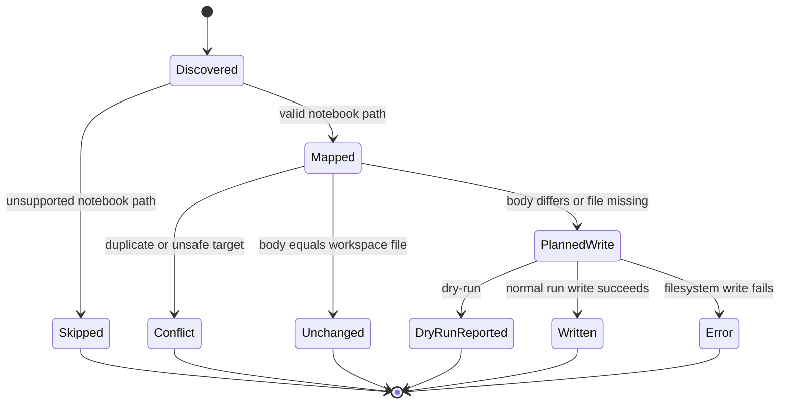

## Context

`brainstorming/` 與 `artifacts/` 目前是工作目錄中的 workflow 層，透過 query capture、archive project 或 workflow writeback 按需推送到 Joplin `@llm-wiki` notebook tree。缺口是使用者在 Joplin UI 直接修正 workflow note 後，repo 端 Markdown 不會更新，導致兩邊內容分歧。

本設計新增明確的 Joplin-to-workspace pull sync。它不是 raw/wiki pipeline 的一部分，也不是自動常駐雙向同步；它是一個可 dry-run、可審計、只處理 workflow notebook tree 的手動同步入口。

## Goals / Non-Goals

**Goals:**

- 從 `@llm-wiki/brainstorming/{chat,health}` 拉回 Joplin note body，寫入 `brainstorming/chat/` 或 `brainstorming/health/` 對應 Markdown 檔。
- 從 `@llm-wiki/artifacts/<project>` 拉回 Joplin note body，寫入 `artifacts/<project>/` 對應 Markdown 檔。
- CLI 與 MCP 共用同一個 service，輸出一致的結構化摘要。
- dry-run 完整列出將 create/update/skip/conflict/error 的項目，但不寫檔。
- 保持全本機與 loopback Data API 邊界，不需要 Ollama、Chroma 或外部網路。

**Non-Goals:**

- 不把 `raw/` 或 compiled `wiki/` 改成雙向同步。
- 不監看 Joplin Data API 或 Joplin SQLite 形成自動即時同步。
- 不做內容 merge、CRDT、附件同步、資源同步、note metadata 同步。
- 不取代 Joplin Cloud、Jarvis 或既有 workspace-to-Joplin writeback。

## Architecture Overview

新增 `WorkflowSyncService`，位於 Joplin Data API client 與 workflow filesystem writer 之間。CLI subcommand 與 MCP tool 只負責解析參數、載入 config、呼叫 service，避免兩套邏輯分歧。



## Local-First Constraints

- Network：只允許既有 `joplin_data_api.base_url`，並沿用 loopback hostname allowlist。
- LLM：此流程不呼叫 Ollama，不讀取 prompt，不產生 summary。
- Vector：此流程不讀寫 ChromaDB，也不觸發 index、watch、ask、lint。
- Filesystem：只允許工作目錄內 `brainstorming/` 與 `artifacts/`；所有目標 path 寫入前都要 resolve 並確認仍在允許根目錄內。
- Dry-run：不得建立目錄、不得寫檔、不得修改 Joplin。

## Component Diagram



## Module Layout

```text
src/
  commands/
    cmd-workflow-sync.js
  joplin/
    data-api-client.js
    wiki-writeback.js
    workflow-sync.js
  mcp/
    schema.js
    tools.js
  knowledge-flow/
    orchestration-service.js
bin/
  joplin-llm-wiki.js
package.json
pnpm-lock.yaml
config.yaml.example
README.md
docs/
  llm-knowledge-flow.md
brainstorming/
artifacts/
raw/
wiki/
data/chroma/
reports/
```

`data/chroma/`、`reports/`、Ollama、Watcher、Indexer、VectorStore、RAGService、LintEngine、ReportWriter、Scheduler 不在此 change 的 runtime path 中；文件只需說明它們不受 workflow pull sync 影響。

## Decisions

### Reuse Joplin Data API client and config boundary

沿用現有 `joplin_data_api` 與 `joplin_wiki_writeback` 設定，不新增第二套 token 或 base URL。這可重用 loopback allowlist、timeout、preflight 與既有錯誤碼。

Alternative considered：直接讀 Joplin SQLite。拒絕原因是 workflow writeback 使用 Data API 建立 note，SQLite 內部 schema 與 notebook tree traversal 會讓映射與權限邊界更脆弱。

### Add WorkflowSyncService as the single implementation path

CLI 與 MCP 都呼叫 `WorkflowSyncService`。Service 負責讀 notebook tree、映射 path、detect conflict、執行 dry-run 或 write。

Alternative considered：CLI 先實作、MCP 包 CLI stdout。拒絕原因是 MCP spec 要求 structured result，stdout parsing 會讓錯誤處理與測試變脆弱。

### Use deterministic title-based Markdown filenames for MVP

MVP 以 Joplin note title 產生 safe filename，並使用 notebook tree 決定 section 與 project。這與現有 workflow writeback 的 upsert-by-title 模型一致。

Alternative considered：在 Joplin note body frontmatter 寫入 repo path。拒絕原因是會改變既有 workflow note 內容，且本需求是拉回使用者在 Joplin 的內容，不應先要求 metadata migration。

### Fail closed on ambiguous or unsafe targets

任何 duplicate target、path traversal、unsupported brainstorming first-level folder、non-Markdown target 都列為 conflict 或 skipped，不寫入。正常執行只寫入無衝突的 allowlisted targets。

Alternative considered：自動加 suffix 解決 duplicate。拒絕原因是會創造非預期檔名，讓使用者難以判斷哪份是 canonical artifact。

## API/CLI Contract

CLI 新增 subcommand `workflow-sync`，建議簽名：

```text
joplin-llm-wiki workflow-sync --config <path> [--dry-run] [--section brainstorming|artifacts|all]
```

成功 stdout JSON shape：

```json
{
  "workflow_sync_status": "ok",
  "dry_run": true,
  "sections": ["brainstorming", "artifacts"],
  "scanned": 3,
  "created": 0,
  "updated": 1,
  "unchanged": 1,
  "skipped": 1,
  "conflicts": 0,
  "errors": 0,
  "changed_files": ["brainstorming/chat/example.md"],
  "details": []
}
```

錯誤碼：

| Error code | Condition | Write behavior |
| --- | --- | --- |
| `CONFIG_INVALID` | config missing token/base_url or invalid section | no writes |
| `JOPLIN_DATA_API_FAILED` | preflight or read fails before note traversal completes | no writes |
| `WORKFLOW_SYNC_CONFLICT` | fail-fast mode, if implemented, sees conflicts | no conflicted writes |
| `WORKFLOW_SYNC_WRITE_FAILED` | filesystem write fails for a target | previous successful writes remain reported in summary |

MCP 新增 tool `joplin_sync_workflow_notes`，input 包含 `config_path`、`dry_run`、`section`；output 直接回傳同一 summary object，不要求 caller parse CLI stdout。

## Data Model

Workflow note candidate：

| Field | Source | Meaning |
| --- | --- | --- |
| `note_id` | Joplin Data API | Joplin note id for diagnostics |
| `title` | Joplin Data API | note title, sanitized into filename |
| `body` | Joplin Data API | Markdown body written to workspace |
| `section` | notebook tree | `brainstorming` or `artifacts` |
| `folder_parts` | notebook tree under section | `chat`, `health`, or artifact project path |
| `target_relpath` | mapper | workspace relative Markdown path |
| `status` | sync service | `created`, `updated`, `unchanged`, `skipped`, `conflict`, `error` |

狀態機：



## Error Handling

- Data API preflight failure aborts before filesystem writes.
- Per-note mapping errors are summarized and do not block unrelated safe candidates unless fail-fast is explicitly added later.
- Duplicate target conflicts block all writes to that target.
- Filesystem write failures record target path and error code in `details`; subsequent unrelated candidates can continue only if implementation can preserve a truthful summary.
- User-facing messages avoid token, raw HTTP query strings, stack traces, and internal field dumps.

## Security & Privacy

- Token stays in config and Data API client; summaries must not include tokenized URLs.
- All target paths are resolved against workspace root and compared against allowed roots before writing.
- The service does not read arbitrary Joplin notebooks outside configured workflow tree.
- No external network, SaaS LLM, Chroma server, or public listener is introduced.

## Observability

CLI stdout JSON is the primary audit surface. It must include counts and changed file relpaths. Detailed entries can include note id, title, section, target relpath, status, and reason. Errors remain deterministic enough for tests and operator troubleshooting.

## Migration/Phase

1. Add service and tests with mocked Data API fixtures.
2. Add CLI subcommand and help text.
3. Add MCP schema/tool wrapper.
4. Update README, `docs/llm-knowledge-flow.md`, and `config.yaml.example` wording.
5. Run narrow unit tests and full relevant test suite.

Rollback is operational: stop running `workflow-sync`, inspect git diff, and revert unwanted workspace Markdown changes. Existing writeback, sqlite-sync, wiki compile, and MCP query/archive tools remain usable.

## Implementation Contract

Behavior：當使用者在 Joplin `@llm-wiki/brainstorming` 或 `@llm-wiki/artifacts` 內編輯文字筆記後，執行 CLI 或 MCP pull sync 會讓 repo 端對應 Markdown 檔內容與 Joplin note body 一致，前提是該 note 可安全映射且沒有衝突。

Interface：CLI 提供 `workflow-sync` subcommand；MCP 提供 `joplin_sync_workflow_notes` tool。兩者使用相同 service，接受 config path、dry-run、section filter，回傳同一 summary shape。

Failure modes：Data API 不通或 token 無效時以 `JOPLIN_DATA_API_FAILED` 失敗且不寫檔；映射衝突不覆蓋檔案並列入 summary；dry-run 不建立目錄也不寫檔。

Acceptance：`test/joplin-workflow-sync.test.js` 覆蓋 brainstorming update、artifact update、dry-run no-write、duplicate conflict、path traversal rejection、Data API preflight failure。MCP tests 覆蓋 tool schema 與 structured result。CLI smoke test 驗證 stdout JSON counts 與 changed files。

Scope boundaries：只處理 workflow notebooks；不碰 raw/wiki/index/lint/watch/Chroma/Ollama；不修改 Joplin note body；不新增 background daemon。

## Traceability

| Requirement | Design coverage |
| --- | --- |
| REQ-JWFS-SCOPE | Local-First Constraints, Data Model, Implementation Contract |
| REQ-JWFS-MAPPING | Deterministic title-based Markdown filenames, Data Model |
| REQ-JWFS-WRITE | API/CLI Contract, Error Handling, Observability |
| REQ-JWFS-CONFLICT | Fail closed on ambiguous or unsafe targets, Error Handling |
| REQ-JWFS-LOCAL | Reuse Joplin Data API client and config boundary, Security & Privacy |
| REQ-JWKB-WORKFLOW-PULL | Context, Goals / Non-Goals, Migration/Phase |
| REQ-MCP-WORKFLOW-SYNC | API/CLI Contract, Add WorkflowSyncService as the single implementation path |

## Risks / Trade-offs

- [Risk] Title-based mapping can produce conflicts when Joplin contains duplicate titles in the same project folder → Mitigation: report conflicts and never overwrite duplicate targets.
- [Risk] Users can expect automatic continuous sync → Mitigation: documentation names this as explicit pull sync and keeps automatic sync out of MVP.
- [Risk] Pulling from Joplin could overwrite repo-side edits → Mitigation: dry-run is available, summary lists changed files, and git diff remains the rollback surface.
- [Risk] Existing writeback parser and new pull mapper can drift → Mitigation: shared helper tests cover equivalent notebook tree conventions for brainstorming and artifacts.

## Open Questions

- None for MVP. Frontmatter-based stable path metadata can be considered in a later change if title-based mapping becomes too limiting.
