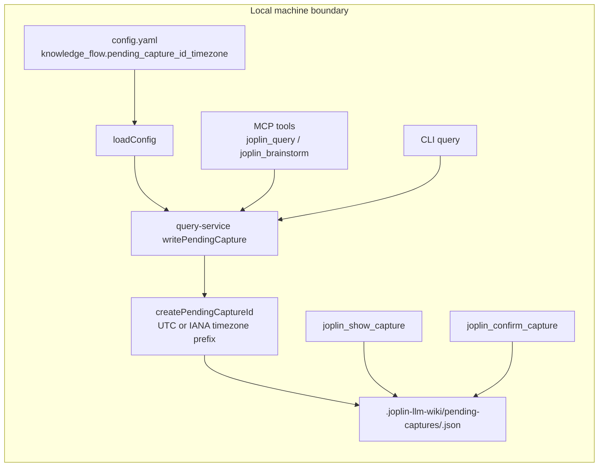

## Context

目前 pending capture 由 query/brainstorm 流程建立，核心產生端在 `writePendingCapture`：以 `new Date().toISOString().replace(/[:.]/g, "-")` 建立 UTC `Z` stamp，再串接 title slug 與 8 字元 hex hash。讀取與確認則以使用者提供的完整 `capture_id` 對應 `.joplin-llm-wiki/pending-captures/<id>.json`，不需要反解析時間。

需求是讓新建立的 `capture_draft_id` 可使用 Asia/Taipei／GMT+8 本地時間前綴，但預設維持 UTC `Z`，並且舊 capture ID 繼續可 show 與 confirm。

## Goals / Non-Goals

**Goals:**

- 新增 `knowledge_flow.pending_capture_id_timezone` 設定，預設值為 `UTC`，允許 `Asia/Taipei` 等 IANA timezone。
- 集中 pending capture ID 的時間前綴產生端，避免 MCP 與 CLI 各自硬改字串。
- 保留 slug 與 hash 組成，讓 ID 後半部語意不漂移。
- 保留舊 UTC `Z` ID 的讀取與確認相容性，不做 migration。
- 同步更新 Vitest 測試與 pending capture workflow 文件。

**Non-Goals:**

- 不改 formal note 落地檔名的 timestamp 規則。
- 不改 pending capture JSON schema，除非新增設定值需要在結果中回報；既有欄位不可移除。
- 不加入 Luxon、date-fns、Moment 或其他日期套件。
- 不改 Joplin、Jarvis、Ollama、ChromaDB 或 wiki compile 路徑。

## Decisions

### 集中建立 pending capture draft ID formatter

在 query-service 內建立單一 helper，例如 `createPendingCaptureId({ now, title, timezone })` 或等價命名，由 `writePendingCapture` 呼叫。helper 負責：

- 根據 timezone 產生 timestamp prefix。
- 呼叫既有 `slugify(title)` 並維持 slice 長度。
- 產生既有 8 字元 lowercase hex hash。

替代方案是直接在 `writePendingCapture` 內分支處理 UTC 與 Asia/Taipei，但這會讓測試較難固定時間與 hash，也讓未來其他 capture flow 更容易複製字串邏輯。

### 使用 `knowledge_flow.pending_capture_id_timezone` 作為設定介面

新增 top-level `knowledge_flow` 區塊，欄位為 `pending_capture_id_timezone`，預設 `UTC`。`loadConfig` 讀取並驗證該值為非空字串；實作可以用 `Intl.DateTimeFormat` 嘗試格式化固定日期來驗證 timezone 是否有效，無效時丟 `CONFIG_INVALID`。

替代方案是放在 `joplin_wiki_writeback` 或 `joplin_sqlite_sync` 下，但 pending capture 屬於 knowledge-flow query/brainstorm，不屬於 writeback 或 sqlite export。

### UTC 保留舊格式，非 UTC 使用本地無 offset 檔名安全格式

當 timezone 為 `UTC` 時，沿用 `toISOString().replace(/[:.]/g, "-")`，保留形如 `2026-05-25T11-46-36-845Z` 的前綴。當 timezone 為 `Asia/Taipei` 時，輸出 `YYYY-MM-DDTHH-mm-ss`，例如 `2026-05-25T19-46-36`。非 UTC timezone 也採相同無 offset 格式，避免 `+`、`:` 等字元進入檔名與既有 ID path handling。

替代方案是在 ID 中加入 `+08-00` 或 `GMT+8`，但現有 ID 用 `-` 串接 slug/hash，加入 offset 會增加 parser 與人工辨識成本；而讀取流程不依靠時間反解析。

### 讀取與確認流程保持以完整 ID 查檔

`readPendingCapture` 繼續使用完整 `capture_id` 加 `.json` 查找 pending capture 檔案，只保留既有 basename 防護，不新增新格式 parser。這是相容舊 UTC ID 的關鍵：舊檔名不用轉換或重寫。

替代方案是新增 ID parser 做 normalization，但會增加錯誤面，也可能把舊 ID 中的 slug 破壞。



## Implementation Contract

**Behavior**

- 新 capture draft 在 `knowledge_flow.pending_capture_id_timezone: Asia/Taipei` 時，`capture_draft_id` 的 prefix 必須是 GMT+8 本地時間 `YYYY-MM-DDTHH-mm-ss`。
- 未設定 `knowledge_flow.pending_capture_id_timezone` 時，新 capture draft 必須維持既有 UTC `Z` prefix。
- `joplin_show_capture` 與 `joplin_confirm_capture` 對既有 `2026-05-25T11-46-36-845Z-...` ID 必須照常運作。

**Interface / data shape**

- Config：新增 `knowledge_flow.pending_capture_id_timezone`，型別 string，預設 `UTC`，範例值 `Asia/Taipei`。
- MCP result：`capture_draft_id` 仍為 string 或 null，不新增必填欄位。
- Pending file：仍為 `.joplin-llm-wiki/pending-captures/<capture_draft_id>.json`。
- Pending JSON：至少保留 `id`、`created_at`、`question`、`answer`、`provider`、`source_scope`、`capture`。

**Failure modes**

- 無效 timezone 設定丟 `CONFIG_INVALID`，訊息需指出 `knowledge_flow.pending_capture_id_timezone` 無效。
- 舊 pending capture 找不到時維持既有 not-found 行為，不因 timezone 設定嘗試 fallback 或改寫 ID。

**Acceptance criteria**

- Vitest 覆蓋 Asia/Taipei 固定時間輸出 `2026-05-25T19-46-36`。
- Vitest 覆蓋預設 UTC 固定時間仍相容 `2026-05-25T11-46-36-845Z`。
- Vitest 覆蓋舊 UTC `Z` ID 可 show 與 confirm。
- Vitest 覆蓋 slug component 與 8 字元 lowercase hex hash shape 未變。
- 文件補充設定位置、預設 UTC、Asia/Taipei 範例與舊 ID 相容性。

**Scope boundaries**

- In scope：`src/knowledge-flow/query-service.js`、`src/config/load-config.js`、MCP／CLI 呼叫路徑需要傳遞 config 的最小改動、README 與 docs、相關 Vitest。
- Out of scope：formal note timestamp、archive artifact timestamp、sqlite-sync timestamp、report timestamp、Joplin Data API writeback 行為。

## Module Layout

```text
src/
  config/load-config.js
  knowledge-flow/query-service.js
  mcp/tools.js
  commands/cmd-query.js
bin/
  joplin-llm-wiki.js
  joplin-llm-wiki-mcp.js
config.yaml.example
README.md
README.en.md
docs/
  codex-cursor-mcp.md
  llm-knowledge-flow.md
test/
  query.test.js
  mcp-server.test.js
```

## API/CLI Contract

| 介面 | 輸入 | 輸出 | 錯誤碼 | 冪等性 |
| --- | --- | --- | --- | --- |
| `joplin_query` | 問題、config path、可選 capture 設定 | `capture_draft_id` string/null | `CONFIG_INVALID`、既有 query errors | 每次建立 capture 會產生新 hash，不冪等 |
| `joplin_brainstorm` | title/content/context、config path | `capture_draft_id` string/null | `CONFIG_INVALID`、既有 workflow errors | 每次建立 capture 會產生新 hash，不冪等 |
| `joplin_show_capture` | `capture_id` | pending capture content | 既有 not-found error | 讀取不修改檔案，冪等 |
| `joplin_confirm_capture` | `capture_id`、可選 artifact project | formal note result | 既有 not-found/writeback errors | 成功後移除 pending，第二次不冪等 |
| CLI `query --confirm-capture` | capture ID | formal note result | 既有 not-found/writeback errors | 成功後移除 pending，第二次不冪等 |

## Data Model

| 欄位 | 型別 | 預設 | 必填 | 說明 |
| --- | --- | --- | --- | --- |
| `knowledge_flow.pending_capture_id_timezone` | string | `UTC` | 否 | 新 pending capture ID 的 timestamp prefix timezone。使用 `Asia/Taipei` 時輸出 GMT+8 local prefix。 |
| `capture_draft_id` | string | 無 | capture 建立時必有 | `<timestamp>-<slug>-<hash>`，timestamp 由設定決定，slug/hash 維持既有規則。 |
| `created_at` | string | 建立當下 UTC ISO | 是 | Pending JSON metadata；仍使用 ISO timestamp，不作為檔名相容性依據。 |

## Security & Privacy

本變更只使用本機 config 與本機檔案系統，不新增 HTTP listener、不連外、不觸碰 Joplin 原始筆記。`readPendingCapture` 的 basename 防護需保留，避免 capture_id 被用成 path traversal。timezone 設定驗證只使用 Node.js 內建 Intl，不引入外部資料來源。

## Observability

CLI 的 `CAPTURE_DRAFT` JSON 與 MCP result 仍顯示 `capture_draft_id`。文件應說明 ID 的時間前綴可能是 UTC 或設定的本地時區；debug 時以 pending JSON 的 `created_at` 作為絕對 UTC 建立時間。

## Migration/Phase

1. 新增 config default 與 formatter helper，先以單元測試固定時間驗證 UTC 與 Asia/Taipei。
2. 將 `writePendingCapture` 改為讀取 config timezone，MCP／CLI 路徑傳入現有 cfg。
3. 加入舊 UTC ID show/confirm 測試，確認沒有 migration 需求。
4. 更新 config example、README、README.en、MCP docs 與 knowledge-flow docs。
5. Rollback 時移除 config 或保持預設 `UTC`，既有 pending capture 檔案仍可用完整 ID 讀取。

## Traceability

| Spec scenario | Design coverage |
| --- | --- |
| SCN-MCP-CAPTURE-ID-01 | formatter helper、Asia/Taipei local prefix、MCP/CLI result contract |
| SCN-MCP-CAPTURE-ID-02 | UTC default decision與 config default |
| SCN-MCP-CAPTURE-ID-03 | read-by-full-ID contract |
| SCN-MCP-CAPTURE-ID-04 | confirm old ID contract |
| SCN-MCP-CAPTURE-ID-05 | slug/hash preservation in formatter helper |

## Risks / Trade-offs

- [Risk] Node.js Intl timezone support 在極端精簡 runtime 不完整 → Mitigation：使用 Node 20 常見 Intl API，並在 config validation 以固定日期格式化驗證。
- [Risk] 新 config 區塊命名與未來 knowledge-flow 設定擴張衝突 → Mitigation：使用明確欄位 `pending_capture_id_timezone`，避免泛用 `timezone`。
- [Risk] 測試若直接依賴真實時間會不穩 → Mitigation：formatter helper 支援注入固定 `Date` 或等價 clock，測試不依賴 wall clock。
- [Risk] 文件只更新中文 README 造成語言版本漂移 → Mitigation：同步更新 README.md 與 README.en.md。

## Open Questions

(none)
